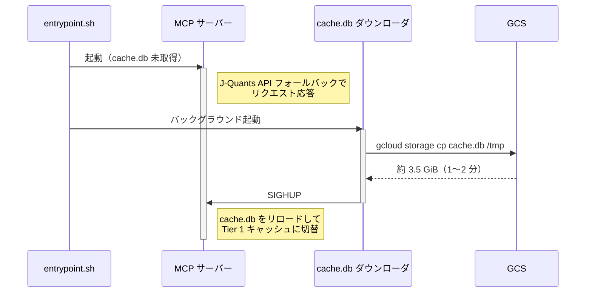

# jquants-dat-mcp

[J-Quants API v2](https://jpx-jquants.com/) を使って日本株市場データを取得する [MCP (Model Context Protocol)](https://modelcontextprotocol.io/) サーバーです。

[j-quants-doc-mcp](https://github.com/knishioka/j-quants-doc-mcp)（ドキュメント MCP）の対になるサーバーです。doc が API の仕様を説明するのに対し、dat は実際に **API を呼び出してデータを取得** します。

## 特徴

- **27 の MCP ツール** — J-Quants API v2 の全エンドポイントをカバー
- **2層 SQLite キャッシュ** — 時系列データは行レベル、その他はレスポンスレベル（TTL付き）
- **株式分割検知** — AdjFactor 変化時にキャッシュを自動無効化
- **レート制限** — プラン別スライディングウィンドウ（Free: 5回/分, Light: 60, Standard: 120, Premium: 500）
- **リトライ** — 429/5xx エラーに対する指数バックオフ
- **ページネーション** — 複数ページの透過的取得
- **プラン対応** — 全ツールを登録し、プラン制限時はわかりやすいエラーメッセージを返却

## 必要要件

- Python 3.10+
- [J-Quants API キー](https://jpx-jquants.com/)（Free プラン以上）

## インストール

```bash
# uv（推奨）
uv pip install jquants-dat-mcp

# pip
pip install jquants-dat-mcp
```

### ソースから

```bash
git clone https://github.com/shigechika/jquants-dat-mcp.git
cd jquants-dat-mcp
uv sync --dev
```

## 設定

設定は以下の優先順位で読み込まれます（後勝ち）:

1. `~/.jquants-api/jquants-api.toml` — API キーのみ（J-Quants 公式設定）
2. `~/.config/jquants-dat-mcp/config.ini`（ユーザーグローバル）
3. `./config.ini`（カレントディレクトリ）
4. 環境変数（MCP クライアントや CLI から）

### API キー（ゼロコンフィグ）

[jquants-api-client](https://github.com/J-Quants/jquants-api-client-python) を既に利用している場合、`~/.jquants-api/jquants-api.toml` から API キーが自動読み込みされます。追加の設定は不要です。

### config.ini

MCP 固有の設定（プラン、キャッシュ、クライアント動作）:

```ini
[jquants]
plan = premium
# cache_dir = ~/.cache/jquants-dat-mcp
# base_url = https://api.jquants.com/v2

[client]
# max_retries = 5
# retry_base_delay = 1.0
# max_pages = 10

[server]
# ssl_certfile = /path/to/fullchain.pem
# ssl_keyfile = /path/to/privkey.pem
# bearer_token = <secret>
# encryption_key = <ランダムな秘密値>   # ユーザーごとの API キー保存を有効化（マルチユーザーモード）

[oauth]
# github_client_id = <GitHub OAuth App のクライアント ID>
# github_client_secret = <クライアントシークレット>
# base_url = https://mcp.example.com
# jwt_signing_key = <ランダムな秘密値>  # 省略可: 省略時は自動生成
# require_consent = true
```

### 環境変数

| 変数名 | 必須 | デフォルト | 説明 |
|---|---|---|---|
| `JQUANTS_API_KEY` | いいえ* | — | J-Quants API キー |
| `JQUANTS_PLAN` | いいえ | 自動検出 | プラン: `free` / `light` / `standard` / `premium`（サーバー起動時に API キーから自動検出、明示設定はオーバーライド用） |
| `JQUANTS_CACHE_DIR` | いいえ | `~/.cache/jquants-dat-mcp` | キャッシュディレクトリのパス |
| `JQUANTS_BASE_URL` | いいえ | `https://api.jquants.com/v2` | API ベース URL |
| `MAX_RETRIES` | いいえ | `5` | リクエスト失敗時の最大リトライ回数 |
| `RETRY_BASE_DELAY` | いいえ | `1.0` | 指数バックオフの基本遅延（秒） |
| `MAX_PAGES` | いいえ | `10` | ページネーション時の最大ページ数 |
| `SSL_CERTFILE` | いいえ | — | SSL 証明書ファイルのパス（HTTP トランスポート用） |
| `SSL_KEYFILE` | いいえ | — | SSL 秘密鍵ファイルのパス（HTTP トランスポート用） |
| `MCP_BEARER_TOKEN` | いいえ | — | HTTP 認証用の Bearer トークン |
| `GITHUB_CLIENT_ID` | いいえ | — | GitHub OAuth App のクライアント ID（GitHub OAuth 2.1 を有効化） |
| `GITHUB_CLIENT_SECRET` | いいえ | — | GitHub OAuth App のクライアントシークレット |
| `GOOGLE_CLIENT_ID` | いいえ | — | Google OAuth 2.0 クライアント ID（Google OAuth 2.1 を有効化） |
| `GOOGLE_CLIENT_SECRET` | いいえ | — | Google OAuth 2.0 クライアントシークレット |
| `OAUTH_PROVIDER` | いいえ | `github` | OAuth プロバイダー: `github` または `google` |
| `OAUTH_BASE_URL` | いいえ | — | サーバーの公開ベース URL（例: `https://mcp.example.com`） |
| `OAUTH_JWT_SIGNING_KEY` | いいえ | 自動 | JWT 署名用シークレット。省略時は起動ごとに自動生成 |
| `OAUTH_REQUIRE_CONSENT` | いいえ | `true` | ログインのたびに OAuth 同意画面を表示（`true`/`false`） |
| `MCP_ENCRYPTION_KEY` | いいえ | — | ユーザー API キーの AES-256-GCM 暗号化に使うパスフレーズ |
| `RATE_LIMIT_PER_MINUTE` | いいえ | `60` | マルチユーザー時のユーザー別リクエスト上限（OAuth ユーザー単位） |
| `RATE_LIMIT_BURST` | いいえ | `20` | ユーザー別バースト許容量（トークンバケット容量） |

\* API キーは `~/.jquants-api/jquants-api.toml` から自動検出されます。上書きが必要な場合のみ `JQUANTS_API_KEY` を設定してください。

環境変数は `config.ini` と `jquants-api.toml` の両方を上書きします。普段使いの設定は `config.ini` や `jquants-api.toml` に任せ、MCP クライアント（Claude Desktop, Claude Code）からは `env` ブロックで必要な設定だけ渡すことができます。

## 認証

jquants-dat-mcp は 3 つの認証モードに対応しています:

| モード | 用途 |
|---|---|
| なし | ローカル stdio または信頼済み LAN（シングルユーザー） |
| Bearer Token | HTTPS 経由のシングルユーザーリモートアクセス |
| GitHub OAuth 2.1 | マルチユーザー / Claude Desktop Connectors |
| Google OAuth 2.1 | Google アカウントによるマルチユーザーアクセス |

起動時に設定に基づいて自動的にモードが選択されます:

1. **Google OAuth 2.1** — `GOOGLE_CLIENT_ID`・`GOOGLE_CLIENT_SECRET`・`OAUTH_BASE_URL` がすべて設定され、`OAUTH_PROVIDER=google` の場合
2. **GitHub OAuth 2.1** — `GITHUB_CLIENT_ID`・`GITHUB_CLIENT_SECRET`・`OAUTH_BASE_URL` がすべて設定されている場合
3. **Bearer Token** — `MCP_BEARER_TOKEN`（または `config.ini` の `bearer_token`）が設定されている場合
4. **なし** — 認証なし（stdio トランスポートまたは信頼済み環境）

### GitHub OAuth 2.1

サーバーが OAuth 2.1 認可サーバーとして機能し、GitHub を上流 IdP（identity provider）として使用します。クライアントは GitHub のログイン画面にリダイレクトされ、サーバーが認可コードを署名済み JWT と交換してユーザーを識別します。

#### 1. GitHub OAuth App を作成する

1. **GitHub → Settings → Developer settings → OAuth Apps → New OAuth App** へ移動
2. 以下を入力:
   - **Application name**: `jquants-dat-mcp`（任意の名前でも可）
   - **Homepage URL**: サーバーの公開ベース URL（例: `https://mcp.example.com`）
   - **Authorization callback URL**: `https://mcp.example.com/oauth/callback/github`
3. **Register application** をクリック後、**Generate a new client secret** でシークレットを生成
4. **Client ID** と生成した **Client secret** をコピーしておく

#### 2. サーバーを設定する

**環境変数で設定:**

```bash
export GITHUB_CLIENT_ID=Ov23liXXXXXXXXXXXXXX
export GITHUB_CLIENT_SECRET=<クライアントシークレット>
export OAUTH_BASE_URL=https://mcp.example.com      # 外部から到達可能な URL
export OAUTH_JWT_SIGNING_KEY=<ランダムな秘密値>    # 省略可: 省略時は自動生成
export MCP_ENCRYPTION_KEY=<ランダムな秘密値>       # ユーザーごとの API キー保存に必要
```

**`config.ini` で設定:**

```ini
[oauth]
github_client_id = Ov23liXXXXXXXXXXXXXX
github_client_secret = <クライアントシークレット>
base_url = https://mcp.example.com
# jwt_signing_key = <ランダムな秘密値>   # 省略可: 省略時は自動生成
# require_consent = true              # デフォルト: true

[server]
encryption_key = <ランダムな秘密値>    # ユーザーごとの API キー保存に必要
```

#### 3. OAuth 付きでサーバーを起動する

```bash
jquants-dat-mcp -t streamable-http --port 8080 \
  --ssl-certfile /path/to/fullchain.pem \
  --ssl-keyfile /path/to/privkey.pem \
  --github-client-id <ID> \
  --github-client-secret <SECRET> \
  --oauth-base-url https://mcp.example.com
```

環境変数や `config.ini` で OAuth 設定が完了している場合、CLI フラグは省略可能です。起動時に自動的に OAuth が有効化されます。

| CLI オプション | 説明 |
|---|---|
| `--github-client-id` | GitHub OAuth App のクライアント ID |
| `--github-client-secret` | GitHub OAuth App のクライアントシークレット |
| `--oauth-base-url` | サーバーの公開ベース URL（リダイレクト URI の構築に使用） |

### Google OAuth 2.1

GitHub の代わりに Google を OAuth 2.1 の IdP として使用できます。ユーザーは Google のサインインページにリダイレクトされ、サーバーが認可コードを署名済み JWT と交換してユーザーを識別します。

#### 1. Google OAuth 2.0 クライアントを作成する

1. [Google Cloud Console](https://console.cloud.google.com/) → **API とサービス → 認証情報 → 認証情報を作成 → OAuth 2.0 クライアント ID** へ移動
2. **ウェブ アプリケーション** を選択し、以下を入力:
   - **Authorized JavaScript origins**: `https://mcp.example.com`
   - **Authorized redirect URIs**: `https://mcp.example.com/oauth/callback/google`
3. **作成** をクリックし、**クライアント ID** と **クライアントシークレット** をコピーする

#### 2. サーバーを設定する

**環境変数で設定:**

```bash
export GOOGLE_CLIENT_ID=<クライアント ID>
export GOOGLE_CLIENT_SECRET=<クライアントシークレット>
export OAUTH_PROVIDER=google
export OAUTH_BASE_URL=https://mcp.example.com
export MCP_ENCRYPTION_KEY=<ランダムな秘密値>    # ユーザーごとの API キー保存に必要
```

**`config.ini` で設定:**

```ini
[oauth]
google_client_id = <クライアント ID>
google_client_secret = <クライアントシークレット>
provider = google
base_url = https://mcp.example.com

[server]
encryption_key = <ランダムな秘密値>
```

### /settings Web UI

OAuth が有効な場合、`https://mcp.example.com/settings` でブラウザからAPIキーを登録できます。

1. ブラウザで `https://mcp.example.com/settings` を開く
2. **Sign in with GitHub**（`config.ini` で `provider = google` の場合は **Sign in with Google**）をクリック
3. 認証後、J-Quants API キーとプランを入力して **Save** をクリック

MCP クライアントなしでブラウザから直接 `register_api_key` 相当の操作が可能です。

## マルチユーザーモード

GitHub OAuth 2.1 と `MCP_ENCRYPTION_KEY` を両方設定すると、**マルチユーザーモード**で動作します。認証された各ユーザーが自分の J-Quants API キーをサーバーに登録でき、データ取得ツールは自動的にそのキーを使用します。キャッシュは全ユーザーで共有され、レート制限はユーザーごとに独立します。

### ユーザーフロー


### マルチユーザーモード用ツール

| ツール | 必要条件 | 説明 |
|---|---|---|
| `register_api_key` | OAuth 2.1 + `MCP_ENCRYPTION_KEY` | J-Quants API キーを暗号化して登録 |
| `delete_api_key` | OAuth 2.1 + `MCP_ENCRYPTION_KEY` | 登録済みの API キーを削除 |

**キーの登録**（Claude に伝える）:

> 「J-Quants の API キー `<APIキー>` を登録して」

Claude が `register_api_key(api_key="...")` を呼び出します。サーバーはキーを使ってプラン固有のエンドポイントをプローブし、プラン（`free` / `light` / `standard` / `premium`）を自動検出して暗号化済みキーと一緒に保存します。手動でのプラン指定は不要です。以降のツール呼び出しは検出されたプランに基づいてレート制限・日付範囲制約を適用します。

### セキュリティ

- API キーは **AES-256-GCM**（認証付き暗号化）で暗号化して保存
- 暗号化キーは `MCP_ENCRYPTION_KEY` から **PBKDF2-HMAC-SHA256**（60 万回反復）で導出
- 暗号化のたびにランダムな 12 バイトのノンスを生成。同じキーを 2 回暗号化しても異なる暗号文になる
- 改ざん・切り詰めされた暗号文は復号前に検出して拒否

### 後方互換性

| 設定状態 | 動作 |
|---|---|
| 認証なし・`MCP_ENCRYPTION_KEY` なし | シングルユーザー: 全接続で共通の `JQUANTS_API_KEY` を使用 |
| Bearer Token のみ | シングルユーザー: 同上（HTTP 認証あり） |
| OAuth + `MCP_ENCRYPTION_KEY` なし | OAuth 認証あり、全ユーザーで共通の `JQUANTS_API_KEY` を使用 |
| OAuth + `MCP_ENCRYPTION_KEY` あり | フルマルチユーザー: ユーザーごとに独立した暗号化 API キー |

## 使い方

### Claude Code

`claude mcp add` で MCP サーバーを登録:

```bash
claude mcp add jquants-dat-mcp -- jquants-dat-mcp
```

ソースからインストールした場合:

```bash
claude mcp add jquants-dat-mcp \
  -- /path/to/jquants-dat-mcp/.venv/bin/jquants-dat-mcp
```

`--scope`（`-s`）オプションで設定の保存先を指定できます:

| スコープ | 説明 | 設定ファイル |
|---|---|---|
| `local`（デフォルト） | 現在のプロジェクト、現ユーザーのみ | `.claude.json` |
| `project` | 現在のプロジェクト、チーム共有 | プロジェクトルートの `.mcp.json` |
| `user` | 全プロジェクト、現ユーザーのみ | `~/.claude.json` |

API キーは `~/.jquants-api/jquants-api.toml` から自動検出されます。上書きが必要な場合のみ `-e JQUANTS_API_KEY=...` を指定してください。

### Claude Desktop

Claude Desktop の設定ファイルに追加:

| OS | 設定ファイル |
|---|---|
| macOS | `~/Library/Application Support/Claude/claude_desktop_config.json` |
| Windows | `%APPDATA%\Claude\claude_desktop_config.json` |
| Linux | `~/.config/Claude/claude_desktop_config.json` |

```json
{
  "mcpServers": {
    "jquants-dat-mcp": {
      "command": "/path/to/jquants-dat-mcp/.venv/bin/jquants-dat-mcp"
    }
  }
}
```

サーバーは起動時に API キーからプランを自動検出するので、手動設定は不要です。検出結果をオーバーライドしたい場合や別の API キーを指定したい場合のみ `env` ブロックを追加してください。

> **注意:** Claude Desktop は限定的な `PATH`（`/usr/local/bin`, `/usr/bin` 等）しか持たないため、実行ファイルはフルパスで指定してください。

設定後、Claude Desktop を再起動してください。

### スタンドアロン（stdio）

```bash
jquants-dat-mcp
```

### Streamable HTTP（リモートアクセス）

HTTP トランスポートで起動すると、他のマシンの MCP クライアントから接続できます:

```bash
jquants-dat-mcp --transport streamable-http --port 8080
```

MCP エンドポイントは `http://<host>:8080/mcp` で公開されます。同一 LAN 内（または SSH トンネル経由）のクライアントから接続可能です。

**Claude Code（リモート接続）:**

```bash
claude mcp add jquants-dat-mcp \
  --transport http http://192.0.2.1:8080/mcp
```

| オプション | デフォルト | 説明 |
|---|---|---|
| `--transport`, `-t` | `stdio` | トランスポート: `stdio` または `streamable-http` |
| `--host` | `0.0.0.0` | バインドアドレス |
| `--port`, `-p` | `8080` | ポート番号 |
| `--ssl-certfile` | — | SSL 証明書ファイルのパス |
| `--ssl-keyfile` | — | SSL 秘密鍵ファイルのパス |
| `--bearer-token` | — | Bearer トークン認証 |

### TLS + Bearer Token 認証

インターネット経由（IPv6 等）で安全にリモートアクセスするには、TLS 暗号化と Bearer token 認証を有効にします:

```bash
# Bearer トークンを生成
python3 -c "import secrets; print(secrets.token_hex(32))"

# TLS + 認証付きで起動
jquants-dat-mcp -t streamable-http --port 8080 \
  --ssl-certfile /path/to/fullchain.pem \
  --ssl-keyfile /path/to/privkey.pem \
  --bearer-token <TOKEN>
```

または `config.ini` で設定（CLI フラグ不要）:

```ini
[server]
ssl_certfile = /path/to/fullchain.pem
ssl_keyfile = /path/to/privkey.pem
bearer_token = <TOKEN>
```

**Claude Code（TLS 付きリモート接続）:**

> **注意:** `claude mcp add --transport http --header "Authorization: Bearer ..."` はヘルスチェック時にヘッダーを送信しません（[claude-code#28293](https://github.com/anthropics/claude-code/issues/28293)）。ワークアラウンドとして [mcp-stdio](https://github.com/shigechika/mcp-stdio) 経由で接続してください:

```bash
pip install mcp-stdio  # または: uvx mcp-stdio

claude mcp add jquants-dat-mcp -- \
  mcp-stdio https://192.0.2.1:8080/mcp --bearer-token <TOKEN>
```

### Claude Desktop（mcp-stdio 経由のリモート接続）

Claude Desktop は Streamable HTTP トランスポートに直接対応していません。[mcp-stdio](https://pypi.org/project/mcp-stdio/) を使って stdio とリモート MCP サーバーを中継できます:

```json
{
  "mcpServers": {
    "jquants-dat-mcp": {
      "command": "mcp-stdio",
      "args": [
        "http://192.0.2.1:8080/mcp"
      ]
    }
  }
}
```

TLS + Bearer token 認証付きサーバーに接続する場合:

```json
{
  "mcpServers": {
    "jquants-dat-mcp": {
      "command": "mcp-stdio",
      "args": [
        "https://192.0.2.1:8080/mcp",
        "--bearer-token", "<TOKEN>"
      ]
    }
  }
}
```

設定後、Claude Desktop を再起動してください。

### Claude Desktop Connectors（OAuth 2.1）

Claude Desktop の **Connectors** 機能を使うと、ネイティブな OAuth 2.1 認証フローが利用できます。Connectors パネルで **Connect** をクリックすると、自動的に GitHub のログイン画面にリダイレクトされます。トークンの手動管理は不要です。

> **必要条件:**
> - **HTTPS** でアクセス可能なサーバー（TLS 証明書が必要）
> - GitHub OAuth 2.1 の設定済み（[GitHub OAuth 2.1](#github-oauth-21) を参照）
> - サーバー側で `MCP_ENCRYPTION_KEY` を設定済み（ユーザーごとの API キー保存に必要）

**サーバー側の起動コマンド:**

```bash
jquants-dat-mcp -t streamable-http --port 8080 \
  --ssl-certfile /path/to/fullchain.pem \
  --ssl-keyfile /path/to/privkey.pem \
  --github-client-id <ID> \
  --github-client-secret <SECRET> \
  --oauth-base-url https://mcp.example.com
```

**`claude_desktop_config.json`（Connectors UI）:**

```json
{
  "mcpServers": {
    "jquants-dat-mcp": {
      "type": "http",
      "url": "https://mcp.example.com/mcp"
    }
  }
}
```

初回接続時に GitHub OAuth のブラウザウィンドウが開きます。認証後はトークンが自動保存され、以降の接続はサイレントに行われます。

> **注意:** Claude Desktop の Connectors 対応（`"type": "http"` + OAuth）は段階的にロールアウト中です。まだ利用できない場合は [stdio プロキシ](#claude-desktop-stdio-プロキシ経由のリモート接続) をフォールバックとして使用してください。

## 提供ツール一覧

### 株式 (Equities) — 6ツール

| ツール名 | エンドポイント | 対応プラン | 説明 |
|---|---|---|---|
| `get_equities_master` | `/equities/master` | Free+ | 上場銘柄一覧 |
| `get_equities_bars_daily` | `/equities/bars/daily` | Free+ | 株価四本値（日足） |
| `get_equities_bars_minute` | `/equities/bars/minute` | Light+ | 株価分足 |
| `get_equities_bars_daily_am` | `/equities/bars/daily/am` | Premium | 前場四本値 |
| `get_equities_investor_types` | `/equities/investor-types` | Light+ | 投資部門別売買 |
| `get_equities_earnings_calendar` | `/equities/earnings-calendar` | Free+ | 決算発表予定 |

### 財務 (Financials) — 3ツール

| ツール名 | エンドポイント | 対応プラン | 説明 |
|---|---|---|---|
| `get_fins_summary` | `/fins/summary` | Free+ | 財務情報（四半期決算） |
| `get_fins_details` | `/fins/details` | Premium | 財務諸表詳細（BS/PL/CF） |
| `get_fins_dividend` | `/fins/dividend` | Premium | 配当金データ |

### 指数 (Indices) — 2ツール

| ツール名 | エンドポイント | 対応プラン | 説明 |
|---|---|---|---|
| `get_indices_bars_daily` | `/indices/bars/daily` | Free+ | 指数四本値 |
| `get_indices_bars_daily_topix` | `/indices/bars/daily/topix` | Free+ | TOPIX 四本値 |

### デリバティブ (Derivatives) — 3ツール

| ツール名 | エンドポイント | 対応プラン | 説明 |
|---|---|---|---|
| `get_derivatives_bars_daily_futures` | `/derivatives/bars/daily/futures` | Light+ | 先物四本値 |
| `get_derivatives_bars_daily_options` | `/derivatives/bars/daily/options` | Light+ | オプション四本値 |
| `get_derivatives_bars_daily_options_225` | `/derivatives/bars/daily/options/225` | Light+ | 日経225オプション四本値 |

### マーケット (Markets) — 6ツール

| ツール名 | エンドポイント | 対応プラン | 説明 |
|---|---|---|---|
| `get_markets_margin_interest` | `/markets/margin-interest` | Standard+ | 信用取引残高 |
| `get_markets_margin_alert` | `/markets/margin-alert` | Standard+ | 増担保規制情報 |
| `get_markets_short_ratio` | `/markets/short-ratio` | Standard+ | 業種別空売り比率 |
| `get_markets_short_sale_report` | `/markets/short-sale-report` | Standard+ | 空売り残高報告 |
| `get_markets_breakdown` | `/markets/breakdown` | Premium | 売買内訳データ |
| `get_markets_calendar` | `/markets/calendar` | Free+ | 取引カレンダー |

### バルクダウンロード (Bulk) — 2ツール

| ツール名 | エンドポイント | 対応プラン | 説明 |
|---|---|---|---|
| `get_bulk_list` | `/bulk/list` | Light+ | ダウンロード可能ファイル一覧 |
| `get_bulk_download_url` | `/bulk/get` | Light+ | 署名付きダウンロード URL 取得 |

### ユーティリティ — 5ツール

| ツール名 | 必要条件 | 説明 |
|---|---|---|
| `health_check` | — | サーバー稼働状態・API キー設定確認 |
| `cache_status` | — | キャッシュ統計情報 |
| `cache_clear` | — | キャッシュクリア |
| `register_api_key` | OAuth 2.1 | J-Quants API キーを暗号化して登録（マルチユーザーモード） |
| `delete_api_key` | OAuth 2.1 | 登録済みの J-Quants API キーを削除 |

## キャッシュ

2層構造の SQLite キャッシュを使用しています:

- **Tier 1（行レベル）**: 時系列データを日付×コードで管理。増分取得・株式分割検知（AdjFactor 比較）に対応。
  - `equities_bars_daily`, `equities_master`, `fins_summary`, `indices_bars_daily_topix`, `investor_types`, `markets_margin_interest`, `markets_margin_alert`, `markets_short_ratio`, `markets_breakdown`, `markets_calendar`
- **Tier 2（レスポンスレベル）**: API レスポンス全体を TTL 付きでキャッシュ（6h / 24h / 7d）。

キャッシュの保存先はデフォルトで `~/.cache/jquants-dat-mcp/cache.db` です。

### バルクデータ一括取得

`scripts/bulk_fetch_all.py` は J-Quants Bulk API から CSV データを一括ダウンロードし、SQLite キャッシュにインポートするスクリプトです。過去データを効率的にローカルキャッシュに蓄積できます。

```bash
# プランに応じた全データを取得
uv run python scripts/bulk_fetch_all.py

# 特定のエンドポイントのみ取得
uv run python scripts/bulk_fetch_all.py --endpoints fins_summary topix margin_interest

# ドライラン — ファイル一覧とサイズのみ表示
uv run python scripts/bulk_fetch_all.py --dry-run
```

プラン別のレート制限（例: Light は 60 req/min）を遵守し、429 エラー時は自動リトライします。

### CSV インポート

`scripts/import_csv_to_cache.py` はローカルの CSV ファイルをキャッシュにインポートします。API を叩かずに他のパイプラインからデータをサイドロードできます。

```bash
# 全件インポート（初回セットアップ）
uv run python scripts/import_csv_to_cache.py \
    --market-history /path/to/jpx-market-history.csv \
    --tickers /path/to/jpx-tickers.csv

# 差分インポート（日次運用）
uv run python scripts/import_csv_to_cache.py \
    --market-history /path/to/jpx-market-history.csv \
    --tickers /path/to/jpx-tickers.csv \
    --incremental
```

`--incremental` を指定すると、キャッシュ最新日より新しい行だけをインポートします（530万行超の全件ではなく ~4,000行/日）。株式分割・併合は `AdjFactor != 1.0` で自動検知し、該当銘柄の全期間データを再インポートして調整済み値を更新します。

### 日次データ取得

`scripts/daily_fetch.py` は `jquantsapi.ClientV2` で追加データを取得し、SQLite キャッシュに直接投入するスクリプトです。外部の日次パイプライン（cron やシェルスクリプト）から呼び出す想定です。

`~/.config/jquants-dat-mcp/config.ini`（または `JQUANTS_PLAN` 環境変数）からプランを読み取り、取得対象を自動決定します:

| プラン | 取得対象 |
|---|---|
| Free | `fins_summary`（決算サマリー）、`earnings_cal`（決算発表予定） |
| Light | + `topix`（TOPIX 日足）、`investor_types`（投資部門別売買動向） |
| Standard | + `short_ratio`（業種別空売り比率）、`margin_interest`（信用取引残高）、`margin_alert`（増担保規制情報）、`short_sale_report`（空売り残高報告） |
| Premium | + `breakdown`（売買内訳） |

```bash
# プランに応じた全データ取得
python3 scripts/daily_fetch.py

# 特定のエンドポイントのみ取得
python3 scripts/daily_fetch.py --topix --investor-types

# 取引カレンダーを取得
python3 scripts/daily_fetch.py --calendar

# Markets 系の過去データをバックフィル（過去N日分）
python3 scripts/daily_fetch.py --backfill 90

# キャッシュ DB パスを指定
python3 scripts/daily_fetch.py --db /path/to/cache.db
```

権限エラー（403）は graceful にスキップし、次のエンドポイントに進みます。

## Cloud Run デプロイ

このサーバーは [Google Cloud Run](https://cloud.google.com/run) にデプロイできます。状態管理は 2 つのマネージドサービスに分離されています:

- **`cache.db`** — セルフホストサーバー（`jpx-short-report` の daily pipeline）が GCS バケットに publish したスナップショットを、Cloud Run 起動時に `/tmp`（tmpfs）にダウンロード。Cloud Run は読み込みのみで、GCS に書き戻しません。
- **`users` / `oauth_state`** — Firestore（Native モード）に保存。強整合性かつマルチライター安全なので、Cloud Run は SQLite 書き込み競合を気にせず水平スケール可能です。

詳細は下記 [GCS と Firestore の連携](#gcs-と-firestore-の連携) を参照してください。

### 前提条件

- [Google Cloud SDK](https://cloud.google.com/sdk/docs/install)
- `cache.db` のリードオンリースナップショットを保持する GCS バケット（セルフホストサーバーが更新）
- Firestore（Native モード）がプロジェクトで有効化されていること（per-user API キーと OAuth セッション状態の保存用）
- 以下の権限を持つサービスアカウント:
  - GCS バケットに対する `roles/storage.objectViewer`（`cache.db` 読み取り専用）
  - プロジェクトに対する `roles/datastore.user`（Firestore 読み書き）
  - API キーを Secret Manager で管理する場合は `roles/secretmanager.secretAccessor`

### GCS バケットの作成

```bash
gcloud storage buckets create gs://YOUR_BUCKET \
  --location asia-northeast1
```

### Firestore の有効化

```bash
gcloud firestore databases create \
  --location=us-west1 \
  --type=firestore-native
```

### デプロイ

推奨経路はリポジトリを fork し、[.github/workflows/cd.yml](.github/workflows/cd.yml) の GitHub Actions CD ワークフローを利用する方法です。このワークフローは正しいフラグ（メモリ、CPU、環境変数、シークレット）付きで `gcloud run deploy --source .` を呼び出し、本番デプロイの唯一の真実源（single source of truth）になります。手動で `gcloud run services update` を実行すると次回の CD で上書きされるので避けてください。

手動で一度だけデプロイしたい場合（fork のテスト等）は、同じコマンドをローカルで実行します:

```bash
gcloud run deploy jquants-dat-mcp \
  --project "${PROJECT_ID}" \
  --region "${REGION}" \
  --source . \
  --execution-environment gen2 \
  --memory 6Gi \
  --cpu 2 \
  --no-cpu-throttling \
  --cpu-boost \
  --set-env-vars "GCS_BUCKET=YOUR_BUCKET,JQUANTS_CACHE_DIR=/tmp" \
  --set-secrets "JQUANTS_API_KEY=jquants-api-key:latest"
```

メモリサイジングの指針は下記 [メモリ要件](#メモリ要件) を参照してください。

### 環境変数

| 変数 | 必須 | デフォルト | 説明 |
|---|---|---|---|
| `GCS_BUCKET` | はい | — | `cache.db` スナップショットを保持する GCS バケット名 |
| `GCS_PREFIX` | いいえ | `jquants-dat-mcp/` | バケット内のオブジェクトキープレフィックス |
| `JQUANTS_CACHE_DIR` | いいえ | `/tmp` | `cache.db` を展開するローカルディレクトリ（Cloud Run では tmpfs） |
| `PORT` | いいえ | `8000` | HTTP ポート（Cloud Run が自動設定） |
| `JQUANTS_API_KEY` | はい | — | J-Quants API キー（Secret Manager 推奨） |
| `JQUANTS_PLAN` | いいえ | 自動検出 | プラン: `free` / `light` / `standard` / `premium`（API キーから自動検出、明示設定はオーバーライド） |
| `MCP_BEARER_TOKEN` | いいえ | — | HTTP 認証用 Bearer トークン（単一ユーザーモードのみ） |
| `OAUTH_PROVIDER`, `OAUTH_BASE_URL`, `GOOGLE_CLIENT_ID`, `GOOGLE_CLIENT_SECRET`, … | いいえ | — | マルチユーザーモード時の OAuth 設定 |

Firestore は Cloud Run サービスアカウントの Application Default Credentials を使うため、プロジェクト ID の環境変数設定は不要です。

### GCS と Firestore の連携

Cloud Run デプロイはコンテナ内 SQLite セットではなく、2 つのマネージドストアに依存します:

| データ | 保存先 | アクセスモード |
|---|---|---|
| `cache.db`（市場データ） | GCS オブジェクト、起動時に `/tmp/cache.db` へ展開 | Cloud Run からは読み取り専用 |
| `users`（ユーザーごとの暗号化 J-Quants API キー） | Firestore `users` コレクション | 読み書き |
| `oauth_state`（OAuth セッション・PKCE 検証・動的クライアント登録） | Firestore `oauth_state` コレクション | 読み書き |

`cache.db` はセルフホストサーバー（`jpx-short-report/daily.sh` を参照）が所有しており、日次バッチで GCS に最新スナップショットを publish します。Cloud Run は GCS に書き戻しません。

#### 起動フロー



注意点:
- `cache.db` は約 3.5 GiB、ダウンロードに 1〜2 分かかります。この間のリクエストは J-Quants API に直接アクセスします（動作はしますが遅くなり、rate limit 対象となります）。
- コールドスタート中は `cache_status` が最小ペイロード（`db_path` + `plan` のみ）を返します。行数や `db_size_mb` まで返るようになればキャッシュロード完了のサインです。
- Firestore は強整合性のため、複数の Cloud Run インスタンスが同時稼働してもデータ競合は発生しません。`maxScale: 1` のような制約は不要で、必要に応じて水平スケール可能です。

#### トラブルシューティング

**起動時の権限エラー（`403 Forbidden` または `storage.objects.get denied`）:**

```bash
gcloud storage buckets get-iam-policy gs://YOUR_BUCKET \
  --format="table(bindings.role, bindings.members)"
```

サービスアカウントにバケットへの `roles/storage.objectViewer` が必要です。下記 [IAM の設定](#iam-の設定) を参照してください。

**Firestore 権限エラー:**

```bash
gcloud projects get-iam-policy "${PROJECT_ID}" \
  --flatten="bindings[].members" \
  --filter="bindings.members:serviceAccount:jquants-dat-mcp@*"
```

サービスアカウントにプロジェクトに対する `roles/datastore.user` が必要です。

**`cache_status` が `db_path` と `plan` のみを返す（行数が出ない）:**

`cache.db` のバックグラウンドダウンロードが未完了です。コールドスタート直後の 1〜2 分は正常動作です。ログに `cache.db download complete; signaling MCP server to reload` が出ていれば完了しています。

**初回デプロイ時に `cache.db` が GCS に存在しない:**

空キャッシュフォールバックモードはありませんが、サーバーは引き続き J-Quants API から直接データを取得して応答します。Tier 1 キャッシュを有効化するには、セルフホストサーバーで温めた `cache.db` のスナップショットを GCS にアップロードしてください（下記 [cache.db の初回アップロード](#cachedb-の初回アップロード) を参照）。

### IAM の設定

```bash
SA="jquants-dat-mcp@${PROJECT_ID}.iam.gserviceaccount.com"

# サービスアカウントの作成
gcloud iam service-accounts create jquants-dat-mcp \
  --display-name "jquants-dat-mcp Cloud Run SA"

# GCS の cache.db スナップショットへの読み取り専用アクセス
gcloud storage buckets add-iam-policy-binding gs://YOUR_BUCKET \
  --member "serviceAccount:${SA}" \
  --role "roles/storage.objectViewer"

# Firestore の users / oauth_state コレクションへのアクセス
gcloud projects add-iam-policy-binding "${PROJECT_ID}" \
  --member "serviceAccount:${SA}" \
  --role "roles/datastore.user"

# Secret Manager アクセス（JQUANTS_API_KEY 等を Secret Manager で管理する場合）
gcloud projects add-iam-policy-binding "${PROJECT_ID}" \
  --member "serviceAccount:${SA}" \
  --role "roles/secretmanager.secretAccessor"
```

Note: `cache.db` を publish するセルフホストサーバーが別のサービスアカウントを使っている場合、書き込み権限はそちら側にのみ必要です。Cloud Run サービスアカウントは viewer のみで構いません。

### cache.db の初回アップロード

Cloud Run は `cache.db` をリードオンリースナップショットとして読み込みます。キャッシュを温めたセルフホストサーバーから初回デプロイ前にスナップショットを publish してください:

```bash
gcloud storage cp ~/.cache/jquants-dat-mcp/cache.db \
  gs://YOUR_BUCKET/jquants-dat-mcp/cache.db \
  --no-gzip-in-flight
```

> **重要:** 大きなファイルのアップロード時は parallel composite upload（デフォルト有効）を必ず無効化してください。SQLite ファイルが壊れます（再構成されたオブジェクトが有効な DB ページレイアウトにならないため）。publish ホスト側で以下を設定します:
>
> ```bash
> gcloud config set storage/parallel_composite_upload_enabled False
> ```

Firestore 側の事前セットアップは不要です。サーバーが初回書き込み時に `users` と `oauth_state` コレクションを自動作成します。

### メモリ要件

Cloud Run は `cache.db` を `/tmp`（tmpfs = RAM）に展開します。したがってメモリ上限は以下を収容できる必要があります:

- `cache.db` のサイズ（現状 ~3.57 GiB）
- Python runtime + fastmcp + sqlite + httpx のオーバーヘッド（~300 MiB）
- リクエスト処理中の JSON シリアライズ用ヘッドルーム

本番の現行サイジング（[.github/workflows/cd.yml](.github/workflows/cd.yml) 参照）は `--memory 6Gi --cpu 2 --no-cpu-throttling` で、ベースラインに対して約 2.2 GiB のヘッドルームを確保しています。4 GiB を超えるメモリ割り当てには Cloud Run gen2 が必要です。

`cache.db` が ~4 GiB を超えて肥大化した場合はメモリ上限も上げてください。tmpfs の上限はインスタンスメモリとほぼ同じなので、最低限 `cache.db サイズ + ~2 GiB` を確保してください。

詳細は [README.md](README.md) の "Cloud Run Deployment" セクションを参照してください。

## 運用

Cloud Run デプロイの障害対応 runbook:

- [OOM / メモリ圧迫](docs/runbooks/oom.md)
- [5xx スパイク](docs/runbooks/5xx-spike.md)
- [Firestore 障害 / クォータ](docs/runbooks/firestore-outage.md)
- [cache.db 欠損 / ダウンロード失敗](docs/runbooks/cache-db-missing.md)
- [OAuth ループ / 401 継続](docs/runbooks/oauth-loop.md)
- [Firestore リストア](docs/runbooks/firestore-restore.md)

アラートポリシーは [`ops/alerts/`](ops/alerts/) にあり、各ポリシーの documentation から対応する runbook にリンクしています。

## 開発

```bash
# 開発用依存パッケージのインストール
uv sync --dev

# テスト実行
uv run pytest -v

# リント
uv run ruff check src/ tests/

# フォーマット
uv run ruff format src/ tests/
```

## ライセンス

[MIT](LICENSE)
