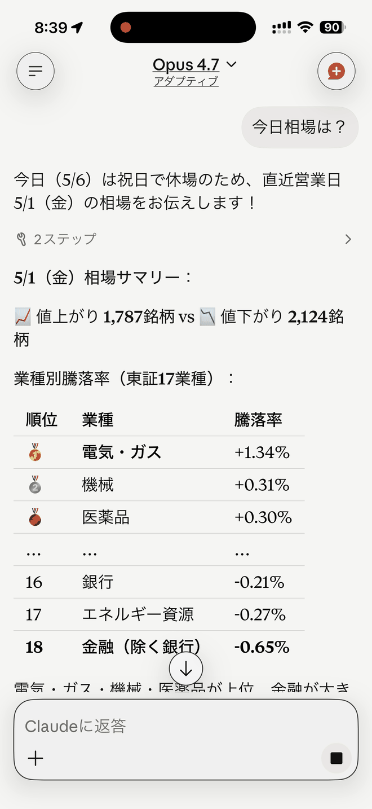
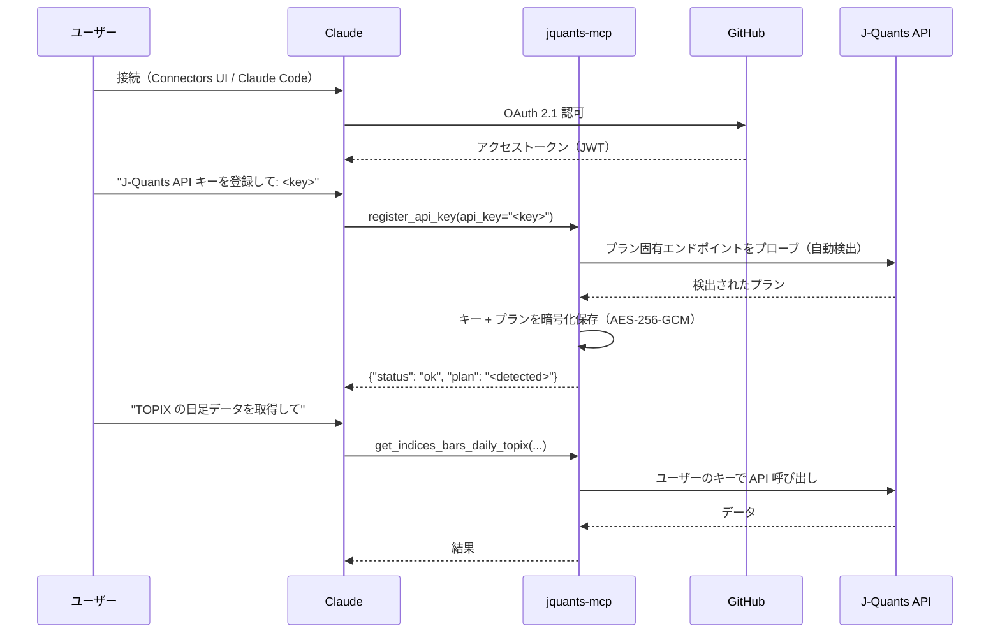
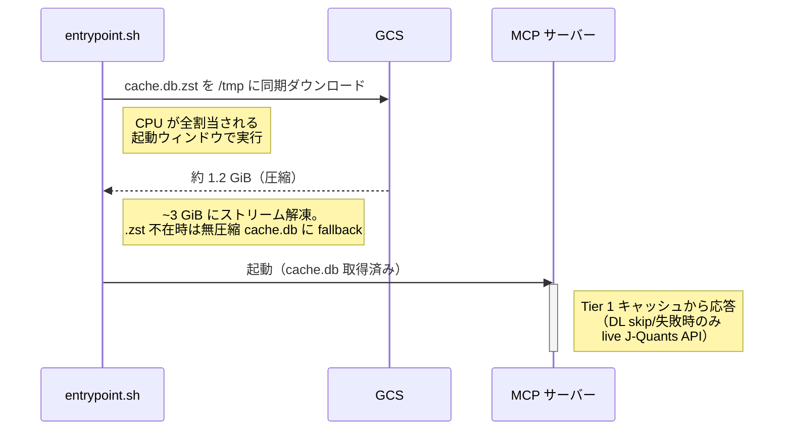
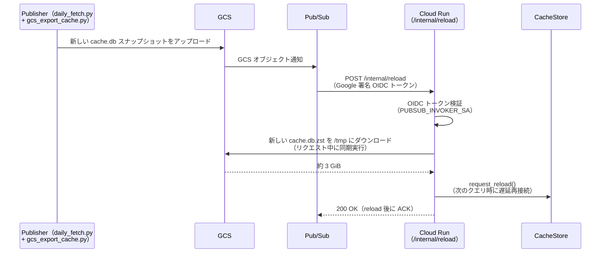
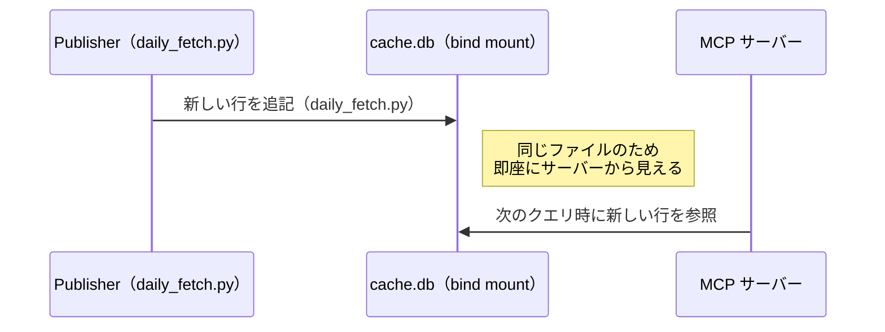

<!-- mcp-name: io.github.shigechika/jquants-mcp -->

# jquants-mcp

[English](README.md) | 日本語

[J-Quants API v2](https://jpx-jquants.com/) を使って日本株市場データを取得する [MCP (Model Context Protocol)](https://modelcontextprotocol.io/) サーバーです。

ユーザー向けドキュメントサイト: <https://shigechika.github.io/jquants-mcp/ja/>（5 分で始められる導入ガイド。英語版は [https://shigechika.github.io/jquants-mcp/](https://shigechika.github.io/jquants-mcp/)）。本 README は技術リファレンス（設定 schema、55 ツール全パラメータ表、デプロイ）です。

リリース履歴・変更履歴は [GitHub Releases](https://github.com/shigechika/jquants-mcp/releases) を参照してください。

デプロイ形態（stdio / Docker Compose / セルフホスト HTTP / Cloud Run）の選び方は [docs/deploy/README.ja.md](docs/deploy/README.ja.md) を参照。

## デモ

<p align="center">
  
</p>

Claude iPhone アプリ上で jquants-mcp ツールを呼び出した実際の出力（24秒ループ）：

- 業種別騰落率（東証17業種） — `get_sector_performance`
- 売買代金ランキング — `get_top_turnover_value`
- ローソク足チャート（SMA付き） — `get_candlestick_data`
- 決算ダイジェスト — `get_fins_summary`
- 5銘柄リターン比較 — `get_comparison_chart_data`

各フレームの静止画は [docs/screenshots/](docs/screenshots/) にあります。

## 特徴

- **55 の MCP ツール** — J-Quants API v2 全エンドポイント（22）+ マーケット概況・バリュエーション（11）+ オフライン screener（10）+ テクニカル指標（1）+ 単銘柄サマリー（1）+ 銘柄名検索・決算（カレンダー + 実績、3）+ チャートツール（2、JSON、オプション依存なし）+ サーバーユーティリティ（5）
- **2層 SQLite キャッシュ** — 時系列データは行レベル、その他はレスポンスレベル（TTL付き）
- **株式分割検知** — AdjFactor 変化時にキャッシュを自動無効化
- **レート制限** — プラン別スライディングウィンドウ（Free: 5回/分, Light: 60, Standard: 120, Premium: 500）
- **リトライ** — 429/5xx エラーに対する指数バックオフ
- **ページネーション** — 複数ページの透過的取得
- **プラン対応** — 全ツールを登録し、プラン制限時はわかりやすいエラーメッセージを返却

## 必要要件

- Python 3.10+
- [J-Quants API キー](https://jpx-jquants.com/)（Free プラン以上）

## インストール

```bash
# uv（推奨）
uv pip install jquants-mcp

# pip
pip install jquants-mcp
```

### ソースから

```bash
git clone https://github.com/shigechika/jquants-mcp.git
cd jquants-mcp
uv sync --dev
```

## 設定

設定は以下の優先順位で読み込まれます（後勝ち）:

1. `~/.jquants-api/jquants-api.toml` — API キーのみ（J-Quants 公式設定）
2. `~/.config/jquants-mcp/config.ini`（ユーザーグローバル）
3. `./config.ini`（カレントディレクトリ）
4. 環境変数（MCP クライアントや CLI から）

### API キー（ゼロコンフィグ）

[jquants-api-client](https://github.com/J-Quants/jquants-api-client-python) を既に利用している場合、`~/.jquants-api/jquants-api.toml` から API キーが自動読み込みされます。追加の設定は不要です。

### ブラウザログインで API キーを取得

```sh
jquants-mcp login
```

ブラウザで J-Quants（AWS Cognito、PKCE フロー）にログインし、成功したら API キーを `~/.config/jquants-mcp/config.ini`（mode 0600）に保存します。認証バックエンドは [公式 jquants-cli](https://github.com/J-Quants/jquants-cli) と同一です。保存済みキーの削除は `jquants-mcp logout`。

### config.ini

MCP 固有の設定（キャッシュ、クライアント動作）:

```ini
[jquants]
# cache_dir = ~/.cache/jquants-mcp
# base_url = https://api.jquants.com/v2

[client]
# max_retries = 5
# retry_base_delay = 1.0
# max_pages = 10

[server]
# ssl_certfile = /path/to/fullchain.pem
# ssl_keyfile = /path/to/privkey.pem
# bearer_token = <secret>
# encryption_key = <ランダムな秘密値>   # ユーザーごとの API キー保存を有効化（マルチユーザーモード）

[oauth]
# github_client_id = <GitHub OAuth App のクライアント ID>
# github_client_secret = <クライアントシークレット>
# base_url = https://mcp.example.com
# jwt_signing_key = <ランダムな秘密値>  # 省略可: 省略時は自動生成
# require_consent = true
```

### 環境変数

| 変数名 | 必須 | デフォルト | 説明 |
|---|---|---|---|
| `JQUANTS_API_KEY` | いいえ* | — | J-Quants API キー |
| `JQUANTS_API_TOML_PATH` | いいえ | `~/.jquants-api/jquants-api.toml` | J-Quants 公式設定ファイルのパス。macOS 26+ の launchd サンドボックス回避に使用（下記 [macOS launchd 注意](#macos-launchd-注意) 参照）|
| `JQUANTS_PLAN` | いいえ | 自動検出 | プラン: `free` / `light` / `standard` / `premium`（サーバー起動時に API キーから自動検出、明示設定はオーバーライド用） |
| `JQUANTS_CACHE_DIR` | いいえ | `~/.cache/jquants-mcp` | キャッシュディレクトリのパス |
| `JQUANTS_BASE_URL` | いいえ | `https://api.jquants.com/v2` | API ベース URL |
| `MAX_RETRIES` | いいえ | `5` | リクエスト失敗時の最大リトライ回数 |
| `RETRY_BASE_DELAY` | いいえ | `1.0` | 指数バックオフの基本遅延（秒） |
| `MAX_PAGES` | いいえ | `10` | ページネーション時の最大ページ数 |
| `SSL_CERTFILE` | いいえ | — | SSL 証明書ファイルのパス（HTTP トランスポート用） |
| `SSL_KEYFILE` | いいえ | — | SSL 秘密鍵ファイルのパス（HTTP トランスポート用） |
| `MCP_BEARER_TOKEN` | いいえ | — | HTTP 認証用の Bearer トークン |
| `GITHUB_CLIENT_ID` | いいえ | — | GitHub OAuth App のクライアント ID（GitHub OAuth 2.1 を有効化） |
| `GITHUB_CLIENT_SECRET` | いいえ | — | GitHub OAuth App のクライアントシークレット |
| `GOOGLE_CLIENT_ID` | いいえ | — | Google OAuth 2.0 クライアント ID（Google OAuth 2.1 を有効化） |
| `GOOGLE_CLIENT_SECRET` | いいえ | — | Google OAuth 2.0 クライアントシークレット |
| `OAUTH_PROVIDER` | いいえ | `github` | OAuth プロバイダー: `github` または `google` |
| `OAUTH_BASE_URL` | いいえ | — | サーバーの公開ベース URL（例: `https://mcp.example.com`） |
| `OAUTH_JWT_SIGNING_KEY` | いいえ | 自動 | JWT 署名用シークレット。省略時は起動ごとに自動生成 |
| `OAUTH_REQUIRE_CONSENT` | いいえ | `true` | ログインのたびに OAuth 同意画面を表示（`true`/`false`） |
| `MCP_ENCRYPTION_KEY` | いいえ | — | ユーザー API キーの AES-256-GCM 暗号化に使うパスフレーズ |
| `MCP_ENCRYPTION_KEY_PREVIOUS` | いいえ | — | 前世代の暗号化パスフレーズ — ローテーション中の dual-key 復号用。[secrets rotation runbook](docs/runbooks/secrets-rotation.md) 参照 |
| `RATE_LIMIT_PER_MINUTE` | いいえ | `60` | マルチユーザー時のユーザー別リクエスト上限（OAuth ユーザー単位） |
| `RATE_LIMIT_BURST` | いいえ | `20` | ユーザー別バースト許容量（トークンバケット容量） |
| `JQUANTS_ALLOWED_EMAILS` | いいえ | — | カンマ区切りの許可 email リスト。空 = 認証されたユーザー全員を許可（セルフホスト既定）。公開 Cloud Run で特定ユーザーのみに絞りたい場合に設定。未許可ユーザーには 403 相当のメッセージでセルフホストを案内 |

\* API キーは `~/.jquants-api/jquants-api.toml` から自動検出されます。上書きが必要な場合のみ `JQUANTS_API_KEY` を設定してください。

環境変数は `config.ini` と `jquants-api.toml` の両方を上書きします。普段使いの設定は `config.ini` や `jquants-api.toml` に任せ、MCP クライアント（Claude Desktop, Claude Code）からは `env` ブロックで必要な設定だけ渡すことができます。

### macOS launchd 注意

`jquants-mcp` を **macOS の LaunchAgent として常駐**させ、API キーを `~/.jquants-api/jquants-api.toml` から読み込む構成では、macOS 26 以降で起動時に **silent にサンドボックスへ block されて port を bind せず hang** する現象が発生します。launchd 配下のプロセスに適用される TCC サンドボックスが `$HOME` 直下の一部 dotfile（mode `600`）への `open()` を遮断するため、ログにも何も出ずに固まります。

回避策: toml をサンドボックス外の位置にコピーし、`JQUANTS_API_TOML_PATH` で指定:

```sh
sudo mkdir -p /usr/local/etc/jquants-mcp
sudo cp ~/.jquants-api/jquants-api.toml /usr/local/etc/jquants-mcp/jquants-api.toml
sudo chown "$USER":staff /usr/local/etc/jquants-mcp/jquants-api.toml
sudo chmod 600 /usr/local/etc/jquants-mcp/jquants-api.toml
```

LaunchAgent の plist の `EnvironmentVariables` dict に以下を追加:

```xml
<key>JQUANTS_API_TOML_PATH</key>
<string>/usr/local/etc/jquants-mcp/jquants-api.toml</string>
```

代替: `JQUANTS_API_KEY` を plist に直接設定する（簡単だが plist ファイルが Time Machine / iCloud にバックアップされるリスクあり）、もしくは `~/.config/jquants-mcp/config.ini` の `[jquants]` セクションに `api_key =` を直接書く（macOS のバージョンによっては `~/.config/` も block される可能性）。

Linux/systemd 等は影響を受けません。

## 認証

jquants-mcp は 4 つの認証モードに対応しています:

| モード | 用途 |
|---|---|
| なし | ローカル stdio または信頼済み LAN（シングルユーザー） |
| Bearer Token | HTTPS 経由のシングルユーザーリモートアクセス |
| GitHub OAuth 2.1 | マルチユーザー / Claude Desktop Connectors |
| Google OAuth 2.1 | Google アカウントによるマルチユーザーアクセス |

起動時に設定に基づいて自動的にモードが選択されます:

1. **Google OAuth 2.1** — `GOOGLE_CLIENT_ID`・`GOOGLE_CLIENT_SECRET`・`OAUTH_BASE_URL` がすべて設定され、`OAUTH_PROVIDER=google` の場合
2. **GitHub OAuth 2.1** — `GITHUB_CLIENT_ID`・`GITHUB_CLIENT_SECRET`・`OAUTH_BASE_URL` がすべて設定されている場合
3. **Bearer Token** — `MCP_BEARER_TOKEN`（または `config.ini` の `bearer_token`）が設定されている場合
4. **なし** — 認証なし（stdio トランスポートまたは信頼済み環境）

### GitHub OAuth 2.1

サーバーが OAuth 2.1 認可サーバーとして機能し、GitHub を上流 IdP（identity provider）として使用します。クライアントは GitHub のログイン画面にリダイレクトされ、サーバーが認可コードを署名済み JWT と交換してユーザーを識別します。

#### 1. GitHub OAuth App を作成する

1. **GitHub → Settings → Developer settings → OAuth Apps → New OAuth App** へ移動
2. 以下を入力:
   - **Application name**: `jquants-mcp`（任意の名前でも可）
   - **Homepage URL**: サーバーの公開ベース URL（例: `https://mcp.example.com`）
   - **Authorization callback URL**: `https://mcp.example.com/oauth/callback`
3. **Register application** をクリック後、**Generate a new client secret** でシークレットを生成
4. **Client ID** と生成した **Client secret** をコピーしておく

#### 2. サーバーを設定する

**環境変数で設定:**

```bash
export GITHUB_CLIENT_ID=Ov23liXXXXXXXXXXXXXX
export GITHUB_CLIENT_SECRET=<クライアントシークレット>
export OAUTH_BASE_URL=https://mcp.example.com      # 外部から到達可能な URL
export OAUTH_JWT_SIGNING_KEY=<ランダムな秘密値>    # 省略可: 省略時は自動生成
export MCP_ENCRYPTION_KEY=<ランダムな秘密値>       # ユーザーごとの API キー保存に必要
```

**`config.ini` で設定:**

```ini
[oauth]
github_client_id = Ov23liXXXXXXXXXXXXXX
github_client_secret = <クライアントシークレット>
base_url = https://mcp.example.com
# jwt_signing_key = <ランダムな秘密値>   # 省略可: 省略時は自動生成
# require_consent = true              # デフォルト: true

[server]
encryption_key = <ランダムな秘密値>    # ユーザーごとの API キー保存に必要
```

#### 3. OAuth 付きでサーバーを起動する

```bash
jquants-mcp -t streamable-http --port 8080 \
  --ssl-certfile /path/to/fullchain.pem \
  --ssl-keyfile /path/to/privkey.pem \
  --github-client-id <ID> \
  --github-client-secret <SECRET> \
  --oauth-base-url https://mcp.example.com
```

環境変数や `config.ini` で OAuth 設定が完了している場合、CLI フラグは省略可能です。起動時に自動的に OAuth が有効化されます。

| CLI オプション | 説明 |
|---|---|
| `--github-client-id` | GitHub OAuth App のクライアント ID |
| `--github-client-secret` | GitHub OAuth App のクライアントシークレット |
| `--oauth-base-url` | サーバーの公開ベース URL（リダイレクト URI の構築に使用） |

### Google OAuth 2.1

GitHub の代わりに Google を OAuth 2.1 の IdP として使用できます。ユーザーは Google のサインインページにリダイレクトされ、サーバーが認可コードを署名済み JWT と交換してユーザーを識別します。

#### 1. Google OAuth 2.0 クライアントを作成する

1. [Google Cloud Console](https://console.cloud.google.com/) → **API とサービス → 認証情報 → 認証情報を作成 → OAuth 2.0 クライアント ID** へ移動
2. **ウェブ アプリケーション** を選択し、以下を入力:
   - **Authorized JavaScript origins**: `https://mcp.example.com`
   - **Authorized redirect URIs**: `https://mcp.example.com/oauth/callback`
3. **作成** をクリックし、**クライアント ID** と **クライアントシークレット** をコピーする

#### 2. サーバーを設定する

**環境変数で設定:**

```bash
export GOOGLE_CLIENT_ID=<クライアント ID>
export GOOGLE_CLIENT_SECRET=<クライアントシークレット>
export OAUTH_PROVIDER=google
export OAUTH_BASE_URL=https://mcp.example.com
export MCP_ENCRYPTION_KEY=<ランダムな秘密値>    # ユーザーごとの API キー保存に必要
```

**`config.ini` で設定:**

```ini
[oauth]
google_client_id = <クライアント ID>
google_client_secret = <クライアントシークレット>
provider = google
base_url = https://mcp.example.com

[server]
encryption_key = <ランダムな秘密値>
```

### /settings Web UI

OAuth が有効な場合、`https://mcp.example.com/settings` でブラウザからAPIキーを登録できます。

1. ブラウザで `https://mcp.example.com/settings` を開く
2. **Sign in with GitHub**（`config.ini` で `provider = google` の場合は **Sign in with Google**）をクリック
3. 認証後、J-Quants API キーとプランを入力して **Save** をクリック

MCP クライアントなしでブラウザから直接 `register_api_key` 相当の操作が可能です。

### リバースプロキシ（パスプレフィックス）

`https://mcp.example.com/jquants-mcp/mcp` のようにパスプレフィックス配下で動かす場合、コード変更は不要で以下の 2 点だけ設定します。

**① リバースプロキシでプレフィックスをストリップ：**

Caddy：

```caddy
handle /jquants-mcp/* {
    uri strip_prefix /jquants-mcp
    reverse_proxy localhost:8080
}
```

nginx（番号付きバックリファレンスの脆弱性を避けるため named capture group を使用）：

```nginx
location /jquants-mcp/ {
    rewrite ^/jquants-mcp(?<path>/.*)$ $path break;
    proxy_pass http://localhost:8080;
}
```

**② `OAUTH_BASE_URL` をプレフィックス込みの公開 URL に設定：**

```bash
export OAUTH_BASE_URL=https://mcp.example.com/jquants-mcp
```

または `config.ini` で：

```ini
[oauth]
base_url = https://mcp.example.com/jquants-mcp
```

FastMCP はすべての OAuth エンドポイント（`/oauth/callback`、`/settings`、`/.well-known/oauth-authorization-server`）を `OAUTH_BASE_URL` から導出します。プレフィックス込みの公開 URL を設定することで、プロキシがプレフィックスをストリップした後も OAuth フローと settings ページが正しく動作します。

> **Google OAuth の注意：** Google Cloud Console で *Authorized JavaScript origins* に `https://mcp.example.com`、*Authorized redirect URIs* に `https://mcp.example.com/jquants-mcp/oauth/callback` を追加してください。

## マルチユーザーモード

GitHub OAuth 2.1 と `MCP_ENCRYPTION_KEY` を両方設定すると、**マルチユーザーモード**で動作します。認証された各ユーザーが自分の J-Quants API キーをサーバーに登録でき、データ取得ツールは自動的にそのキーを使用します。キャッシュは全ユーザーで共有され、レート制限はユーザーごとに独立します。

### ユーザーフロー



### マルチユーザーモード用ツール

| ツール | 必要条件 | 説明 |
|---|---|---|
| `register_api_key` | OAuth 2.1 + `MCP_ENCRYPTION_KEY` | J-Quants API キーを暗号化して登録 |
| `delete_api_key` | OAuth 2.1 + `MCP_ENCRYPTION_KEY` | 登録済みの API キーを削除 |

**キーの登録**（Claude に伝える）:

> 「J-Quants の API キー `<APIキー>` を登録して」

Claude が `register_api_key(api_key="...")` を呼び出します。サーバーはキーを使ってプラン固有のエンドポイントをプローブし、プラン（`free` / `light` / `standard` / `premium`）を自動検出して暗号化済みキーと一緒に保存します。手動でのプラン指定は不要です。以降のツール呼び出しは検出されたプランに基づいてレート制限・日付範囲制約を適用します。

### セキュリティ

- API キーは **AES-256-GCM**（認証付き暗号化）で暗号化して保存
- 暗号化キーは `MCP_ENCRYPTION_KEY` から **PBKDF2-HMAC-SHA256**（60 万回反復）で導出
- 暗号化のたびにランダムな 12 バイトのノンスを生成。同じキーを 2 回暗号化しても異なる暗号文になる
- 改ざん・切り詰めされた暗号文は復号前に検出して拒否

### 後方互換性

| 設定状態 | 動作 |
|---|---|
| 認証なし・`MCP_ENCRYPTION_KEY` なし | シングルユーザー: 全接続で共通の `JQUANTS_API_KEY` を使用 |
| Bearer Token のみ | シングルユーザー: 同上（HTTP 認証あり） |
| OAuth + `MCP_ENCRYPTION_KEY` なし | OAuth 認証あり、全ユーザーで共通の `JQUANTS_API_KEY` を使用 |
| OAuth + `MCP_ENCRYPTION_KEY` あり | フルマルチユーザー: ユーザーごとに独立した暗号化 API キー |

## 使い方

### Claude Code

`claude mcp add` で MCP サーバーを登録:

```bash
claude mcp add jquants-mcp -- jquants-mcp
```

ソースからインストールした場合:

```bash
claude mcp add jquants-mcp \
  -- /path/to/jquants-mcp/.venv/bin/jquants-mcp
```

`--scope`（`-s`）オプションで設定の保存先を指定できます:

| スコープ | 説明 | 設定ファイル |
|---|---|---|
| `local`（デフォルト） | 現在のプロジェクト、現ユーザーのみ | `.claude.json` |
| `project` | 現在のプロジェクト、チーム共有 | プロジェクトルートの `.mcp.json` |
| `user` | 全プロジェクト、現ユーザーのみ | `~/.claude.json` |

API キーは `~/.jquants-api/jquants-api.toml` から自動検出されます。上書きが必要な場合のみ `--env JQUANTS_API_KEY=...` を指定してください。

### AI エージェント向け Skills

プロジェクトに操作ガイド Skill をインストールします：

```bash
npx skills add shigechika/jquants-mcp
```

`skills/jquants-mcp-usage/SKILL.md` がプロジェクトに追加され、日々のワークフロー（ワンコールのブリーフィング・バリュースクリーニング・個別株の深掘り）に加えて、キャッシュ階層・プラン別日付制限・スクリーナーパターン・安全なキャッシュ管理に関する要点を Claude Code に提供します。ツールの説明を増やすことなく、使い方のコツを Claude Code に伝えられます。

### Claude Desktop

Claude Desktop の設定ファイルに追加:

| OS | 設定ファイル |
|---|---|
| macOS | `~/Library/Application Support/Claude/claude_desktop_config.json` |
| Windows | `%APPDATA%\Claude\claude_desktop_config.json` |
| Linux | `~/.config/Claude/claude_desktop_config.json` |

```json
{
  "mcpServers": {
    "jquants-mcp": {
      "command": "/path/to/jquants-mcp/.venv/bin/jquants-mcp"
    }
  }
}
```

サーバーは起動時に API キーからプランを自動検出するので、手動設定は不要です。検出結果をオーバーライドしたい場合や別の API キーを指定したい場合のみ `env` ブロックを追加してください。

> **注意:** Claude Desktop は限定的な `PATH`（`/usr/local/bin`, `/usr/bin` 等）しか持たないため、実行ファイルはフルパスで指定してください。

設定後、Claude Desktop を再起動してください。

### スタンドアロン（stdio）

```bash
jquants-mcp
```

### Streamable HTTP（リモートアクセス）

HTTP トランスポートで起動すると、他のマシンの MCP クライアントから接続できます:

```bash
jquants-mcp --transport streamable-http --port 8080
```

MCP エンドポイントは `http://<host>:8080/mcp` で公開されます。同一 LAN 内（または SSH トンネル経由）のクライアントから接続可能です。

**Claude Code（リモート接続）:**

```bash
claude mcp add jquants-mcp \
  --transport http http://192.0.2.1:8080/mcp
```

| オプション | デフォルト | 説明 |
|---|---|---|
| `--transport`, `-t` | `stdio` | トランスポート: `stdio` または `streamable-http` |
| `--host` | `127.0.0.1` | バインドアドレス |
| `--port`, `-p` | `8080` | ポート番号 |
| `--ssl-certfile` | — | SSL 証明書ファイルのパス |
| `--ssl-keyfile` | — | SSL 秘密鍵ファイルのパス |
| `--bearer-token` | — | Bearer トークン認証 |

### TLS + Bearer Token 認証

インターネット経由（IPv6 等）で安全にリモートアクセスするには、TLS 暗号化と Bearer token 認証を有効にします:

```bash
# Bearer トークンを生成
python3 -c "import secrets; print(secrets.token_hex(32))"

# TLS + 認証付きで起動
jquants-mcp -t streamable-http --port 8080 \
  --ssl-certfile /path/to/fullchain.pem \
  --ssl-keyfile /path/to/privkey.pem \
  --bearer-token <TOKEN>
```

または `config.ini` で設定（CLI フラグ不要）:

```ini
[server]
ssl_certfile = /path/to/fullchain.pem
ssl_keyfile = /path/to/privkey.pem
bearer_token = <TOKEN>
```

**Claude Code（TLS 付きリモート接続）:**

> **注意:** `claude mcp add --transport http --header "Authorization: Bearer ..."` はヘルスチェック時にヘッダーを送信しません（[claude-code#28293](https://github.com/anthropics/claude-code/issues/28293)）。ワークアラウンドとして [mcp-stdio](https://github.com/shigechika/mcp-stdio) 経由で接続してください:

```bash
pip install mcp-stdio  # または: uvx mcp-stdio

claude mcp add jquants-mcp -- \
  mcp-stdio https://192.0.2.1:8080/mcp --bearer-token <TOKEN>
```

### Claude Desktop（mcp-stdio 経由のリモート接続）

Claude Desktop は Streamable HTTP トランスポートに直接対応していません。[mcp-stdio](https://pypi.org/project/mcp-stdio/) を使って stdio とリモート MCP サーバーを中継できます:

```json
{
  "mcpServers": {
    "jquants-mcp": {
      "command": "mcp-stdio",
      "args": [
        "http://192.0.2.1:8080/mcp"
      ]
    }
  }
}
```

TLS + Bearer token 認証付きサーバーに接続する場合:

```json
{
  "mcpServers": {
    "jquants-mcp": {
      "command": "mcp-stdio",
      "args": [
        "https://192.0.2.1:8080/mcp",
        "--bearer-token", "<TOKEN>"
      ]
    }
  }
}
```

設定後、Claude Desktop を再起動してください。

### Claude Desktop Connectors（OAuth 2.1）

Claude Desktop の **Connectors** 機能を使うと、ネイティブな OAuth 2.1 認証フローが利用できます。Connectors パネルで **Connect** をクリックすると、自動的に GitHub のログイン画面にリダイレクトされます。トークンの手動管理は不要です。

> **必要条件:**
> - **HTTPS** でアクセス可能なサーバー（TLS 証明書が必要）
> - GitHub または Google OAuth 2.1 の設定済み（[GitHub OAuth 2.1](#github-oauth-21) / [Google OAuth 2.1](#google-oauth-21) を参照）
> - サーバー側で `MCP_ENCRYPTION_KEY` を設定済み（ユーザーごとの API キー保存に必要）

**サーバー側の起動コマンド:**

```bash
jquants-mcp -t streamable-http --port 8080 \
  --ssl-certfile /path/to/fullchain.pem \
  --ssl-keyfile /path/to/privkey.pem \
  --github-client-id <ID> \
  --github-client-secret <SECRET> \
  --oauth-base-url https://mcp.example.com
```

**`claude_desktop_config.json`（Connectors UI）:**

```json
{
  "mcpServers": {
    "jquants-mcp": {
      "type": "http",
      "url": "https://mcp.example.com/mcp"
    }
  }
}
```

初回接続時に GitHub OAuth のブラウザウィンドウが開きます。認証後はトークンが自動保存され、以降の接続はサイレントに行われます。

> **注意:** Claude Desktop の Connectors 対応（`"type": "http"` + OAuth）は段階的にロールアウト中です。まだ利用できない場合は、上記の **Claude Desktop（mcp-stdio 経由のリモート接続）** セクションをフォールバックとして使用してください。

## 提供ツール一覧

### 株式 (Equities) — 8ツール

| ツール名 | エンドポイント | 対応プラン | 説明 |
|---|---|---|---|
| `get_equities_master` | `/equities/master` | Free+ | 上場銘柄一覧 |
| `get_equities_bars_daily` | `/equities/bars/daily` | Free+ | 株価四本値（日足） |
| `get_equities_bars_minute` | `/equities/bars/minute` | Light+ | 株価分足 |
| `get_equities_bars_daily_am` | `/equities/bars/daily/am` | Premium | 前場四本値 |
| `get_equities_investor_types` | `/equities/investor-types` | Light+ | 投資部門別売買 |
| `get_equities_earnings_calendar` | `/equities/earnings-calendar` | Free+ | 決算発表予定（単一日・銘柄指定） |
| `get_earnings_this_week` | （キャッシュのみ） | Free+ | 期間内に決算発表する銘柄を日付別にグループ化（既定: 当日〜+7日） |
| `search_equities` | （キャッシュのみ） | Free+ | 銘柄名による逆引き検索（例: `"住友商事"` → `8053`） |

### 財務 (Financials) — 4ツール

| ツール名 | エンドポイント | 対応プラン | 説明 |
|---|---|---|---|
| `get_fins_summary` | `/fins/summary` | Free+ | 財務情報（四半期決算） |
| `get_fins_details` | `/fins/details` | Premium | 財務諸表詳細（BS/PL/CF） |
| `get_fins_dividend` | `/fins/dividend` | Premium | 配当金データ |
| `get_earnings_results_this_week` | （キャッシュのみ） | Free+ | 期間内に開示された決算実績を日付別にグループ化（既定: 直近7日）。売上/営利/純益/EPS + 進捗率 |

### 指数 (Indices) — 2ツール

| ツール名 | エンドポイント | 対応プラン | 説明 |
|---|---|---|---|
| `get_indices_bars_daily` | `/indices/bars/daily` | Standard+ | 指数四本値 |
| `get_indices_bars_daily_topix` | `/indices/bars/daily/topix` | Light+ | TOPIX 四本値 |

### デリバティブ (Derivatives) — 3ツール

| ツール名 | エンドポイント | 対応プラン | 説明 |
|---|---|---|---|
| `get_derivatives_bars_daily_futures` | `/derivatives/bars/daily/futures` | Premium | 先物四本値 |
| `get_derivatives_bars_daily_options` | `/derivatives/bars/daily/options` | Premium | オプション四本値 |
| `get_derivatives_bars_daily_options_225` | `/derivatives/bars/daily/options/225` | Standard+ | 日経225オプション四本値 |

### マーケット (Markets) — 6ツール

| ツール名 | エンドポイント | 対応プラン | 説明 |
|---|---|---|---|
| `get_markets_margin_interest` | `/markets/margin-interest` | Standard+ | 信用取引残高 |
| `get_markets_margin_alert` | `/markets/margin-alert` | Standard+ | 増担保規制情報 |
| `get_markets_short_ratio` | `/markets/short-ratio` | Standard+ | 業種別空売り比率 |
| `get_markets_short_sale_report` | `/markets/short-sale-report` | Standard+ | 空売り残高報告 |
| `get_markets_breakdown` | `/markets/breakdown` | Premium | 売買内訳データ |
| `get_markets_calendar` | `/markets/calendar` | Free+ | 取引カレンダー |

### バルクダウンロード (Bulk) — 2ツール

| ツール名 | エンドポイント | 対応プラン | 説明 |
|---|---|---|---|
| `get_bulk_list` | `/bulk/list` | Light+ | ダウンロード可能ファイル一覧 |
| `get_bulk_download_url` | `/bulk/get` | Light+ | 署名付きダウンロード URL 取得 |

### マーケット概況・バリュエーション (Market Overview & Valuation) — 11ツール

全上場銘柄を横断的にスキャンするキャッシュ専用ツール。追加 API コールなし。「今日の相場全体はどうだった？」「業種別の割安感は？」系のクエリ向け。

| ツール名 | 説明 |
|---|---|
| `detect_price_change` | 日次の値上がり/値下がり銘柄数サマリー（advance/decline ratio 含む） |
| `get_advance_decline_ratio` | 騰落レシオ（cumulative advance/decline ratio）を *period* 営業日累積で計算。デフォルト 25 日（120 超で過熱、70 未満で売られすぎ） |
| `get_top_movers` | 値上がり率/値下がり率ランキング（code + name + change_pct を返す） |
| `get_top_volume` | 出来高ランキング（株数ベース、code + name + volume + turnover_value を返す） |
| `get_top_turnover_value` | 売買代金ランキング（金額ベース）。`get_top_volume` と異なり高単価大型株が上位に来るので機関投資家フローの把握に最適 |
| `get_sector_performance` | 業種別騰落率。デフォルトは東証33業種、`sector_type="s17"` で17業種に切替 |
| `get_sector_briefing` | 業種別ブリーフィング（セクター別 PER/PBR/ROE 中央値）。最新 FY 財務データを分割補正して集計。PER 昇順（割安順）で返却。`sector_type="s17"` で17業種に切替可。 |
| `get_dividend_yield_ranking` | 高配当利回りランキング。`fins_summary` の `DivAnn`（年間配当額）と `AdjC`（調整後終値）から yield_pct = DivAnn / AdjC × 100 を計算。中間報告の空 DivAnn はスキップ |
| `get_valuation_ranking` | PER/PBR バリュエーションランキング。最新 FY の `EPS`/`BPS` と `AdjC`（分割補正）を全銘柄で結合し、デフォルトは PER 昇順（割安）20 件。赤字（EPS≤0、PER）・債務超過（BPS≤0、PBR）は除外。`metric`・`min_value`/`max_value`・`market`・`sector`・`disc_months` でフィルタ |
| `get_value_stock_screen` | 年安・割安・高配当・好決算スクリーニング（composite）— 全条件の AND: 52 週安値から `near_low_pct`% 以内（または当日 52 週新安値）+ PER < `max_per` かつ PBR < `max_pbr` + 予想配当利回り ≥ `min_yield`% + 増益予想（`NxFNp`/`FNP` > `NP`）。分割補正済み、REIT 除外、全キャッシュ処理。各銘柄に `margin_ratio`（信用倍率 = 信用買残/信用売残）と `margin_date` を付与（Standard 以上、なければ null） |
| `get_market_briefing` | 相場ブリーフィング（composite）— 値上がり/値下がり + 騰落レシオ 25 日 + 業種上位/下位 + 値上がりランキング + 売買代金 + screener ハイライト + バリュースクリーン + TOPIX 変化率を 1 回のコールで取得 |

### スクリーナー (Screener) — 10ツール

キャッシュ済の `equities_bars_daily` から直接計算するオフラインツール。追加 API コールなし、numpy / pandas 非依存の pure Python 実装。Claude と組み合わせた銘柄スクリーニング向け。

| ツール名 | 説明 |
|---|---|
| `detect_price_limit` | `UL`/`LL` フラグからストップ高/安の銘柄を検出。終値が高安と一致する場合は `limit_high_close` / `limit_low_close` も True になる。 |
| `compare_close_vs_vwap` | 日次 VWAP (`Va / Vo`) と終値を比較。単日または期間指定。 |
| `detect_52w_high_low` | 52 週ローリング（≈252 営業日）の高値・安値更新を判定。Yahoo / Bloomberg / TradingView 慣習。`new_high` / `new_high_close` / `new_low` / `new_low_close` の 4 シグナル＋確信度フィールド（`AdjO`・`close_vs_vwap`・`volume_ratio`・`volume_ratio_sessions`）。 |
| `detect_52w_high_low_range` | 上記の期間版（`date_from`〜`date_to`）。複数日分を単日ツールの繰り返しではなくこちらで取得。 |
| `detect_ytd_high_low` | 年初来高値・安値を判定。Kabutan / JPX / Yahoo!ファイナンス慣習。同じ 4 シグナル＋確信度フィールド（`AdjO`・`close_vs_vwap`・`volume_ratio`・`volume_ratio_sessions`）。 |
| `detect_ytd_high_low_range` | 上記の期間版（`date_from`〜`date_to`）。複数日分を単日ツールの繰り返しではなくこちらで取得。 |
| `detect_volume_surge` | 指定日の出来高が直近 20 営業日平均の `multiplier` 倍（既定 2.0）以上の銘柄を列挙。 |
| `detect_distribution_days` | TOPIX を市場指標、東証全銘柄の売買代金合計（`SUM(Va)`）を出来高代替として、ディストリビューションデイ（機関投資家の売り圧力）を検出。TOPIX の日次リターンが 20 日ローリング平均から `sigma_multiplier` σ（既定 2.0）以上下落した日をディストリビューションデイとし、`window_sessions`（既定 25）日間に 4 日以上でトレンド悪化警告を発する（IBD — Investor's Business Daily、ディストリビューションデイ手法を開発した米国の投資専門紙 — のメソッドを TOPIX 向けに校正）。各エントリには `volume_confirmed`（当日の市場売買代金が前日を上回ったか）が含まれる。 |
| `detect_follow_through_day` | 新しい上昇トレンドを確認するフォロースルーデイを検出。`rally_start`（安値・反転日 = セッション 1）から 4 日目以降に TOPIX が 20 日ローリング平均から `sigma_multiplier` σ（既定 2.0）以上上昇し、かつ市場売買代金が前日を上回った日がフォロースルーデイ。`rally_start` に反転日を渡し、シグナルが出るまで各日付でチェックする。 |

### 単銘柄ブリーフィング (Single Stock Briefing) — 1ツール

キャッシュ済みデータから単一銘柄の一覧表を組み立てるキャッシュ専用ツール。追加 API コールなし。

| ツール名 | 説明 |
|---|---|
| `get_stock_briefing` | 単銘柄ブリーフィング（株式ブリーフィング）: 最新株価（終値・変化率・出来高・OHLC）、直近 FY 財務（売上・営業利益・純利益）、バリュエーション指標（PER・PBR・ROE・EPS・BPS・配当利回り）を 1 回で返す。すべて分割調整済み。EPS ≤ 0（赤字期）は PER・ROE を null、開示日が 18 ヶ月超の DivAnn は配当利回りを null とする。 |

### テクニカル指標 (Technical Indicators) — 1ツール

キャッシュ済みバーから純 Python で SMA / Bollinger Bands / RSI を計算。キャッシュにない銘柄は J-Quants API にフォールバックして結果を保存。

| ツール名 | 説明 |
|---|---|
| `get_technical_indicators` | 単一銘柄の SMA（5/25/75）・Bollinger Bands（bb20、±2σ 標本標準偏差）・RSI（rsi14、Wilder 平滑化）を数値で返す。「終値は SMA25 の上？」「RSI は過熱していないか？」をチャートを描かずに確認できる。すべて分割調整済み終値（AdjC）使用。ウォームアップ不足の値は `null`。 |

> **チャートへの RSI 描画**: RSI サブパネルは現時点で未対応です。RSI 数値は `get_technical_indicators` をご利用ください。

### チャートツール (Charts) — 2ツール

どちらも JSON 形式で返却（オプション依存なし、常時登録）。React artifact / Plotly 向けの構造化データ。

| ツール名 | 説明 |
|---|---|
| `get_candlestick_data` | 単一銘柄の OHLCV + インジケーターデータを JSON parallel arrays で返却。`dates`・`ohlcv`・`indicators`（SMA / Bollinger）・`lock_days`・`earnings_dates` を含む。デフォルト: 直近91日、`sma5` + `sma25` オーバーレイ。 |
| `get_comparison_chart_data` | 複数銘柄の時系列データを JSON wide-format で返却（最大10銘柄）。`mode="return_pct"`（デフォルト）は各系列を最初のバーで 0% に正規化、`mode="price"` は調整済み終値。 |

`get_candlestick_data` のインジケーターオプション:

- **インジケーター**: `volume`, `sma5`, `sma20`, `sma25`, `sma60`, `sma75`, `sma200`, `bb20`（20日 Bollinger Band。`bb20_upper` / `bb20_mid` / `bb20_lower` に展開）
- **分割調整**: デフォルト `adjusted=True`、`False` で raw OHLC

### ユーティリティ — 5ツール

| ツール名 | 必要条件 | 説明 |
|---|---|---|
| `health_check` | — | サーバー稼働状態・API キー設定確認 |
| `cache_status` | — | キャッシュ統計情報 |
| `cache_clear` | — | キャッシュクリア |
| `register_api_key` | OAuth 2.1 | J-Quants API キーを暗号化して登録（マルチユーザーモード） |
| `delete_api_key` | OAuth 2.1 | 登録済みの J-Quants API キーを削除 |

## キャッシュ

2層構造の SQLite キャッシュを使用しています:

- **Tier 1（行レベル）**: 時系列データを日付×コードで管理。増分取得・株式分割検知（AdjFactor 比較）に対応。
  - `equities_bars_daily`, `equities_master`, `fins_summary`, `indices_bars_daily_topix`, `investor_types`, `markets_margin_interest`, `markets_margin_alert`, `markets_short_ratio`, `markets_breakdown`, `markets_calendar`
- **Tier 2（レスポンスレベル）**: API レスポンス全体を TTL 付きでキャッシュ（6h / 24h / 7d）。

キャッシュの保存先はデフォルトで `~/.cache/jquants-mcp/cache.db` です。

**過去データをフル取得した後の想定ディスク使用量**（概算値、市場データの取得可能範囲により変動）:

| プラン | 保持期間 | 概算サイズ |
|---|---|---|
| Free | 2 年 | ~500 MB |
| Light | 5 年 | ~2.9 GB |
| Standard | 10 年 | ~3.5 GB |
| Premium | 全期間 | ~4 GB+ |

### バルクデータ一括取得

`scripts/bulk_fetch_all.py` は J-Quants Bulk API から CSV データを一括ダウンロードし、SQLite キャッシュにインポートするスクリプトです。過去データを効率的にローカルキャッシュに蓄積できます。

```bash
# プランに応じた全データを取得
uv run python scripts/bulk_fetch_all.py

# 特定のエンドポイントのみ取得
uv run python scripts/bulk_fetch_all.py --endpoints fins_summary topix margin_interest

# ドライラン — ファイル一覧とサイズのみ表示
uv run python scripts/bulk_fetch_all.py --dry-run
```

プラン別のレート制限（例: Light は 60 req/min）を遵守し、429 エラー時は自動リトライします。全履歴データの取得には**約 1 時間**かかります。進捗は `health_check` で確認できます。

### CSV インポート

CSV サイドロードスクリプト（`import_csv_to_cache.py`）はこのキャッシュにデータを投入する publisher パイプライン側で管理されています。独自パイプラインを構築する場合は、`src/jquants_mcp/cache/schema.py` で定義されたスキーマに従って `equities_bars_daily` / `equities_master` テーブルに直接 INSERT することでサイドロードできます。

### 日次データ取得

`scripts/daily_fetch.py` は `jquantsapi.ClientV2` で追加データを取得し、SQLite キャッシュに直接投入するスクリプトです。外部の日次パイプライン（cron やシェルスクリプト）から呼び出す想定です。

`~/.config/jquants-mcp/config.ini`（または `JQUANTS_PLAN` 環境変数）からプランを読み取り、取得対象を自動決定します:

| プラン | 取得対象 |
|---|---|
| Free | `fins_summary`（決算サマリー）、`earnings_cal`（決算発表予定） |
| Light | + `topix`（TOPIX 日足）、`investor_types`（投資部門別売買動向） |
| Standard | + `short_ratio`（業種別空売り比率）、`margin_interest`（信用取引残高）、`margin_alert`（増担保規制情報）、`short_sale_report`（空売り残高報告） |
| Premium | + `breakdown`（売買内訳） |

```bash
# プランに応じた全データ取得
python3 scripts/daily_fetch.py

# 特定のエンドポイントのみ取得
python3 scripts/daily_fetch.py --topix --investor-types

# 取引カレンダーを取得
python3 scripts/daily_fetch.py --calendar

# Markets 系の過去データをバックフィル（過去N日分）
python3 scripts/daily_fetch.py --backfill 90

# キャッシュ DB パスを指定
python3 scripts/daily_fetch.py --db /path/to/cache.db
```

権限エラー（403）は graceful にスキップし、次のエンドポイントに進みます。

### キャッシュ健全性チェック

`scripts/verify_cache_completeness.py` はローカルキャッシュを監査し、現在のプランに対してどのテーブルが最新・古い・欠落しているかをレポートします。

```bash
# 簡易チェック（テキスト出力）
uv run python scripts/verify_cache_completeness.py

# CI / 監視向けの JSON 出力
uv run python scripts/verify_cache_completeness.py --output json

# 日付単位の取得漏れを検出（取得株数が異常に少ない日を検知）
uv run python scripts/verify_cache_completeness.py --check-gaps

# --auto-fix が修復する内容を API 呼び出しなしで確認
uv run python scripts/verify_cache_completeness.py --check-gaps --auto-fix --dry-run

# 取得漏れ日を自動再フェッチ
uv run python scripts/verify_cache_completeness.py --check-gaps --auto-fix
```

終了コード: `0` = 全テーブル正常、`1` = 古いテーブルまたは欠落あり、`2` = 致命的エラー（DB 読み取り不可）。

プランは API キーから自動検出されます（`daily_fetch.py` と同じプローブ）。`--plan <plan>` で上書き可能。`JQUANTS_PLAN` 環境変数でも指定できます（自動検出をスキップ）。

プランダウングレード前に現在カバーされているデータがフェッチ済みか確認する用途や、サイレントなフェッチ失敗を早期に発見する定期チェックとして活用できます。

## Cloud Run デプロイ

このサーバーは [Google Cloud Run](https://cloud.google.com/run) にデプロイできます。状態管理は 2 つのマネージドサービスに分離されています:

- **`cache.db`** — セルフホストサーバー（`scripts/daily_fetch.py` / `scripts/bulk_fetch_all.py` + `scripts/gcs_export_cache.py` を cron/launchd/systemd 等で日次実行）が GCS バケットに publish したスナップショットを、Cloud Run 起動時に `/tmp`（tmpfs）にダウンロード。Cloud Run は読み込みのみで、GCS に書き戻しません。
- **`users` / `oauth_state`** — Firestore（Native モード）に保存。強整合性かつマルチライター安全なので、Cloud Run は SQLite 書き込み競合を気にせず水平スケール可能です。

詳細は下記 [GCS と Firestore の連携](#gcs-と-firestore-の連携) を参照してください。

> fork して自分の GCP にデプロイする手順（WIF / OAuth クライアント / カスタムドメイン / Claude モバイル接続 / allowlist）は [docs/deploy/gcp.md](docs/deploy/gcp.md) を参照。以下のセクションは要点のサマリで、step-by-step はデプロイガイドが正本です。

### 前提条件

- [Google Cloud SDK](https://cloud.google.com/sdk/docs/install)
- `cache.db` のリードオンリースナップショットを保持する GCS バケット（セルフホストサーバーが更新）
- Firestore（Native モード）がプロジェクトで有効化されていること（per-user API キーと OAuth セッション状態の保存用）
- 以下の権限を持つサービスアカウント:
  - GCS バケットに対する `roles/storage.objectViewer`（`cache.db` 読み取り専用）
  - プロジェクトに対する `roles/datastore.user`（Firestore 読み書き）
  - API キーを Secret Manager で管理する場合は `roles/secretmanager.secretAccessor`

### GCS バケットの作成

```bash
gcloud storage buckets create gs://YOUR_BUCKET \
  --location asia-northeast1
```

### Firestore の有効化

```bash
gcloud firestore databases create \
  --location=us-west1 \
  --type=firestore-native
```

### デプロイ

推奨経路はリポジトリを fork し、[.github/workflows/cd.yml](.github/workflows/cd.yml) の GitHub Actions CD ワークフローを利用する方法です。このワークフローは正しいフラグ（メモリ、CPU、環境変数、シークレット）付きで `gcloud run deploy --source .` を呼び出し、本番デプロイの唯一の真実源（single source of truth）になります。手動で `gcloud run services update` を実行すると次回の CD で上書きされるので避けてください。

手動で一度だけデプロイしたい場合（fork のテスト等）は、同じコマンドをローカルで実行します:

```bash
gcloud run deploy jquants-mcp \
  --project "${PROJECT_ID}" \
  --region "${REGION}" \
  --source . \
  --execution-environment gen2 \
  --memory 8Gi \
  --cpu 2 \
  --cpu-boost \
  --max-instances 3 \
  --set-env-vars "GCS_BUCKET=YOUR_BUCKET,JQUANTS_CACHE_DIR=/tmp" \
  --set-secrets "JQUANTS_API_KEY=jquants-api-key:latest"
```

メモリサイジングの指針は下記 [メモリ要件](#メモリ要件) を参照してください。

### 環境変数

| 変数 | 必須 | デフォルト | 説明 |
|---|---|---|---|
| `GCS_BUCKET` | はい | — | `cache.db` スナップショットを保持する GCS バケット名 |
| `GCS_PREFIX` | いいえ | `jquants-mcp/` | バケット内のオブジェクトキープレフィックス |
| `JQUANTS_CACHE_DIR` | いいえ | `/tmp` | `cache.db` を展開するローカルディレクトリ（Cloud Run では tmpfs） |
| `PORT` | いいえ | `8000` | HTTP ポート（Cloud Run が自動設定） |
| `JQUANTS_API_KEY` | はい | — | J-Quants API キー（Secret Manager 推奨） |
| `JQUANTS_PLAN` | いいえ | 自動検出 | プラン: `free` / `light` / `standard` / `premium`（API キーから自動検出、明示設定はオーバーライド） |
| `MCP_BEARER_TOKEN` | いいえ | — | HTTP 認証用 Bearer トークン（単一ユーザーモードのみ） |
| `PUBSUB_INVOKER_SA` | いいえ | — | Pub/Sub push 認証用サービスアカウントメール。設定時は `/internal/reload` エンドポイントで Google 署名 OIDC トークンを検証。Pub/Sub 自動リロードを使う場合に必須。 |
| `PUBSUB_AUDIENCE` | いいえ | リクエスト URL | OIDC 検証時の audience（デフォルトはリクエスト URL） |
| `GOOGLE_CLOUD_PROJECT` | はい | — | GCP プロジェクト ID。Firestore（ユーザー DB）および Secret Manager アクセスに必須。CD ワークフローで `vars.GCP_PROJECT` 経由で設定。 |
| `OAUTH_PROVIDER`, `OAUTH_BASE_URL`, `GOOGLE_CLIENT_ID`, `GOOGLE_CLIENT_SECRET`, … | いいえ | — | マルチユーザーモード時の OAuth 設定 |

Firestore は Cloud Run サービスアカウントの Application Default Credentials を使います。

### GCS と Firestore の連携

Cloud Run デプロイはコンテナ内 SQLite セットではなく、2 つのマネージドストアに依存します:

| データ | 保存先 | アクセスモード |
|---|---|---|
| `cache.db`（市場データ） | GCS オブジェクト、起動時に `/tmp/cache.db` へ展開 | Cloud Run からは読み取り専用 |
| `users`（ユーザーごとの暗号化 J-Quants API キー） | Firestore `users` コレクション | 読み書き |
| `oauth_state`（OAuth セッション・PKCE 検証・動的クライアント登録） | Firestore `oauth_state` コレクション | 読み書き |

`cache.db` はセルフホストの publisher（`scripts/daily_fetch.py` / `scripts/bulk_fetch_all.py` + `scripts/gcs_export_cache.py` を cron/launchd/systemd 等で日次実行）が所有しており、日次バッチで GCS に最新スナップショットを publish します。Cloud Run は GCS に書き戻しません。

#### 起動フロー



注意点:
- `cache.db` は**コンテナ起動中に同期ダウンロード**され、サーバーがポートを bind する前に完了します。zstd 圧縮された `cache.db.zst`（wire 上 約 1.2 GiB、~3 GiB にストリーム解凍）として publish されます — Cloud Run インスタンスの GCS 読み込み帯域（~60 MB/s）がボトルネックのため。`.zst` 不在時は無圧縮 `cache.db` に fallback します。Cloud Run のリクエストベース課金では CPU がリクエスト間で ~0 に絞られるため、サーバー起動「後」に始めた DL は CPU 枯渇で完走しません。起動ウィンドウは CPU 全割当（+ `--cpu-boost`）です。トレードオフは cold-start が長くなる点で、scale-to-zero 後の最初のリクエストは DL を待ちます。
- DL が失敗しても起動は続行し、サーバーは live J-Quants API で応答します（遅く、rate limit 対象）。その間 `cache_status` は最小ペイロード（`db_path` + `plan` のみ）を返します。
- Firestore は強整合性のため、複数の Cloud Run インスタンスが同時稼働してもデータ競合は発生しません。`maxScale: 1` のような制約は不要で、必要に応じて水平スケール可能です。

#### 日次キャッシュ更新

起動後の `cache.db` は publisher が日次で更新します。更新のトリガー方法はデプロイ先によって異なります。

**Cloud Run — Pub/Sub push**

Cloud Run のマルチインスタンスモデルでは SIGHUP を特定プロセスへ確実に届けられないため、代わりに Pub/Sub push で `/internal/reload` エンドポイントを呼び出します。サーバーは ACK を返す前に GCS から新しい `cache.db` を**同期的に再ダウンロード**します（リクエストベース課金は CPU をリクエスト間で絞るため、push リクエスト中の CPU で DL を完走させる必要がある）。push subscription の ack deadline は DL 時間より長くする必要があります。[`ops/pubsub/setup.md`](ops/pubsub/setup.md) 参照。



`PUBSUB_INVOKER_SA` には Pub/Sub が OIDC トークンの署名に使うサービスアカウントのメールアドレスを設定します。`PUBSUB_AUDIENCE` はデフォルトでリクエスト URL になるため、通常は設定不要です。

**Docker Compose — ファイル直接更新**

`GCS_BUCKET` を設定しない場合、`cache.db` はローカルファイルシステム（bind mount）に置きます。`daily_fetch.py` は同じファイルに直接行を追記するため、SQLite の通常の concurrent access 処理により、サーバーは次のクエリ時に新しいデータを自動的に参照します。明示的なシグナルは不要です。



**ローカルプロセス（launchd / systemd） — SIGHUP**

MCP サーバーをローカルサービス（macOS の launchd 等）として運用している場合、SIGHUP で遅延再接続をトリガーできます。`bulk_fetch_all.py` で `cache.db` を丸ごと置き換えた後などに有用です:

```bash
# macOS launchd
launchctl kill SIGHUP system/<YOUR_LAUNCHD_LABEL>
# または直接
kill -HUP <MCP_PID>
```

#### トラブルシューティング

**起動時の権限エラー（`403 Forbidden` または `storage.objects.get denied`）:**

```bash
gcloud storage buckets get-iam-policy gs://YOUR_BUCKET \
  --format="table(bindings.role, bindings.members)"
```

サービスアカウントにバケットへの `roles/storage.objectViewer` が必要です。下記 [IAM の設定](#iam-の設定) を参照してください。

**Firestore 権限エラー:**

```bash
gcloud projects get-iam-policy "${PROJECT_ID}" \
  --flatten="bindings[].members" \
  --filter="bindings.members:serviceAccount:jquants-mcp@*"
```

サービスアカウントにプロジェクトに対する `roles/datastore.user` が必要です。

**`cache_status` が `db_path` と `plan` のみを返す（行数が出ない）:**

`cache.db` のバックグラウンドダウンロードが未完了です。コールドスタート直後の 1〜2 分は正常動作です。ログに `cache.db download complete; signaling MCP server to reload` が出ていれば完了しています。

**初回デプロイ時に `cache.db` が GCS に存在しない:**

空キャッシュフォールバックモードはありませんが、サーバーは引き続き J-Quants API から直接データを取得して応答します。Tier 1 キャッシュを有効化するには、セルフホストサーバーで温めた `cache.db` のスナップショットを GCS にアップロードしてください（下記 [cache.db の初回アップロード](#cachedb-の初回アップロード) を参照）。

### IAM の設定

```bash
SA="jquants-mcp@${PROJECT_ID}.iam.gserviceaccount.com"

# サービスアカウントの作成
gcloud iam service-accounts create jquants-mcp \
  --display-name "jquants-mcp Cloud Run SA"

# GCS の cache.db スナップショットへの読み取り専用アクセス
gcloud storage buckets add-iam-policy-binding gs://YOUR_BUCKET \
  --member "serviceAccount:${SA}" \
  --role "roles/storage.objectViewer"

# Firestore の users / oauth_state コレクションへのアクセス
gcloud projects add-iam-policy-binding "${PROJECT_ID}" \
  --member "serviceAccount:${SA}" \
  --role "roles/datastore.user"

# Secret Manager アクセス（JQUANTS_API_KEY 等を Secret Manager で管理する場合）
gcloud projects add-iam-policy-binding "${PROJECT_ID}" \
  --member "serviceAccount:${SA}" \
  --role "roles/secretmanager.secretAccessor"
```

Note: `cache.db` を publish するセルフホストサーバーが別のサービスアカウントを使っている場合、書き込み権限はそちら側にのみ必要です。Cloud Run サービスアカウントは viewer のみで構いません。

### cache.db の初回アップロード

Cloud Run は `cache.db` をリードオンリースナップショットとして読み込みます。キャッシュを温めたセルフホストサーバーから初回デプロイ前にスナップショットを publish してください:

```bash
gcloud storage cp ~/.cache/jquants-mcp/cache.db \
  gs://YOUR_BUCKET/jquants-mcp/cache.db \
  --no-gzip-in-flight
```

> **重要:** 大きなファイルのアップロード時は parallel composite upload（デフォルト有効）を必ず無効化してください。SQLite ファイルが壊れます（再構成されたオブジェクトが有効な DB ページレイアウトにならないため）。publish ホスト側で以下を設定します:
>
> ```bash
> gcloud config set storage/parallel_composite_upload_enabled False
> ```

Firestore 側の事前セットアップは不要です。サーバーが初回書き込み時に `users` と `oauth_state` コレクションを自動作成します。

### メモリ要件

Cloud Run は `cache.db` を `/tmp`（tmpfs = RAM）に展開します。したがってメモリ上限は以下を収容できる必要があります:

- `cache.db` のサイズ（現状 約 3 GiB）
- Python runtime + fastmcp + sqlite + httpx のオーバーヘッド（~300 MiB）
- リクエスト処理中の JSON シリアライズ用ヘッドルーム

本番の現行サイジング（[.github/workflows/cd.yml](.github/workflows/cd.yml) 参照）は `--memory 8Gi --cpu 2 --max-instances 3` で、CPU スロットリングはデフォルト（有効）のままです。CPU スロットリング有効＝**リクエストベース課金**で、リクエスト処理中だけ課金されるため、ほぼ idle な本サービスを月次フリーティア内に収められます。`--no-cpu-throttling` を付けるとインスタンスが生存している全秒（idle キープアライブ含む）が課金対象になります。**リクエストベース課金ではメモリもアクティブ処理中のみ課金**されるため、上限を上げても実質無料（フリーティア内）です。4 GiB を超えるメモリ割り当てには Cloud Run gen2 が必要で、かつ >4 GiB は ≥2 vCPU が強制されます（2 vCPU の上限は 8 GiB）。

メモリが 8 GiB なのは、cache reload 時に `/tmp`（tmpfs = RAM）が一時的に **約 2× `cache.db`** を保持するためです。新スナップショットを一時ファイルへダウンロードする間、現行 `cache.db` がまだマップされたままで、完了後にアトミックに置き換えます。約 3 GiB のスナップショットではこのピーク（約 6 GiB）に Python/SQLite の RSS が乗ると 6 GiB 上限を超え、tmpfs 書き込みが **SIGBUS**（`Container terminated on signal 7` として観測）で失敗します。そのため上限は 8 GiB です。`cache.db` が大きく成長した場合はさらに上限を上げてください（かつ ≥2 vCPU を維持。>8 GiB は ≥4 vCPU 必要）。

詳細は [README.md](README.md) の "Cloud Run Deployment" セクションを参照してください。

## 運用

Cloud Run デプロイの障害対応 runbook:

- [OOM / メモリ圧迫](docs/runbooks/oom.md)
- [5xx スパイク](docs/runbooks/5xx-spike.md)
- [Firestore 障害 / クォータ](docs/runbooks/firestore-outage.md)
- [cache.db 欠損 / ダウンロード失敗](docs/runbooks/cache-db-missing.md)
- [OAuth ループ / 401 継続](docs/runbooks/oauth-loop.md)
- [Firestore リストア](docs/runbooks/firestore-restore.md)
- [Secrets ローテーション](docs/runbooks/secrets-rotation.md)

アラートポリシーは [`ops/alerts/`](ops/alerts/) にあり、各ポリシーの documentation から対応する runbook にリンクしています。

[災害復旧ポスチャ](docs/dr.md) に現行のシングルリージョン構成、RTO/RPO、未実施のスタンバイリージョン復旧手順を記載しています。

Service Level Objectives（可用性・レイテンシ目標とエラーバジェット方針）は [docs/slo.md](docs/slo.md) にあります。

## 開発

```bash
# 開発用依存パッケージのインストール
uv sync --dev

# テスト実行
uv run pytest -v

# リント
uv run ruff check src/ tests/

# フォーマット
uv run ruff format src/ tests/
```

## 免責事項

本ソフトウェア（jquants-mcp）は [J-Quants API v2](https://jpx-jquants.com/) から取得した日本株データを Claude 等の MCP クライアントで利用するための技術ツールです。投資判断のための参考情報を提供するものであり、以下の点にご留意ください：

- 本ソフトウェアおよびその出力は **投資助言・推奨を行うものではありません**。
- 表示される情報の正確性・完全性・適時性について保証するものではありません。
- **投資判断は利用者ご自身の責任** において行ってください。
- 過去の実績は将来の運用成果を保証するものではありません。
- 本ソフトウェアの作者は金融商品取引業者の登録を受けていません。
- データソースである J-Quants の[利用規約](https://jpx-jquants.com/)・利用条件に従ってください。
- 本ソフトウェアの利用により生じた損害について、作者は一切の責任を負いません。

## ライセンス

[MIT](LICENSE)
