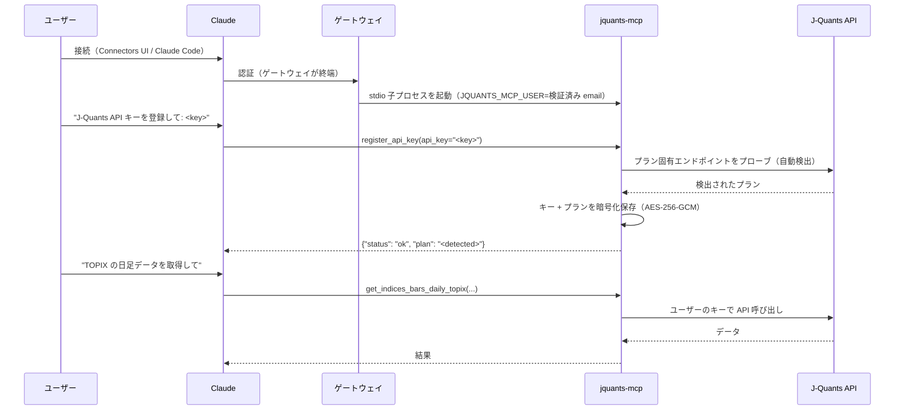
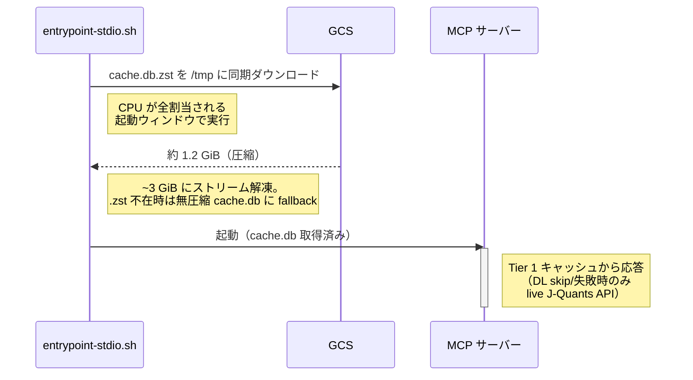

<!-- mcp-name: io.github.shigechika/jquants-mcp -->

# jquants-mcp

[English](README.md) | 日本語

[J-Quants API v2](https://jpx-jquants.com/) を使って日本株市場データを取得する [MCP (Model Context Protocol)](https://modelcontextprotocol.io/) サーバーです。

ユーザー向けドキュメントサイト: <https://shigechika.github.io/jquants-mcp/ja/>（5 分で始められる導入ガイド。英語版は [https://shigechika.github.io/jquants-mcp/](https://shigechika.github.io/jquants-mcp/)）。本 README は技術リファレンス（設定 schema、55 ツール全パラメータ表、デプロイ）です。

リリース履歴・変更履歴は [GitHub Releases](https://github.com/shigechika/jquants-mcp/releases) を参照してください。

デプロイ形態（stdio / Docker Compose / ゲートウェイ経由のセルフホスト / Cloud Run）の選び方は [docs/deploy/README.ja.md](docs/deploy/README.ja.md) を参照。

## デモ

<p align="center">
  
</p>

Claude iPhone アプリ上で jquants-mcp ツールを呼び出した実際の出力（24秒ループ）：

- 業種別騰落率（東証17業種） — `get_sector_performance`
- 売買代金ランキング — `get_top_turnover_value`
- ローソク足チャート（SMA付き） — `get_candlestick_data`
- 決算ダイジェスト — `get_fins_summary`
- 5銘柄リターン比較 — `get_comparison_chart_data`

各フレームの静止画は [docs/screenshots/](docs/screenshots/) にあります。

## 特徴

- **55 の MCP ツール** — J-Quants API v2 全エンドポイント（22）+ マーケット概況・バリュエーション（11）+ オフライン screener（10）+ テクニカル指標（1）+ 単銘柄サマリー（1）+ 銘柄名検索・決算（カレンダー + 実績、3）+ チャートツール（2、JSON、オプション依存なし）+ サーバーユーティリティ（5）
- **2層 SQLite キャッシュ** — 時系列データは行レベル、その他はレスポンスレベル（TTL付き）
- **株式分割検知** — AdjFactor 変化時にキャッシュを自動無効化
- **レート制限** — プラン別スライディングウィンドウ（Free: 5回/分, Light: 60, Standard: 120, Premium: 500）
- **リトライ** — 429/5xx エラーに対する指数バックオフ
- **ページネーション** — 複数ページの透過的取得
- **プラン対応** — 全ツールを登録し、プラン制限時はわかりやすいエラーメッセージを返却

## 必要要件

- Python 3.10+
- [J-Quants API キー](https://jpx-jquants.com/)（Free プラン以上）

## インストール

```bash
# uv（推奨）
uv pip install jquants-mcp

# pip
pip install jquants-mcp
```

### ソースから

```bash
git clone https://github.com/shigechika/jquants-mcp.git
cd jquants-mcp
uv sync --dev
```

## 設定

設定は以下の優先順位で読み込まれます（後勝ち）:

1. `~/.jquants-api/jquants-api.toml` — API キーのみ（J-Quants 公式設定）
2. `~/.config/jquants-mcp/config.ini`（ユーザーグローバル）
3. `./config.ini`（カレントディレクトリ）
4. 環境変数（MCP クライアントや CLI から）

### API キー（ゼロコンフィグ）

[jquants-api-client](https://github.com/J-Quants/jquants-api-client-python) を既に利用している場合、`~/.jquants-api/jquants-api.toml` から API キーが自動読み込みされます。追加の設定は不要です。

### ブラウザログインで API キーを取得

```sh
jquants-mcp login
```

ブラウザで J-Quants（AWS Cognito、PKCE フロー）にログインし、成功したら API キーを `~/.config/jquants-mcp/config.ini`（mode 0600）に保存します。認証バックエンドは [公式 jquants-cli](https://github.com/J-Quants/jquants-cli) と同一です。保存済みキーの削除は `jquants-mcp logout`。

### config.ini

MCP 固有の設定（キャッシュ、クライアント動作）:

```ini
[jquants]
# cache_dir = ~/.cache/jquants-mcp
# base_url = https://api.jquants.com/v2

[client]
# max_retries = 5
# retry_base_delay = 1.0
# max_pages = 10

[server]
# encryption_key = <ランダムな秘密値>   # ユーザーごとの API キー保存を有効化（マルチユーザーモード）
```

### 環境変数

| 変数名 | 必須 | デフォルト | 説明 |
|---|---|---|---|
| `JQUANTS_API_KEY` | いいえ* | — | J-Quants API キー |
| `JQUANTS_API_TOML_PATH` | いいえ | `~/.jquants-api/jquants-api.toml` | J-Quants 公式設定ファイルのパス。macOS 26+ の launchd サンドボックス回避に使用（下記 [macOS launchd 注意](#macos-launchd-注意) 参照）|
| `JQUANTS_PLAN` | いいえ | 自動検出 | プラン: `free` / `light` / `standard` / `premium`（サーバー起動時に API キーから自動検出、明示設定はオーバーライド用） |
| `JQUANTS_CACHE_DIR` | いいえ | `~/.cache/jquants-mcp` | キャッシュディレクトリのパス |
| `JQUANTS_BASE_URL` | いいえ | `https://api.jquants.com/v2` | API ベース URL |
| `MAX_RETRIES` | いいえ | `5` | リクエスト失敗時の最大リトライ回数 |
| `RETRY_BASE_DELAY` | いいえ | `1.0` | 指数バックオフの基本遅延（秒） |
| `MAX_PAGES` | いいえ | `10` | ページネーション時の最大ページ数 |
| `JQUANTS_MCP_USER` | いいえ | — | 認証済みユーザーの識別子。前段のゲートウェイが子プロセス起動時に注入する（`mcp-stdio serve --user-env JQUANTS_MCP_USER`）ため、手動設定は不要。未設定ならシングルユーザーとして動作 |
| `MCP_ENCRYPTION_KEY` | いいえ | — | ユーザー API キーの AES-256-GCM 暗号化に使うパスフレーズ |
| `MCP_ENCRYPTION_KEY_PREVIOUS` | いいえ | — | 前世代の暗号化パスフレーズ — ローテーション中の dual-key 復号用。[secrets rotation runbook](docs/runbooks/secrets-rotation.md) 参照 |
| `RATE_LIMIT_PER_MINUTE` | いいえ | `60` | マルチユーザー時のユーザー別リクエスト上限（認証済みユーザー単位） |
| `RATE_LIMIT_BURST` | いいえ | `20` | ユーザー別バースト許容量（トークンバケット容量） |
| `JQUANTS_ALLOWED_EMAILS` | いいえ | — | カンマ区切りの許可 email リスト。空 = 認証されたユーザー全員を許可（セルフホスト既定）。公開 Cloud Run で特定ユーザーのみに絞りたい場合に設定。未許可ユーザーには 403 相当のメッセージでセルフホストを案内 |

\* API キーは `~/.jquants-api/jquants-api.toml` から自動検出されます。上書きが必要な場合のみ `JQUANTS_API_KEY` を設定してください。

環境変数は `config.ini` と `jquants-api.toml` の両方を上書きします。普段使いの設定は `config.ini` や `jquants-api.toml` に任せ、MCP クライアント（Claude Desktop, Claude Code）からは `env` ブロックで必要な設定だけ渡すことができます。

### macOS launchd 注意

`jquants-mcp` を **macOS の LaunchAgent として常駐**させ、API キーを `~/.jquants-api/jquants-api.toml` から読み込む構成では、macOS 26 以降で起動時に **silent にサンドボックスへ block されて port を bind せず hang** する現象が発生します。launchd 配下のプロセスに適用される TCC サンドボックスが `$HOME` 直下の一部 dotfile（mode `600`）への `open()` を遮断するため、ログにも何も出ずに固まります。

回避策: toml をサンドボックス外の位置にコピーし、`JQUANTS_API_TOML_PATH` で指定:

```sh
sudo mkdir -p /usr/local/etc/jquants-mcp
sudo cp ~/.jquants-api/jquants-api.toml /usr/local/etc/jquants-mcp/jquants-api.toml
sudo chown "$USER":staff /usr/local/etc/jquants-mcp/jquants-api.toml
sudo chmod 600 /usr/local/etc/jquants-mcp/jquants-api.toml
```

LaunchAgent の plist の `EnvironmentVariables` dict に以下を追加:

```xml
<key>JQUANTS_API_TOML_PATH</key>
<string>/usr/local/etc/jquants-mcp/jquants-api.toml</string>
```

代替: `JQUANTS_API_KEY` を plist に直接設定する（簡単だが plist ファイルが Time Machine / iCloud にバックアップされるリスクあり）、もしくは `~/.config/jquants-mcp/config.ini` の `[jquants]` セクションに `api_key =` を直接書く（macOS のバージョンによっては `~/.config/` も block される可能性）。

Linux/systemd 等は影響を受けません。

## 認証

jquants-mcp は **stdio トランスポート専用**で、ネットワークソケットを一切 bind しません。TLS 終端・トークン検証・OAuth フローはサーバープロセスの外側、前段のゲートウェイの責務です。

| モード | 用途 |
|---|---|
| なし | ローカル stdio（シングルユーザー）。API キーは `jquants-api.toml` / `config.ini` / 環境変数から読み込み |
| ゲートウェイ終端 | リモートアクセス・マルチユーザー。[mcp-stdio](https://github.com/shigechika/mcp-stdio) の `serve` が HTTP と認証を終端し、認証済みユーザーごとに stdio の子プロセスを起動する |

### ゲートウェイによる識別

ゲートウェイ構成では、認証済みユーザーの識別子（検証済み email）が環境変数 `JQUANTS_MCP_USER` として子プロセスに注入されます（`mcp-stdio serve --trusted-user-header X-Forwarded-Email --user-env JQUANTS_MCP_USER`）。1 つの子プロセスは生存期間を通じて 1 ユーザーだけを担当し、サーバーはこの値を検証済みの email として扱って `JQUANTS_ALLOWED_EMAILS` の許可リスト判定・ユーザーごとのレート制限・保存済み API キーの参照に用います。`JQUANTS_MCP_USER` が未設定の場合はシングルユーザーとして扱われ、共通の `JQUANTS_API_KEY` とデフォルトプランで動作します。

> **信頼モデル**: `JQUANTS_MCP_USER` は検証なしでそのまま信頼されます。サーバー自身は一切の検証を行いません。つまり**子プロセスの環境変数を設定できる者は、そのままそのユーザーになれます**。この変数は必ずゲートウェイが注入するものであり、ユーザー入力に由来する値を渡してはいけません。
>
> **`--trusted-user-header` を使う場合、前段には TLS 終端だけのプロキシではなく「認証を行うプロキシ」が必須です。** ゲートウェイはこのヘッダを検証せずに信頼するため、素の TLS プロキシのようにクライアントのヘッダをそのまま通す構成だと、誰でも `X-Forwarded-Email: victim@example.com` を送って他人として振る舞い、その人の保存済み API キーに到達できます。前段のプロキシが**呼び出し元を認証し、クライアントが送ってきた値を破棄して検証済みの identity で上書きする**必要があります（`oauth2-proxy` は既定の `skip_auth_strip_headers` でこれを行います）。あわせてゲートウェイは loopback に bind し、そのプロキシ経由でしか到達できないようにします。
>
> 認証プロキシを置かない場合は `--trusted-user-header` と `--user-env` を指定しないでください。設定済み API キーによるシングルユーザー動作になり、安全です。

Cloud Run 本番構成（[scripts/entrypoint-stdio.sh](scripts/entrypoint-stdio.sh)）の例:

```
oauth2-proxy（Google OAuth）
  → mcp-stdio serve --enable-oauth --trusted-user-header X-Forwarded-Email --user-env JQUANTS_MCP_USER
    → jquants-mcp（stdio、ユーザーごとの子プロセス）
```

ユーザーごとの API キー登録を有効にするには、サーバー側で `MCP_ENCRYPTION_KEY` を設定します（[マルチユーザーモード](#マルチユーザーモード) 参照）。`JQUANTS_ALLOWED_EMAILS` を設定すると、ゲートウェイが認証したユーザーのうち許可リストに載っているものだけにアクセスを絞れます。

## マルチユーザーモード

前段のゲートウェイが認証を終端する構成で `MCP_ENCRYPTION_KEY` を設定すると、**マルチユーザーモード**で動作します。認証された各ユーザーが自分の J-Quants API キーを `register_api_key` ツールで登録でき、データ取得ツールは自動的にそのキーを使用します。キャッシュは全ユーザーで共有され、レート制限はユーザーごとに独立します。

### ユーザーフロー


```mermaid
sequenceDiagram
    participant U as ユーザー
    participant C as Claude
    participant G as ゲートウェイ
    participant S as jquants-mcp
    participant J as J-Quants API
    U->>C: 接続（Connectors UI / Claude Code）
    C->>G: 認証（ゲートウェイが終端）
    G->>S: stdio 子プロセスを起動（JQUANTS_MCP_USER=検証済み email）
    U->>C: "J-Quants API キーを登録して: <key>"
    C->>S: register_api_key(api_key="<key>")
    S->>J: プラン固有エンドポイントをプローブ（自動検出）
    J-->>S: 検出されたプラン
    S->>S: キー + プランを暗号化保存（AES-256-GCM）
    S-->>C: {"status": "ok", "plan": "<detected>"}
    U->>C: "TOPIX の日足データを取得して"
    C->>S: get_indices_bars_daily_topix(...)
    S->>J: ユーザーのキーで API 呼び出し
    J-->>S: データ
    S-->>C: 結果
```

### マルチユーザーモード用ツール

| ツール | 必要条件 | 説明 |
|---|---|---|
| `register_api_key` | ゲートウェイ認証 + `MCP_ENCRYPTION_KEY` | J-Quants API キーを暗号化して登録 |
| `delete_api_key` | ゲートウェイ認証 + `MCP_ENCRYPTION_KEY` | 登録済みの API キーを削除 |

**キーの登録**（Claude に伝える）:

> 「J-Quants の API キー `<APIキー>` を登録して」

Claude が `register_api_key(api_key="...")` を呼び出します。サーバーはキーを使ってプラン固有のエンドポイントをプローブし、プラン（`free` / `light` / `standard` / `premium`）を自動検出して暗号化済みキーと一緒に保存します。手動でのプラン指定は不要です。以降のツール呼び出しは検出されたプランに基づいてレート制限・日付範囲制約を適用します。

### セキュリティ

- API キーは **AES-256-GCM**（認証付き暗号化）で暗号化して保存
- 暗号化キーは `MCP_ENCRYPTION_KEY` から **PBKDF2-HMAC-SHA256**（20 万回反復）で導出。暗号化のたびにランダムな 16 バイトのソルトを生成
- 暗号化のたびにランダムな 12 バイトのノンスを生成。同じキーを 2 回暗号化しても異なる暗号文になる
- 改ざん・切り詰めされた暗号文は復号前に検出して拒否

### シングルユーザーへのフォールバック

| 設定状態 | 動作 |
|---|---|
| ゲートウェイなし（`JQUANTS_MCP_USER` 未設定） | シングルユーザー: 全接続で共通の `JQUANTS_API_KEY` を使用 |
| ゲートウェイ認証あり・`MCP_ENCRYPTION_KEY` なし | ユーザーは識別されるが、全ユーザーで共通の `JQUANTS_API_KEY` を使用 |
| ゲートウェイ認証あり・`MCP_ENCRYPTION_KEY` あり | フルマルチユーザー: ユーザーごとに独立した暗号化 API キー |

## 使い方

### Claude Code（プラグイン）

このリポジトリはプラグイン 1 個のマーケットプレイスも兼ねているので、Claude Code から
そのまま導入できます:

```
/plugin marketplace add shigechika/jquants-mcp
/plugin install jquants-mcp@jquants-mcp
```

プラグインは `uvx` を起動するため、Claude Code を実行するプロセスの `PATH` に
`uvx` が通っている必要があります。ログインシェルなら通常問題ありませんが、
GUI から起動した場合は通っていないことがあります。プラグインが起動しない場合は
[uv](https://docs.astral.sh/uv/) をシステム全体にインストールしてください。

プラグインは `uvx jquants-mcp` を起動し、[設定](#設定)と同じ環境変数を読みます。
`JQUANTS_API_KEY` はプラグイン自身の `.mcp.json` にはあえて含めていません。
すでにお持ちのキー ── `jquants-mcp login`（`~/.config/jquants-mcp/config.ini`
に保存）経由、または J-Quants 公式の `~/.jquants-api/jquants-api.toml` ──
がそのまま見つかるようにするためです。両方とも上書きしたい場合のみ、
Claude Code を起動する前に自分で export してください。

### Claude Code（手動）

`claude mcp add` で MCP サーバーを登録:

```bash
claude mcp add jquants-mcp -- jquants-mcp
```

ソースからインストールした場合:

```bash
claude mcp add jquants-mcp \
  -- /path/to/jquants-mcp/.venv/bin/jquants-mcp
```

`--scope`（`-s`）オプションで設定の保存先を指定できます:

| スコープ | 説明 | 設定ファイル |
|---|---|---|
| `local`（デフォルト） | 現在のプロジェクト、現ユーザーのみ | `.claude.json` |
| `project` | 現在のプロジェクト、チーム共有 | プロジェクトルートの `.mcp.json` |
| `user` | 全プロジェクト、現ユーザーのみ | `~/.claude.json` |

API キーは `~/.jquants-api/jquants-api.toml` から自動検出されます。上書きが必要な場合のみ `--env JQUANTS_API_KEY=...` を指定してください。

### AI エージェント向け Skills

プロジェクトに操作ガイド Skill をインストールします：

```bash
npx skills add shigechika/jquants-mcp
```

`skills/jquants-mcp-usage/SKILL.md` がプロジェクトに追加され、日々のワークフロー（ワンコールのブリーフィング・バリュースクリーニング・個別株の深掘り）に加えて、キャッシュ階層・プラン別日付制限・スクリーナーパターン・安全なキャッシュ管理に関する要点を Claude Code に提供します。ツールの説明を増やすことなく、使い方のコツを Claude Code に伝えられます。

### Claude Desktop

Claude Desktop の設定ファイルに追加:

| OS | 設定ファイル |
|---|---|
| macOS | `~/Library/Application Support/Claude/claude_desktop_config.json` |
| Windows | `%APPDATA%\Claude\claude_desktop_config.json` |
| Linux | `~/.config/Claude/claude_desktop_config.json` |

```json
{
  "mcpServers": {
    "jquants-mcp": {
      "command": "/path/to/jquants-mcp/.venv/bin/jquants-mcp"
    }
  }
}
```

サーバーは起動時に API キーからプランを自動検出するので、手動設定は不要です。検出結果をオーバーライドしたい場合や別の API キーを指定したい場合のみ `env` ブロックを追加してください。

> **注意:** Claude Desktop は限定的な `PATH`（`/usr/local/bin`, `/usr/bin` 等）しか持たないため、実行ファイルはフルパスで指定してください。

設定後、Claude Desktop を再起動してください。

### スタンドアロン（stdio）

```bash
jquants-mcp
```

### Claude Desktop（mcp-stdio 経由のリモート接続）

Claude Desktop はリモート MCP サーバーへの HTTP 接続に直接対応していません。[mcp-stdio](https://pypi.org/project/mcp-stdio/) を使うと、stdio とゲートウェイが公開するリモート MCP エンドポイント（`mcp-stdio serve` の `--path` 配下）を中継できます:

```json
{
  "mcpServers": {
    "jquants-mcp": {
      "command": "mcp-stdio",
      "args": ["--oauth", "https://mcp.example.com/mcp"]
    }
  }
}
```

設定後、Claude Desktop を再起動してください。`--oauth` はゲートウェイの OAuth フローをブラウザで実行します（ゲートウェイ側が `--enable-oauth` の場合）。静的トークンで認証するゲートウェイなら `--oauth` の代わりに `--bearer-token <TOKEN>` を指定します。**どちらも指定しないとゲートウェイに認証情報が渡らず 401 になります。**

## 提供ツール一覧

### 株式 (Equities) — 8ツール

| ツール名 | エンドポイント | 対応プラン | 説明 |
|---|---|---|---|
| `get_equities_master` | `/equities/master` | Free+ | 上場銘柄一覧 |
| `get_equities_bars_daily` | `/equities/bars/daily` | Free+ | 株価四本値（日足） |
| `get_equities_bars_minute` | `/equities/bars/minute` | Light+ | 株価分足 |
| `get_equities_bars_daily_am` | `/equities/bars/daily/am` | Premium | 前場四本値 |
| `get_equities_investor_types` | `/equities/investor-types` | Light+ | 投資部門別売買 |
| `get_equities_earnings_calendar` | `/fins/earnings-date`（Light+）、`/equities/earnings-calendar`（Free） | Free+ | 決算発表予定（単一日・銘柄指定）。Light+ は REIT を含む全上場銘柄、Free は3・9月期決算銘柄限定 |
| `get_earnings_this_week` | （キャッシュのみ） | Free+ | 期間内に決算発表する銘柄を日付別にグループ化（既定: 当日〜+7日） |
| `search_equities` | （キャッシュのみ） | Free+ | 銘柄名による逆引き検索（例: `"住友商事"` → `8053`） |

### 財務 (Financials) — 4ツール

| ツール名 | エンドポイント | 対応プラン | 説明 |
|---|---|---|---|
| `get_fins_summary` | `/fins/summary` | Free+ | 財務情報（四半期決算） |
| `get_fins_details` | `/fins/details` | Premium | 財務諸表詳細（BS/PL/CF） |
| `get_fins_dividend` | `/fins/dividend` | Premium | 配当金データ |
| `get_earnings_results_this_week` | （キャッシュのみ） | Free+ | 期間内に開示された決算実績を日付別にグループ化（既定: 直近7日）。売上/営利/純益/EPS + 進捗率 |

### 指数 (Indices) — 2ツール

| ツール名 | エンドポイント | 対応プラン | 説明 |
|---|---|---|---|
| `get_indices_bars_daily` | `/indices/bars/daily` | Standard+ | 指数四本値 |
| `get_indices_bars_daily_topix` | `/indices/bars/daily/topix` | Light+ | TOPIX 四本値 |

### デリバティブ (Derivatives) — 3ツール

| ツール名 | エンドポイント | 対応プラン | 説明 |
|---|---|---|---|
| `get_derivatives_bars_daily_futures` | `/derivatives/bars/daily/futures` | Premium | 先物四本値 |
| `get_derivatives_bars_daily_options` | `/derivatives/bars/daily/options` | Premium | オプション四本値 |
| `get_derivatives_bars_daily_options_225` | `/derivatives/bars/daily/options/225` | Standard+ | 日経225オプション四本値 |

### マーケット (Markets) — 6ツール

| ツール名 | エンドポイント | 対応プラン | 説明 |
|---|---|---|---|
| `get_markets_margin_interest` | `/markets/margin-interest` | Standard+ | 信用取引残高 |
| `get_markets_margin_alert` | `/markets/margin-alert` | Standard+ | 増担保規制情報 |
| `get_markets_short_ratio` | `/markets/short-ratio` | Standard+ | 業種別空売り比率 |
| `get_markets_short_sale_report` | `/markets/short-sale-report` | Standard+ | 空売り残高報告 |
| `get_markets_breakdown` | `/markets/breakdown` | Premium | 売買内訳データ |
| `get_markets_calendar` | `/markets/calendar` | Free+ | 取引カレンダー |

### バルクダウンロード (Bulk) — 2ツール

| ツール名 | エンドポイント | 対応プラン | 説明 |
|---|---|---|---|
| `get_bulk_list` | `/bulk/list` | Light+ | ダウンロード可能ファイル一覧 |
| `get_bulk_download_url` | `/bulk/get` | Light+ | 署名付きダウンロード URL 取得 |

### マーケット概況・バリュエーション (Market Overview & Valuation) — 11ツール

全上場銘柄を横断的にスキャンするキャッシュ専用ツール。追加 API コールなし。「今日の相場全体はどうだった？」「業種別の割安感は？」系のクエリ向け。

| ツール名 | 説明 |
|---|---|
| `detect_price_change` | 日次の値上がり/値下がり銘柄数サマリー（advance/decline ratio 含む） |
| `get_advance_decline_ratio` | 騰落レシオ（cumulative advance/decline ratio）を *period* 営業日累積で計算。デフォルト 25 日（120 超で過熱、70 未満で売られすぎ） |
| `get_top_movers` | 値上がり率/値下がり率ランキング（code + name + change_pct を返す） |
| `get_top_volume` | 出来高ランキング（株数ベース、code + name + volume + turnover_value を返す） |
| `get_top_turnover_value` | 売買代金ランキング（金額ベース）。`get_top_volume` と異なり高単価大型株が上位に来るので機関投資家フローの把握に最適 |
| `get_sector_performance` | 業種別騰落率。デフォルトは東証33業種、`sector_type="s17"` で17業種に切替 |
| `get_sector_briefing` | 業種別ブリーフィング（セクター別 PER/PBR/ROE 中央値）。最新 FY 財務データを分割補正して集計。PER 昇順（割安順）で返却。`sector_type="s17"` で17業種に切替可。 |
| `get_dividend_yield_ranking` | 高配当利回りランキング。`fins_summary` の `DivAnn`（年間配当額）と `AdjC`（調整後終値）から yield_pct = DivAnn / AdjC × 100 を計算。中間報告の空 DivAnn はスキップ |
| `get_valuation_ranking` | PER/PBR バリュエーションランキング。最新 FY の `EPS`/`BPS` と `AdjC`（分割補正）を全銘柄で結合し、デフォルトは PER 昇順（割安）20 件。赤字（EPS≤0、PER）・債務超過（BPS≤0、PBR）は除外。`metric`・`min_value`/`max_value`・`market`・`sector`・`disc_months` でフィルタ |
| `get_value_stock_screen` | 年安・割安・高配当・好決算スクリーニング（composite）— 全条件の AND: 52 週安値から `near_low_pct`% 以内（または当日 52 週新安値）+ PER < `max_per` かつ PBR < `max_pbr` + 予想配当利回り ≥ `min_yield`% + 増益予想（`NxFNp`/`FNP` > `NP`）。分割補正済み、REIT 除外、全キャッシュ処理。各銘柄に `margin_ratio`（信用倍率 = 信用買残/信用売残）と `margin_date` を付与（Standard 以上、なければ null） |
| `get_market_briefing` | 相場ブリーフィング（composite）— 値上がり/値下がり + 騰落レシオ 25 日 + 業種上位/下位 + 値上がりランキング + 売買代金 + screener ハイライト + バリュースクリーン + TOPIX 変化率を 1 回のコールで取得 |

### スクリーナー (Screener) — 10ツール

キャッシュ済の `equities_bars_daily` から直接計算するオフラインツール。追加 API コールなし、numpy / pandas 非依存の pure Python 実装。Claude と組み合わせた銘柄スクリーニング向け。

| ツール名 | 説明 |
|---|---|
| `detect_price_limit` | `UL`/`LL` フラグからストップ高/安の銘柄を検出。終値が高安と一致する場合は `limit_high_close` / `limit_low_close` も True になる。 |
| `compare_close_vs_vwap` | 日次 VWAP (`Va / Vo`) と終値を比較。単日または期間指定。 |
| `detect_52w_high_low` | 52 週ローリング（≈252 営業日）の高値・安値更新を判定。Yahoo / Bloomberg / TradingView 慣習。`new_high` / `new_high_close` / `new_low` / `new_low_close` の 4 シグナル＋確信度フィールド（`AdjO`・`close_vs_vwap`・`volume_ratio`・`volume_ratio_sessions`）。 |
| `detect_52w_high_low_range` | 上記の期間版（`date_from`〜`date_to`）。複数日分を単日ツールの繰り返しではなくこちらで取得。 |
| `detect_ytd_high_low` | 年初来高値・安値を判定。Kabutan / JPX / Yahoo!ファイナンス慣習。同じ 4 シグナル＋確信度フィールド（`AdjO`・`close_vs_vwap`・`volume_ratio`・`volume_ratio_sessions`）。 |
| `detect_ytd_high_low_range` | 上記の期間版（`date_from`〜`date_to`）。複数日分を単日ツールの繰り返しではなくこちらで取得。 |
| `detect_volume_surge` | 指定日の出来高が直近 20 営業日平均の `multiplier` 倍（既定 2.0）以上の銘柄を列挙。 |
| `detect_distribution_days` | TOPIX を市場指標、東証全銘柄の売買代金合計（`SUM(Va)`）を出来高代替として、ディストリビューションデイ（機関投資家の売り圧力）を検出。TOPIX の日次リターンが 20 日ローリング平均から `sigma_multiplier` σ（既定 2.0）以上下落した日をディストリビューションデイとし、`window_sessions`（既定 25）日間に 4 日以上でトレンド悪化警告を発する（IBD — Investor's Business Daily、ディストリビューションデイ手法を開発した米国の投資専門紙 — のメソッドを TOPIX 向けに校正）。各エントリには `volume_confirmed`（当日の市場売買代金が前日を上回ったか）が含まれる。 |
| `detect_follow_through_day` | 新しい上昇トレンドを確認するフォロースルーデイを検出。`rally_start`（安値・反転日 = セッション 1）から 4 日目以降に TOPIX が 20 日ローリング平均から `sigma_multiplier` σ（既定 2.0）以上上昇し、かつ市場売買代金が前日を上回った日がフォロースルーデイ。`rally_start` に反転日を渡し、シグナルが出るまで各日付でチェックする。 |

### 単銘柄ブリーフィング (Single Stock Briefing) — 1ツール

キャッシュ済みデータから単一銘柄の一覧表を組み立てるキャッシュ専用ツール。追加 API コールなし。

| ツール名 | 説明 |
|---|---|
| `get_stock_briefing` | 単銘柄ブリーフィング（株式ブリーフィング）: 最新株価（終値・変化率・出来高・OHLC）、直近 FY 財務（売上・営業利益・純利益）、バリュエーション指標（PER・PBR・ROE・EPS・BPS・配当利回り）を 1 回で返す。すべて分割調整済み。EPS ≤ 0（赤字期）は PER を null とする。ROE は、キャッシュにネイティブ ROE 値が無い場合のみ EPS ≤ 0 で null とする（ネイティブ ROE がある場合は EPS の符号に関わらずその値を返す）。開示日が 18 ヶ月超の DivAnn は配当利回りを null とする。 |

### テクニカル指標 (Technical Indicators) — 1ツール

キャッシュ済みバーから純 Python で SMA / Bollinger Bands / RSI を計算。キャッシュにない銘柄は J-Quants API にフォールバックして結果を保存。

| ツール名 | 説明 |
|---|---|
| `get_technical_indicators` | 単一銘柄の SMA（5/25/75）・Bollinger Bands（bb20、±2σ 標本標準偏差）・RSI（rsi14、Wilder 平滑化）を数値で返す。「終値は SMA25 の上？」「RSI は過熱していないか？」をチャートを描かずに確認できる。すべて分割調整済み終値（AdjC）使用。ウォームアップ不足の値は `null`。 |

> **チャートへの RSI 描画**: RSI サブパネルは現時点で未対応です。RSI 数値は `get_technical_indicators` をご利用ください。

### チャートツール (Charts) — 2ツール

どちらも JSON 形式で返却（オプション依存なし、常時登録）。React artifact / Plotly 向けの構造化データ。

| ツール名 | 説明 |
|---|---|
| `get_candlestick_data` | 単一銘柄の OHLCV + インジケーターデータを JSON parallel arrays で返却。`dates`・`ohlcv`・`indicators`（SMA / Bollinger）・`lock_days`・`earnings_dates` を含む。デフォルト: 直近91日、`sma5` + `sma25` オーバーレイ。 |
| `get_comparison_chart_data` | 複数銘柄の時系列データを JSON wide-format で返却（最大10銘柄）。`mode="return_pct"`（デフォルト）は各系列を最初のバーで 0% に正規化、`mode="price"` は調整済み終値。 |

`get_candlestick_data` のインジケーターオプション:

- **インジケーター**: `volume`, `sma5`, `sma20`, `sma25`, `sma60`, `sma75`, `sma200`, `bb20`（20日 Bollinger Band。`bb20_upper` / `bb20_mid` / `bb20_lower` に展開）
- **分割調整**: デフォルト `adjusted=True`、`False` で raw OHLC

### ユーティリティ — 5ツール

| ツール名 | 必要条件 | 説明 |
|---|---|---|
| `health_check` | — | サーバー稼働状態・API キー設定確認 |
| `cache_status` | — | キャッシュ統計情報 |
| `cache_clear` | — | キャッシュクリア |
| `register_api_key` | ゲートウェイ認証 | J-Quants API キーを暗号化して登録（マルチユーザーモード） |
| `delete_api_key` | ゲートウェイ認証 | 登録済みの J-Quants API キーを削除 |

## キャッシュ

2層構造の SQLite キャッシュを使用しています:

- **Tier 1（行レベル）**: 時系列データを日付×コードで管理。増分取得・株式分割検知（AdjFactor 比較）に対応。
  - `equities_bars_daily`, `equities_master`, `fins_summary`, `indices_bars_daily_topix`, `investor_types`, `markets_margin_interest`, `markets_margin_alert`, `markets_short_ratio`, `markets_breakdown`, `markets_calendar`
- **Tier 2（レスポンスレベル）**: API レスポンス全体を TTL 付きでキャッシュ（6h / 24h / 7d）。

キャッシュの保存先はデフォルトで `~/.cache/jquants-mcp/cache.db` です。

**過去データをフル取得した後の想定ディスク使用量**（概算値、市場データの取得可能範囲により変動）:

| プラン | 保持期間 | 概算サイズ |
|---|---|---|
| Free | 2 年 | ~500 MB |
| Light | 5 年 | ~2.9 GB |
| Standard | 10 年 | ~3.5 GB |
| Premium | 全期間 | ~4 GB+ |

### バルクデータ一括取得

`scripts/bulk_fetch_all.py` は J-Quants Bulk API から CSV データを一括ダウンロードし、SQLite キャッシュにインポートするスクリプトです。過去データを効率的にローカルキャッシュに蓄積できます。

```bash
# プランに応じた全データを取得
uv run python scripts/bulk_fetch_all.py

# 特定のエンドポイントのみ取得
uv run python scripts/bulk_fetch_all.py --endpoints fins_summary topix margin_interest

# ドライラン — ファイル一覧とサイズのみ表示
uv run python scripts/bulk_fetch_all.py --dry-run
```

プラン別のレート制限（例: Light は 60 req/min）を遵守し、429 エラー時は自動リトライします。全履歴データの取得には**約 1 時間**かかります。進捗は `health_check` で確認できます。

### CSV インポート

CSV サイドロードスクリプト（`import_csv_to_cache.py`）はこのキャッシュにデータを投入する publisher パイプライン側で管理されています。独自パイプラインを構築する場合は、`src/jquants_mcp/cache/schema.py` で定義されたスキーマに従って `equities_bars_daily` / `equities_master` テーブルに直接 INSERT することでサイドロードできます。

### 日次データ取得

`scripts/daily_fetch.py` は `jquantsapi.ClientV2` で追加データを取得し、SQLite キャッシュに直接投入するスクリプトです。外部の日次パイプライン（cron やシェルスクリプト）から呼び出す想定です。

`jquants-api-client` はコア依存には含まれません（MCPサーバ本体は import しません）。`fetch` extra でインストールしてください: `uv sync --extra fetch`。入れないまま運用すると、手動インストールしたコピーがセルフホスト環境での通常の `uv sync` 実行時に無警告で消えます。

`~/.config/jquants-mcp/config.ini`（または `JQUANTS_PLAN` 環境変数）からプランを読み取り、取得対象を自動決定します:

| プラン | 取得対象 |
|---|---|
| Free | `fins_summary`（決算サマリー）、`earnings_cal`（決算発表予定） |
| Light | + `topix`（TOPIX 日足）、`investor_types`（投資部門別売買動向） |
| Standard | + `short_ratio`（業種別空売り比率）、`margin_interest`（信用取引残高）、`margin_alert`（増担保規制情報）、`short_sale_report`（空売り残高報告） |
| Premium | + `breakdown`（売買内訳） |

```bash
# プランに応じた全データ取得
python3 scripts/daily_fetch.py

# 特定のエンドポイントのみ取得
python3 scripts/daily_fetch.py --topix --investor-types

# 取引カレンダーを取得
python3 scripts/daily_fetch.py --calendar

# Markets 系の過去データをバックフィル（過去N日分）
python3 scripts/daily_fetch.py --backfill 90

# キャッシュ DB パスを指定
python3 scripts/daily_fetch.py --db /path/to/cache.db
```

権限エラー（403）は graceful にスキップし、次のエンドポイントに進みます。

### キャッシュ健全性チェック

`scripts/verify_cache_completeness.py` はローカルキャッシュを監査し、現在のプランに対してどのテーブルが最新・古い・欠落しているかをレポートします。

```bash
# 簡易チェック（テキスト出力）
uv run python scripts/verify_cache_completeness.py

# CI / 監視向けの JSON 出力
uv run python scripts/verify_cache_completeness.py --output json

# 日付単位の取得漏れを検出（取得株数が異常に少ない日を検知）
uv run python scripts/verify_cache_completeness.py --check-gaps

# --auto-fix が修復する内容を API 呼び出しなしで確認
uv run python scripts/verify_cache_completeness.py --check-gaps --auto-fix --dry-run

# 取得漏れ日を自動再フェッチ
uv run python scripts/verify_cache_completeness.py --check-gaps --auto-fix
```

終了コード: `0` = 全テーブル正常、`1` = 古いテーブルまたは欠落あり、`2` = 致命的エラー（DB 読み取り不可）。

プランは API キーから自動検出されます（`daily_fetch.py` と同じプローブ）。`--plan <plan>` で上書き可能。`JQUANTS_PLAN` 環境変数でも指定できます（自動検出をスキップ）。

プランダウングレード前に現在カバーされているデータがフェッチ済みか確認する用途や、サイレントなフェッチ失敗を早期に発見する定期チェックとして活用できます。

## Cloud Run デプロイ

このサーバーは [Google Cloud Run](https://cloud.google.com/run) にデプロイできます。状態管理は 2 つのマネージドサービスに分離されています:

- **`cache.db`** — セルフホストサーバー（`scripts/daily_fetch.py` / `scripts/bulk_fetch_all.py` + `scripts/gcs_export_cache.py` を cron/launchd/systemd 等で日次実行）が GCS バケットに publish したスナップショットを、Cloud Run 起動時に `/tmp`（tmpfs）にダウンロード。Cloud Run は読み込みのみで、GCS に書き戻しません。
- **`users` / `oauth_state`** — Firestore（Native モード）に保存。強整合性かつマルチライター安全なので、Cloud Run は SQLite 書き込み競合を気にせず水平スケール可能です。

詳細は下記 [GCS と Firestore の連携](#gcs-と-firestore-の連携) を参照してください。

> fork して自分の GCP にデプロイする手順（WIF / OAuth クライアント / カスタムドメイン / Claude モバイル接続 / allowlist）は [docs/deploy/gcp.md](docs/deploy/gcp.md) を参照。以下のセクションは要点のサマリで、step-by-step はデプロイガイドが正本です。

### 前提条件

- [Google Cloud SDK](https://cloud.google.com/sdk/docs/install)
- `cache.db` のリードオンリースナップショットを保持する GCS バケット（セルフホストサーバーが更新）
- Firestore（Native モード）がプロジェクトで有効化されていること（per-user API キーと OAuth セッション状態の保存用）
- 以下の権限を持つサービスアカウント:
  - GCS バケットに対する `roles/storage.objectViewer`（`cache.db` 読み取り専用）
  - プロジェクトに対する `roles/datastore.user`（Firestore 読み書き）
  - API キーを Secret Manager で管理する場合は `roles/secretmanager.secretAccessor`

### GCS バケットの作成

```bash
gcloud storage buckets create gs://YOUR_BUCKET \
  --location asia-northeast1
```

### Firestore の有効化

```bash
gcloud firestore databases create \
  --location=us-west1 \
  --type=firestore-native
```

### デプロイ

推奨経路はリポジトリを fork し、[.github/workflows/cd.yml](.github/workflows/cd.yml) の GitHub Actions CD ワークフローを利用する方法です。このワークフローは Cloud Build でイメージをビルドし、**app コンテナのイメージだけ**を更新します（`gcloud run services update --container app --image …`）。サイドカー・スケーリング・CPU・環境変数・シークレットは一度手で設定したものを CD が意図的に触らない設計です。

2 コンテナ構成のサービス自体は、app コンテナを `--command /app/scripts/entrypoint-stdio.sh` で起動する形で、CD の外側で一度だけ作成します。その初期構築手順は [docs/deploy/gcp.md](docs/deploy/gcp.md) が正典です。

メモリとスケーリングの指針は下記 [メモリ要件](#メモリ要件) を参照してください。

### 環境変数

| 変数 | 必須 | デフォルト | 説明 |
|---|---|---|---|
| `GCS_BUCKET` | はい | — | `cache.db` スナップショットを保持する GCS バケット名 |
| `GCS_PREFIX` | いいえ | `jquants-mcp/` | バケット内のオブジェクトキープレフィックス |
| `JQUANTS_CACHE_DIR` | いいえ | `/tmp` | `cache.db` を展開するローカルディレクトリ（Cloud Run では tmpfs） |
| `PUBLIC_URL` | はい | — | サービスの公開ベース URL（例: `https://mcp.example.com`）。`mcp-stdio serve --public-url` に渡される |
| `PORT` | いいえ | `8081` | ゲートウェイが待ち受けるポート（ingress コンテナは `oauth2-proxy` サイドカー） |
| `FIRESTORE_TOKEN_STORE` | いいえ | `mcp_stdio_oauth/state` | ゲートウェイの OAuth トークンストアの Firestore パス |
| `JQUANTS_API_KEY` | はい | — | J-Quants API キー（Secret Manager 推奨） |
| `JQUANTS_PLAN` | いいえ | 自動検出 | プラン: `free` / `light` / `standard` / `premium`（API キーから自動検出、明示設定はオーバーライド） |
| `MCP_ENCRYPTION_KEY` | いいえ | — | ユーザーごとの API キー保存（マルチユーザーモード）を有効化。Secret Manager 推奨 |
| `JQUANTS_ALLOWED_EMAILS` | いいえ | — | 認証済みユーザーのうちサービスを利用できる範囲を制限する |
| `GOOGLE_CLOUD_PROJECT` | はい | — | GCP プロジェクト ID。Firestore（ユーザー DB）および Secret Manager アクセスに必須。CD ワークフローで `vars.GCP_PROJECT` 経由で設定 |

Firestore は Cloud Run サービスアカウントの Application Default Credentials を使います。`oauth2-proxy` サイドカーは独自の設定（Google OAuth クライアント、cookie secret）を持ちます — [docs/deploy/gcp.md](docs/deploy/gcp.md) 参照。

### GCS と Firestore の連携

Cloud Run デプロイはコンテナ内 SQLite セットではなく、2 つのマネージドストアに依存します:

| データ | 保存先 | アクセスモード |
|---|---|---|
| `cache.db`（市場データ） | GCS オブジェクト、起動時に `/tmp/cache.db` へ展開 | Cloud Run からは読み取り専用 |
| `users`（ユーザーごとの暗号化 J-Quants API キー） | Firestore `users` コレクション | 読み書き |
| `oauth_state`（OAuth セッション・PKCE 検証・動的クライアント登録） | Firestore `oauth_state` コレクション | 読み書き |

`cache.db` はセルフホストの publisher（`scripts/daily_fetch.py` / `scripts/bulk_fetch_all.py` + `scripts/gcs_export_cache.py` を cron/launchd/systemd 等で日次実行）が所有しており、日次バッチで GCS に最新スナップショットを publish します。Cloud Run は GCS に書き戻しません。

#### 起動フロー


```mermaid
sequenceDiagram
    participant E as entrypoint-stdio.sh
    participant G as GCS
    participant M as MCP サーバー

    E->>G: cache.db.zst を /tmp に同期ダウンロード
    Note right of E: CPU が全割当される<br/>起動ウィンドウで実行
    G-->>E: 約 1.2 GiB（圧縮）
    Note right of E: ~3 GiB にストリーム解凍。<br/>.zst 不在時は無圧縮 cache.db に fallback
    E->>M: 起動（cache.db 取得済み）
    activate M
    Note right of M: Tier 1 キャッシュから応答<br/>（DL skip/失敗時のみ<br/>live J-Quants API）
    deactivate M
```

注意点:
- `cache.db` は**コンテナ起動中に同期ダウンロード**され、サーバーがポートを bind する前に完了します。zstd 圧縮された `cache.db.zst`（wire 上 約 1.2 GiB、~3 GiB にストリーム解凍）として publish されます — Cloud Run インスタンスの GCS 読み込み帯域（~60 MB/s）がボトルネックのため。`.zst` 不在時は無圧縮 `cache.db` に fallback します。Cloud Run のリクエストベース課金では CPU がリクエスト間で ~0 に絞られるため、サーバー起動「後」に始めた DL は CPU 枯渇で完走しません。起動ウィンドウは CPU 全割当（+ `--cpu-boost`）です。トレードオフは cold-start が長くなる点で、scale-to-zero 後の最初のリクエストは DL を待ちます。
- DL が失敗しても起動は続行し、サーバーは live J-Quants API で応答します（遅く、rate limit 対象）。その間 `cache_status` は最小ペイロード（`db_path` + `plan` のみ）を返します。
- Firestore は強整合性のため、複数の Cloud Run インスタンスが同時稼働してもデータ競合は発生しません。`maxScale: 1` のような制約は不要で、必要に応じて水平スケール可能です。

#### 日次キャッシュ更新

起動後、`cache.db` は publisher によって日次で更新されます。その更新が稼働中のサーバーに
届く経路はデプロイ形態によって異なります。

**Cloud Run — インスタンスのリサイクル**

コンテナ内に更新機構はありません。`min-instances=0` なのでコールドスタートのたびに最新の
`cache.db` をダウンロードします。したがって稼働中のインスタンスが古いコピーを保持しうるのは、
publisher のエクスポートをまたいで温まり続けた場合だけです。その窓では、まだキャッシュされて
いない日付は live な J-Quants API にフォールバックします（正しい結果になりますが遅くなります）。
一方、**すでにキャッシュ済みの行に対する訂正は古いまま**です — キャッシュか API かの判定は行の
存在有無で行われ、行レベルの Tier に TTL が無いためです。`min-instances=0` での実測インスタンス
生存時間は 15〜26 分なので、影響はリサイクルによって上限が定まります。push 型のリロード
エンドポイントは v1.0.0 まで存在しましたが、設計を評価した結果「構成要素の増加に見合わない」と
判断して削除しました（#584）。

**ローカルプロセス**

publisher とサーバーはファイルシステムを共有するため、更新された `cache.db` はシグナルなしで
次のクエリから見えます。`mcp-stdio serve` のようなゲートウェイ配下では、セッションごとに新しい
子プロセスが起動し、その時点のファイルを開きます。

#### トラブルシューティング

**起動時の権限エラー（`403 Forbidden` または `storage.objects.get denied`）:**

```bash
gcloud storage buckets get-iam-policy gs://YOUR_BUCKET \
  --format="table(bindings.role, bindings.members)"
```

サービスアカウントにバケットへの `roles/storage.objectViewer` が必要です。下記 [IAM の設定](#iam-の設定) を参照してください。

**Firestore 権限エラー:**

```bash
gcloud projects get-iam-policy "${PROJECT_ID}" \
  --flatten="bindings[].members" \
  --filter="bindings.members:serviceAccount:jquants-mcp@*"
```

サービスアカウントにプロジェクトに対する `roles/datastore.user` が必要です。

**`cache_status` が `db_path` と `plan` のみを返す（行数が出ない）:**

`cache.db` のバックグラウンドダウンロードが未完了です。コールドスタート直後の 1〜2 分は正常動作です。ログに `cache.db download complete; signaling MCP server to reload` が出ていれば完了しています。

**初回デプロイ時に `cache.db` が GCS に存在しない:**

空キャッシュフォールバックモードはありませんが、サーバーは引き続き J-Quants API から直接データを取得して応答します。Tier 1 キャッシュを有効化するには、セルフホストサーバーで温めた `cache.db` のスナップショットを GCS にアップロードしてください（下記 [cache.db の初回アップロード](#cachedb-の初回アップロード) を参照）。

### IAM の設定

```bash
SA="jquants-mcp@${PROJECT_ID}.iam.gserviceaccount.com"

# サービスアカウントの作成
gcloud iam service-accounts create jquants-mcp \
  --display-name "jquants-mcp Cloud Run SA"

# GCS の cache.db スナップショットへの読み取り専用アクセス
gcloud storage buckets add-iam-policy-binding gs://YOUR_BUCKET \
  --member "serviceAccount:${SA}" \
  --role "roles/storage.objectViewer"

# Firestore の users / oauth_state コレクションへのアクセス
gcloud projects add-iam-policy-binding "${PROJECT_ID}" \
  --member "serviceAccount:${SA}" \
  --role "roles/datastore.user"

# Secret Manager アクセス（JQUANTS_API_KEY 等を Secret Manager で管理する場合）
gcloud projects add-iam-policy-binding "${PROJECT_ID}" \
  --member "serviceAccount:${SA}" \
  --role "roles/secretmanager.secretAccessor"
```

Note: `cache.db` を publish するセルフホストサーバーが別のサービスアカウントを使っている場合、書き込み権限はそちら側にのみ必要です。Cloud Run サービスアカウントは viewer のみで構いません。

### cache.db の初回アップロード

Cloud Run は `cache.db` をリードオンリースナップショットとして読み込みます。キャッシュを温めたセルフホストサーバーから初回デプロイ前にスナップショットを publish してください:

```bash
gcloud storage cp ~/.cache/jquants-mcp/cache.db \
  gs://YOUR_BUCKET/jquants-mcp/cache.db \
  --no-gzip-in-flight
```

> **重要:** 大きなファイルのアップロード時は parallel composite upload（デフォルト有効）を必ず無効化してください。SQLite ファイルが壊れます（再構成されたオブジェクトが有効な DB ページレイアウトにならないため）。publish ホスト側で以下を設定します:
>
> ```bash
> gcloud config set storage/parallel_composite_upload_enabled False
> ```

Firestore 側の事前セットアップは不要です。サーバーが初回書き込み時に `users` と `oauth_state` コレクションを自動作成します。

### メモリ要件

Cloud Run は `cache.db` を `/tmp`（tmpfs = RAM）に展開します。したがってメモリ上限は以下を収容できる必要があります:

- `cache.db` のサイズ（現状 約 3 GiB）
- Python runtime + mcp SDK + sqlite + httpx のオーバーヘッド（~300 MiB）
- リクエスト処理中の JSON シリアライズ用ヘッドルーム

本番の現行サイジングは `--memory 8Gi --cpu 2`、`min-instances=0`（ゼロスケール）、`max-instances=1`、CPU 常時割当です。この課金に関わる 3 設定は CD ワークフローからは一切渡されません。一度手で設定したものを、デプロイの前後で [.github/workflows/scripts/assert-jquants-billing-settings.sh](.github/workflows/scripts/assert-jquants-billing-settings.sh) が検証するため、CD の外側で変更されると次のデプロイが失敗し、黙って残り続けることがありません。ゼロスケールはコストだけでなく**正しさのためにも load-bearing** です — コールドスタートのたびに最新の `cache.db` を再ダウンロードするからです（[日次キャッシュ更新](#日次キャッシュ更新) 参照）。4 GiB を超えるメモリ割り当てには Cloud Run gen2 が必要で、かつ >4 GiB は ≥2 vCPU が強制されます（2 vCPU の上限は 8 GiB）。

メモリが 8 GiB なのは、cache reload 時に `/tmp`（tmpfs = RAM）が一時的に **約 2× `cache.db`** を保持するためです。新スナップショットを一時ファイルへダウンロードする間、現行 `cache.db` がまだマップされたままで、完了後にアトミックに置き換えます。約 3 GiB のスナップショットではこのピーク（約 6 GiB）に Python/SQLite の RSS が乗ると 6 GiB 上限を超え、tmpfs 書き込みが **SIGBUS**（`Container terminated on signal 7` として観測）で失敗します。そのため上限は 8 GiB です。`cache.db` が大きく成長した場合はさらに上限を上げてください（かつ ≥2 vCPU を維持。>8 GiB は ≥4 vCPU 必要）。

詳細は [README.md](README.md) の "Cloud Run Deployment" セクションを参照してください。

## 運用

Cloud Run デプロイの障害対応 runbook:

- [OOM / メモリ圧迫](docs/runbooks/oom.md)
- [5xx スパイク](docs/runbooks/5xx-spike.md)
- [Firestore 障害 / クォータ](docs/runbooks/firestore-outage.md)
- [cache.db 欠損 / ダウンロード失敗](docs/runbooks/cache-db-missing.md)
- [OAuth ループ / 401 継続](docs/runbooks/oauth-loop.md)
- [Firestore リストア](docs/runbooks/firestore-restore.md)
- [Secrets ローテーション](docs/runbooks/secrets-rotation.md)

アラートポリシーは [`ops/alerts/`](ops/alerts/) にあり、各ポリシーの documentation から対応する runbook にリンクしています。

[災害復旧ポスチャ](docs/dr.md) に現行のシングルリージョン構成、RTO/RPO、未実施のスタンバイリージョン復旧手順を記載しています。

Service Level Objectives（可用性・レイテンシ目標とエラーバジェット方針）は [docs/slo.md](docs/slo.md) にあります。

## 開発

```bash
# 開発用依存パッケージのインストール
uv sync --dev

# テスト実行
uv run pytest -v

# リント
uv run ruff check src/ tests/

# フォーマット
uv run ruff format src/ tests/
```

## 免責事項

本ソフトウェア（jquants-mcp）は [J-Quants API v2](https://jpx-jquants.com/) から取得した日本株データを Claude 等の MCP クライアントで利用するための技術ツールです。投資判断のための参考情報を提供するものであり、以下の点にご留意ください：

- 本ソフトウェアおよびその出力は **投資助言・推奨を行うものではありません**。
- 表示される情報の正確性・完全性・適時性について保証するものではありません。
- **投資判断は利用者ご自身の責任** において行ってください。
- 過去の実績は将来の運用成果を保証するものではありません。
- 本ソフトウェアの作者は金融商品取引業者の登録を受けていません。
- データソースである J-Quants の[利用規約](https://jpx-jquants.com/)・利用条件に従ってください。
- 本ソフトウェアの利用により生じた損害について、作者は一切の責任を負いません。

## ライセンス

[MIT](LICENSE)
