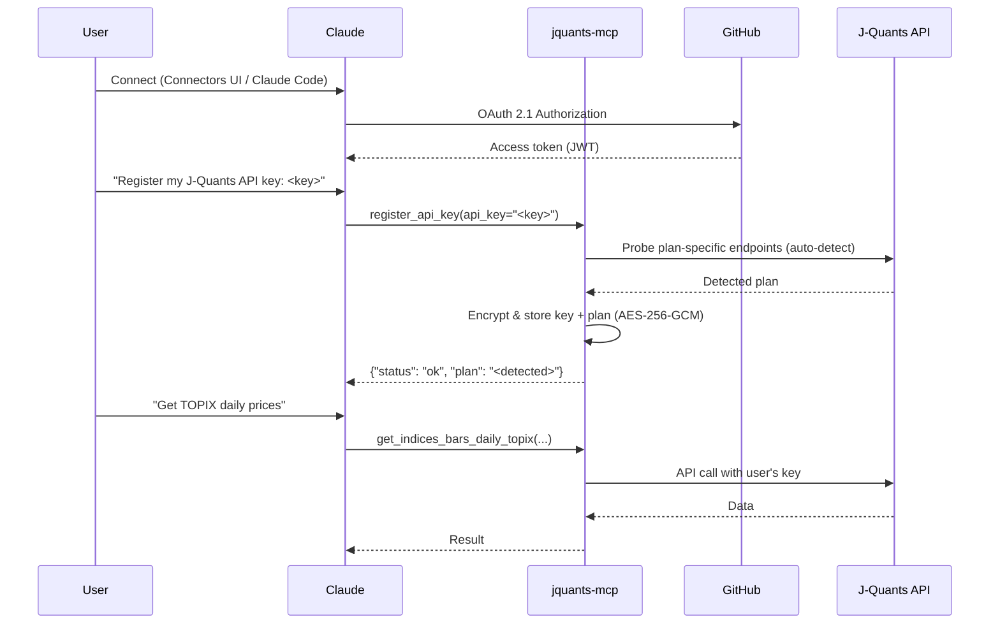
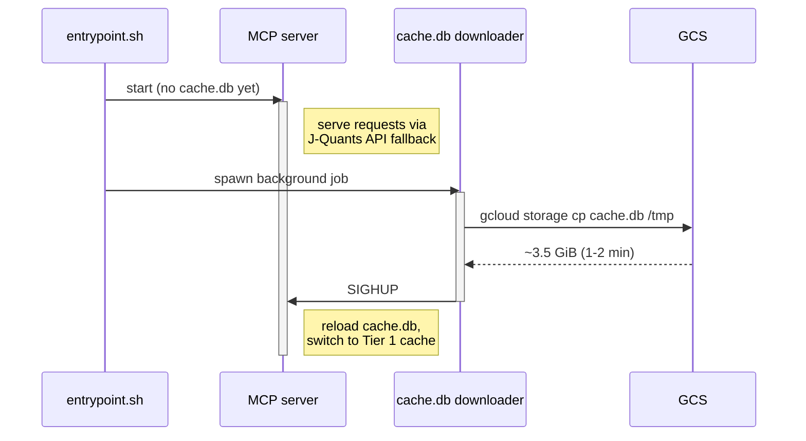
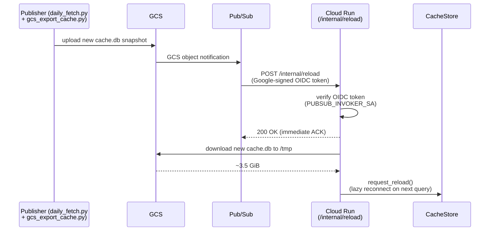
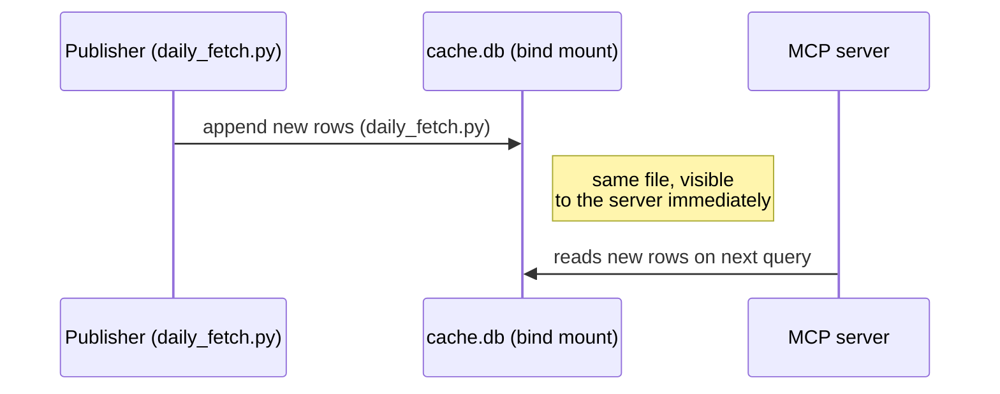

<!-- mcp-name: io.github.shigechika/jquants-mcp -->

# jquants-mcp

English | [日本語](README.ja.md)

An [MCP (Model Context Protocol)](https://modelcontextprotocol.io/) server that retrieves Japanese stock market data via [J-Quants API v2](https://jpx-jquants.com/).

Release history and changelog: [GitHub Releases](https://github.com/shigechika/jquants-mcp/releases).

Deployment shapes (stdio / Docker Compose / self-hosted HTTP / Cloud Run) and how to pick between them: see [docs/deploy/](docs/deploy/).

## Features

- **33 MCP tools**: 22 covering all J-Quants API v2 endpoints, 5 utility, 5 offline screener, and 1 opt-in candlestick chart renderer
- **Two-tier SQLite cache** — row-level cache for time-series data, response-level cache with TTL for others
- **Stock split detection** — automatic cache invalidation when AdjFactor changes
- **Rate limiting** — plan-aware sliding window (Free: 5/min, Light: 60, Standard: 120, Premium: 500)
- **Retry with backoff** — automatic retry for 429/5xx errors
- **Pagination** — transparent multi-page fetching
- **Plan-aware** — all tools registered regardless of plan; graceful error messages on restriction

## Requirements

- Python 3.10+
- [J-Quants API key](https://jpx-jquants.com/) (Free plan or above)

## Installation

```bash
# Using uv (recommended)
uv pip install jquants-mcp

# Using pip
pip install jquants-mcp
```

### From source

```bash
git clone https://github.com/shigechika/jquants-mcp.git
cd jquants-mcp
uv sync --dev
```

## Configuration

Settings are loaded with the following priority (later wins):

1. `~/.jquants-api/jquants-api.toml` — API key only (J-Quants official config)
2. `~/.config/jquants-mcp/config.ini` (user global)
3. `./config.ini` (current directory)
4. Environment variables (from MCP client or shell)

### API Key (zero-config)

If you already use [jquants-api-client](https://github.com/J-Quants/jquants-api-client-python), your API key is automatically read from `~/.jquants-api/jquants-api.toml`. No extra configuration needed.

### API Key via browser login

```sh
jquants-mcp login
```

Opens a browser to J-Quants (AWS Cognito, PKCE flow), and on success writes the API key to `~/.config/jquants-mcp/config.ini` (mode 0600). Same auth backend as the [official jquants-cli](https://github.com/J-Quants/jquants-cli). Use `jquants-mcp logout` to clear the saved key.

### config.ini

MCP-specific settings (cache, client behavior):

```ini
[jquants]
# cache_dir = ~/.cache/jquants-mcp
# base_url = https://api.jquants.com/v2

[client]
# max_retries = 5
# retry_base_delay = 1.0
# max_pages = 10

[server]
# ssl_certfile = /path/to/fullchain.pem
# ssl_keyfile = /path/to/privkey.pem
# bearer_token = <secret>
# encryption_key = <random-secret>   # enables per-user API key storage (multi-user mode)

[oauth]
# github_client_id = <your-github-client-id>
# github_client_secret = <your-github-client-secret>
# base_url = https://mcp.example.com
# jwt_signing_key = <random-secret>  # optional: auto-generated if blank
# require_consent = true
```

### Environment Variables

| Variable | Required | Default | Description |
|---|---|---|---|
| `JQUANTS_API_KEY` | No* | — | J-Quants API key |
| `JQUANTS_API_TOML_PATH` | No | `~/.jquants-api/jquants-api.toml` | Path to the J-Quants official config file. Override to avoid macOS 26+ launchd sandbox restrictions (see [macOS launchd note](#macos-launchd-note) below) |
| `JQUANTS_PLAN` | No | auto-detect | Plan: `free` / `light` / `standard` / `premium` (auto-detected from the API key at server startup; set this variable only to override) |
| `JQUANTS_CACHE_DIR` | No | `~/.cache/jquants-mcp` | Cache directory path |
| `JQUANTS_BASE_URL` | No | `https://api.jquants.com/v2` | API base URL |
| `MAX_RETRIES` | No | `5` | Max retry attempts for failed requests |
| `RETRY_BASE_DELAY` | No | `1.0` | Base delay (seconds) for exponential backoff |
| `MAX_PAGES` | No | `10` | Max pages to fetch per paginated request |
| `SSL_CERTFILE` | No | — | Path to SSL certificate file (HTTP transport) |
| `SSL_KEYFILE` | No | — | Path to SSL private key file (HTTP transport) |
| `MCP_BEARER_TOKEN` | No | — | Bearer token for HTTP authentication |
| `GITHUB_CLIENT_ID` | No | — | GitHub OAuth App client ID (enables GitHub OAuth 2.1) |
| `GITHUB_CLIENT_SECRET` | No | — | GitHub OAuth App client secret |
| `GOOGLE_CLIENT_ID` | No | — | Google OAuth 2.0 client ID (enables Google OAuth 2.1) |
| `GOOGLE_CLIENT_SECRET` | No | — | Google OAuth 2.0 client secret |
| `OAUTH_PROVIDER` | No | `github` | OAuth provider: `github` or `google` |
| `OAUTH_BASE_URL` | No | — | Public base URL of the server (e.g. `https://mcp.example.com`) |
| `OAUTH_JWT_SIGNING_KEY` | No | auto | Secret for JWT signing; auto-generated if blank |
| `OAUTH_REQUIRE_CONSENT` | No | `true` | Show OAuth consent screen on every login (`true`/`false`) |
| `MCP_ENCRYPTION_KEY` | No | — | Passphrase for AES-256-GCM encryption of per-user API keys |
| `MCP_ENCRYPTION_KEY_PREVIOUS` | No | — | Previous encryption passphrase — enables dual-key decrypt during a rotation window. See [secrets rotation runbook](docs/runbooks/secrets-rotation.md) |
| `RATE_LIMIT_PER_MINUTE` | No | `60` | Per-user request ceiling (multi-user mode). Applies per OAuth user |
| `RATE_LIMIT_BURST` | No | `20` | Per-user burst allowance (token-bucket capacity) |
| `JQUANTS_ALLOWED_EMAILS` | No | — | Comma-separated allowlist of emails. Empty = allow any authenticated user (self-host default). Set this on public Cloud Run instances to restrict access; unauthorized users get a 403-style message pointing them to self-host |

\* API key is auto-detected from `~/.jquants-api/jquants-api.toml`. Set `JQUANTS_API_KEY` only to override.

Environment variables override both `config.ini` and `jquants-api.toml`. This allows MCP clients (Claude Desktop, Claude Code) to pass settings via their `env` block while keeping defaults elsewhere.

### macOS launchd note

If you run `jquants-mcp` as a **macOS LaunchAgent** and the API key lives in `~/.jquants-api/jquants-api.toml`, the server may silently hang during startup on macOS 26 or later. The TCC sandbox applied to launchd-spawned processes blocks `open()` on some dotfiles under `$HOME` (mode `600`), and the process never reaches the port-bind step.

Workaround: copy the toml outside the sandboxed home hierarchy and point the server at it via `JQUANTS_API_TOML_PATH`:

```sh
sudo mkdir -p /usr/local/etc/jquants-mcp
sudo cp ~/.jquants-api/jquants-api.toml /usr/local/etc/jquants-mcp/jquants-api.toml
sudo chown "$USER":staff /usr/local/etc/jquants-mcp/jquants-api.toml
sudo chmod 600 /usr/local/etc/jquants-mcp/jquants-api.toml
```

Then add the following to your LaunchAgent plist's `EnvironmentVariables` dict:

```xml
<key>JQUANTS_API_TOML_PATH</key>
<string>/usr/local/etc/jquants-mcp/jquants-api.toml</string>
```

Alternatives: set `JQUANTS_API_KEY` directly in the plist (simpler but puts the key in a plist file that Time Machine / iCloud may back up), or put `api_key =` directly in `~/.config/jquants-mcp/config.ini` (if that path is not sandbox-blocked on your macOS version).

Linux/systemd and other init systems are not affected.

## Authentication

jquants-mcp supports four authentication modes:

| Mode | When to use |
|---|---|
| None | Local stdio or trusted LAN (single user) |
| Bearer Token | Single-user remote access over HTTPS |
| GitHub OAuth 2.1 | Multi-user access / Claude Desktop Connectors |
| Google OAuth 2.1 | Multi-user access via Google account |

The mode is selected automatically at startup:

1. **Google OAuth 2.1** — when `GOOGLE_CLIENT_ID`, `GOOGLE_CLIENT_SECRET`, and `OAUTH_BASE_URL` are all set, and `OAUTH_PROVIDER=google`
2. **GitHub OAuth 2.1** — when `GITHUB_CLIENT_ID`, `GITHUB_CLIENT_SECRET`, and `OAUTH_BASE_URL` are all set
3. **Bearer Token** — when `MCP_BEARER_TOKEN` (or `bearer_token` in `config.ini`) is set
4. **None** — no authentication (stdio transport or trusted environment)

### GitHub OAuth 2.1

The server acts as an OAuth 2.1 authorization server using GitHub as the upstream identity provider (IdP). Clients are redirected to GitHub's login page; the server exchanges the authorization code for a signed JWT that identifies the user across requests.

#### 1. Create a GitHub OAuth App

1. Go to **GitHub → Settings → Developer settings → OAuth Apps → New OAuth App**
2. Fill in:
   - **Application name**: `jquants-mcp` (or any name)
   - **Homepage URL**: your server's public base URL (e.g. `https://mcp.example.com`)
   - **Authorization callback URL**: `https://mcp.example.com/oauth/callback`
3. Click **Register application**, then click **Generate a new client secret**
4. Copy the **Client ID** and the generated **Client secret**

#### 2. Configure the server

**Via environment variables:**

```bash
export GITHUB_CLIENT_ID=Ov23liXXXXXXXXXXXXXX
export GITHUB_CLIENT_SECRET=<your-client-secret>
export OAUTH_BASE_URL=https://mcp.example.com      # must be publicly reachable
export OAUTH_JWT_SIGNING_KEY=<random-secret>       # optional: auto-generated if blank
export MCP_ENCRYPTION_KEY=<random-secret>          # required for per-user API key storage
```

**Via `config.ini`:**

```ini
[oauth]
github_client_id = Ov23liXXXXXXXXXXXXXX
github_client_secret = <your-client-secret>
base_url = https://mcp.example.com
# jwt_signing_key = <random-secret>   # optional: auto-generated if blank
# require_consent = true              # default: true

[server]
encryption_key = <random-secret>      # required for per-user API key storage
```

#### 3. Start the server with OAuth

```bash
jquants-mcp -t streamable-http --port 8080 \
  --ssl-certfile /path/to/fullchain.pem \
  --ssl-keyfile /path/to/privkey.pem \
  --github-client-id <ID> \
  --github-client-secret <SECRET> \
  --oauth-base-url https://mcp.example.com
```

When all OAuth settings are configured via environment variables or `config.ini`, CLI flags are optional — OAuth is activated automatically on startup.

| CLI Option | Description |
|---|---|
| `--github-client-id` | GitHub OAuth App client ID |
| `--github-client-secret` | GitHub OAuth App client secret |
| `--oauth-base-url` | Public base URL of the server (used to build redirect URIs) |

### Google OAuth 2.1

The server supports Google as an alternative OAuth 2.1 identity provider. Users are redirected to Google's Sign-In page; the server exchanges the authorization code for a signed JWT.

#### 1. Create a Google OAuth 2.0 Client

1. Go to [Google Cloud Console](https://console.cloud.google.com/) → **APIs & Services → Credentials → Create Credentials → OAuth 2.0 Client ID**
2. Select **Web application** and fill in:
   - **Authorized JavaScript origins**: `https://mcp.example.com`
   - **Authorized redirect URIs**: `https://mcp.example.com/oauth/callback`
3. Click **Create**, then copy the **Client ID** and **Client secret**

#### 2. Configure the server

**Via environment variables:**

```bash
export GOOGLE_CLIENT_ID=<your-client-id>
export GOOGLE_CLIENT_SECRET=<your-client-secret>
export OAUTH_PROVIDER=google
export OAUTH_BASE_URL=https://mcp.example.com
export MCP_ENCRYPTION_KEY=<random-secret>          # required for per-user API key storage
```

**Via `config.ini`:**

```ini
[oauth]
google_client_id = <your-client-id>
google_client_secret = <your-client-secret>
provider = google
base_url = https://mcp.example.com

[server]
encryption_key = <random-secret>
```

### /settings Web UI

When OAuth is enabled, the server provides a browser-based settings page at `https://mcp.example.com/settings`.

1. Open `https://mcp.example.com/settings` in a browser
2. Click **Sign in with GitHub** (or **Sign in with Google** when `provider = google` in `config.ini`)
3. After authentication, enter your J-Quants API key and plan, then click **Save**

This is equivalent to calling `register_api_key` via Claude, but accessible directly from any browser without an MCP client.

## Multi-user Mode

When GitHub OAuth 2.1 and `MCP_ENCRYPTION_KEY` are both configured, the server operates in **multi-user mode**: each authenticated user stores their own J-Quants API key on the server, and all data tools use that key automatically. All users share the read cache; each user gets an independent J-Quants client with isolated rate limiting.

### User flow



### Tools for multi-user mode

| Tool | Required | Description |
|---|---|---|
| `register_api_key` | OAuth 2.1 + `MCP_ENCRYPTION_KEY` | Encrypt and store your J-Quants API key |
| `delete_api_key` | OAuth 2.1 + `MCP_ENCRYPTION_KEY` | Remove your stored key |

**Registering a key** (tell Claude):

> "Register my J-Quants API key: `<your-api-key>`"

Claude calls `register_api_key(api_key="...")`. The server probes plan-specific endpoints with the key to auto-detect the plan (`free` / `light` / `standard` / `premium`) and stores it alongside the encrypted key — no manual selection needed. Subsequent tool calls use the detected plan for rate limiting and date-range restrictions.

### Security

- API keys are encrypted with **AES-256-GCM** (authenticated encryption — integrity-protected)
- The encryption key is derived via **PBKDF2-HMAC-SHA256** (600,000 iterations) from `MCP_ENCRYPTION_KEY`
- Each ciphertext uses a unique random 12-byte nonce — encrypting the same key twice produces different ciphertext
- Tampered or truncated ciphertexts are rejected before decryption

### Backward compatibility

| Configuration | Behavior |
|---|---|
| No auth, no `MCP_ENCRYPTION_KEY` | Single-user: global `JQUANTS_API_KEY` for all connections |
| Bearer token | Single-user: same as above, with HTTP authentication |
| OAuth + no `MCP_ENCRYPTION_KEY` | OAuth authentication, but all users share the global `JQUANTS_API_KEY` |
| OAuth + `MCP_ENCRYPTION_KEY` | Full multi-user: each user has an independent encrypted API key |

## Usage

### Claude Code

Register the MCP server with `claude mcp add`:

```bash
claude mcp add jquants-mcp -- jquants-mcp
```

Or if installed from source:

```bash
claude mcp add jquants-mcp \
  -- /path/to/jquants-mcp/.venv/bin/jquants-mcp
```

The `--scope` (`-s`) option controls where the configuration is stored:

| Scope | Description | Config location |
|---|---|---|
| `local` (default) | Current project, current user only | `.claude.json` |
| `project` | Current project, shared with team | `.mcp.json` in project root |
| `user` | All projects, current user only | `~/.claude.json` |

API key is auto-detected from `~/.jquants-api/jquants-api.toml`. Set `--env JQUANTS_API_KEY=...` only to override.

### Claude Desktop

Add to Claude Desktop config file:

| OS | Config file |
|---|---|
| macOS | `~/Library/Application Support/Claude/claude_desktop_config.json` |
| Windows | `%APPDATA%\Claude\claude_desktop_config.json` |
| Linux | `~/.config/Claude/claude_desktop_config.json` |

```json
{
  "mcpServers": {
    "jquants-mcp": {
      "command": "/path/to/jquants-mcp/.venv/bin/jquants-mcp"
    }
  }
}
```

The server auto-detects the plan from your API key on startup — no need to set it manually. Add an `env` block only if you want to override the detection or point to a different API key.

> **Note:** Claude Desktop has a limited `PATH` (`/usr/local/bin`, `/usr/bin`, etc.), so you must specify the full path to the executable.

Restart Claude Desktop after editing.

### Standalone (stdio)

```bash
jquants-mcp
```

### Streamable HTTP (remote access)

Run the server over HTTP so that MCP clients on other machines can connect:

```bash
jquants-mcp --transport streamable-http --port 8080
```

This exposes the MCP endpoint at `http://<host>:8080/mcp`. Clients on the same LAN (or via SSH tunnel) can connect to the server.

**Claude Code (remote):**

```bash
claude mcp add jquants-mcp \
  --transport http http://192.0.2.1:8080/mcp
```

| Option | Default | Description |
|---|---|---|
| `--transport`, `-t` | `stdio` | Transport type: `stdio` or `streamable-http` |
| `--host` | `0.0.0.0` | Bind address |
| `--port`, `-p` | `8080` | Port number |
| `--ssl-certfile` | — | Path to SSL certificate file |
| `--ssl-keyfile` | — | Path to SSL private key file |
| `--bearer-token` | — | Bearer token for authentication |

### TLS + Bearer Token Authentication

For secure remote access over the internet (e.g., IPv6), enable TLS encryption and Bearer token authentication:

```bash
# Generate a bearer token
python3 -c "import secrets; print(secrets.token_hex(32))"

# Start with TLS and authentication
jquants-mcp -t streamable-http --port 8080 \
  --ssl-certfile /path/to/fullchain.pem \
  --ssl-keyfile /path/to/privkey.pem \
  --bearer-token <TOKEN>
```

Or configure via `config.ini` (no CLI flags needed):

```ini
[server]
ssl_certfile = /path/to/fullchain.pem
ssl_keyfile = /path/to/privkey.pem
bearer_token = <TOKEN>
```

**Claude Code (remote with TLS):**

> **Note:** `claude mcp add --transport http --header "Authorization: Bearer ..."` does not send the header during health checks ([claude-code#28293](https://github.com/anthropics/claude-code/issues/28293)). Use [mcp-stdio](https://github.com/shigechika/mcp-stdio) as a workaround:

```bash
pip install mcp-stdio  # or: uvx mcp-stdio

claude mcp add jquants-mcp -- \
  mcp-stdio https://192.0.2.1:8080/mcp --bearer-token <TOKEN>
```

### Claude Desktop (remote via mcp-stdio)

Claude Desktop does not support Streamable HTTP transport directly. Use [mcp-stdio](https://pypi.org/project/mcp-stdio/) to bridge stdio to a remote MCP server:

```json
{
  "mcpServers": {
    "jquants-mcp": {
      "command": "mcp-stdio",
      "args": [
        "http://192.0.2.1:8080/mcp"
      ]
    }
  }
}
```

To connect to a TLS-enabled server with Bearer token authentication:

```json
{
  "mcpServers": {
    "jquants-mcp": {
      "command": "mcp-stdio",
      "args": [
        "https://192.0.2.1:8080/mcp",
        "--bearer-token", "<TOKEN>"
      ]
    }
  }
}
```

Restart Claude Desktop after editing.

### Claude Desktop Connectors (OAuth 2.1)

Claude Desktop's **Connectors** feature provides a native OAuth 2.1 authentication flow. Users click **Connect** in the Connectors panel and are redirected to GitHub's login page automatically — no manual token management required.

> **Requirements:**
> - Server accessible over **HTTPS** (TLS certificate required)
> - GitHub or Google OAuth 2.1 configured (see [GitHub OAuth 2.1](#github-oauth-21) / [Google OAuth 2.1](#google-oauth-21))
> - `MCP_ENCRYPTION_KEY` set on the server (for per-user API key storage)

**Server-side startup:**

```bash
jquants-mcp -t streamable-http --port 8080 \
  --ssl-certfile /path/to/fullchain.pem \
  --ssl-keyfile /path/to/privkey.pem \
  --github-client-id <ID> \
  --github-client-secret <SECRET> \
  --oauth-base-url https://mcp.example.com
```

**`claude_desktop_config.json` (Connectors UI):**

```json
{
  "mcpServers": {
    "jquants-mcp": {
      "type": "http",
      "url": "https://mcp.example.com/mcp"
    }
  }
}
```

On first use, Claude Desktop opens a browser window for GitHub OAuth. After authentication, the token is stored automatically and subsequent connections use it silently.

> **Note:** Claude Desktop Connectors support (`"type": "http"` with OAuth) is rolling out gradually. If it is not yet available in your version, use the [stdio proxy method](#claude-desktop-remote-via-mcp-stdio) as a fallback.

## Available Tools

### Equities (6 tools)

| Tool | Endpoint | Plan | Description |
|---|---|---|---|
| `get_equities_master` | `/equities/master` | Free+ | Listed issue information |
| `get_equities_bars_daily` | `/equities/bars/daily` | Free+ | Daily stock prices (OHLC) |
| `get_equities_bars_minute` | `/equities/bars/minute` | Light+ | Minute-level stock prices |
| `get_equities_bars_daily_am` | `/equities/bars/daily/am` | Premium | Morning session prices |
| `get_equities_investor_types` | `/equities/investor-types` | Light+ | Trading by investor type |
| `get_equities_earnings_calendar` | `/equities/earnings-calendar` | Free+ | Earnings schedule |

### Financials (3 tools)

| Tool | Endpoint | Plan | Description |
|---|---|---|---|
| `get_fins_summary` | `/fins/summary` | Free+ | Financial summary (quarterly) |
| `get_fins_details` | `/fins/details` | Premium | Detailed statements (BS/PL/CF) |
| `get_fins_dividend` | `/fins/dividend` | Premium | Cash dividend data |

### Indices (2 tools)

| Tool | Endpoint | Plan | Description |
|---|---|---|---|
| `get_indices_bars_daily` | `/indices/bars/daily` | Free+ | Index daily prices |
| `get_indices_bars_daily_topix` | `/indices/bars/daily/topix` | Free+ | TOPIX daily prices |

### Derivatives (3 tools)

| Tool | Endpoint | Plan | Description |
|---|---|---|---|
| `get_derivatives_bars_daily_futures` | `/derivatives/bars/daily/futures` | Light+ | Futures daily prices |
| `get_derivatives_bars_daily_options` | `/derivatives/bars/daily/options` | Light+ | Options daily prices |
| `get_derivatives_bars_daily_options_225` | `/derivatives/bars/daily/options/225` | Light+ | Nikkei 225 options prices |

### Markets (6 tools)

| Tool | Endpoint | Plan | Description |
|---|---|---|---|
| `get_markets_margin_interest` | `/markets/margin-interest` | Standard+ | Margin trading data |
| `get_markets_margin_alert` | `/markets/margin-alert` | Standard+ | Margin trading alerts |
| `get_markets_short_ratio` | `/markets/short-ratio` | Standard+ | Short selling ratio |
| `get_markets_short_sale_report` | `/markets/short-sale-report` | Standard+ | Short sale position report |
| `get_markets_breakdown` | `/markets/breakdown` | Premium | Market breakdown by investor |
| `get_markets_calendar` | `/markets/calendar` | Free+ | Trading calendar |

### Bulk Download (2 tools)

| Tool | Endpoint | Plan | Description |
|---|---|---|---|
| `get_bulk_list` | `/bulk/list` | Light+ | List downloadable CSV files |
| `get_bulk_download_url` | `/bulk/get` | Light+ | Get signed download URL |

### Screener (5 tools)

Offline tools that compute signals directly from the cached `equities_bars_daily` rows. No extra API calls, pure Python, no numpy/pandas. Intended for Claude-assisted stock screening without hitting rate limits.

| Tool | Description |
|---|---|
| `detect_price_limit` | Find stocks that touched the daily upper/lower price limit (ストップ高/安) using the `UL`/`LL` flags. Optional close-at-limit refinement via `C == H` / `C == L`. |
| `compare_close_vs_vwap` | Compute the daily VWAP (`Va / Vo`) and compare to the close for a given code + date or date range. |
| `detect_52w_high_low` | New 52-week rolling high/low (Yahoo / Bloomberg / TradingView convention). Returns `new_high` / `new_high_close` / `new_low` / `new_low_close`. |
| `detect_ytd_high_low` | New year-to-date (年初来) high/low (Kabutan / JPX / Yahoo!ファイナンス convention). Same four signals against the YTD prior window. |
| `detect_volume_surge` | List stocks whose volume on `date` exceeds the trailing 20-day average by a configurable `multiplier` (default 2.0). |

### Charts (1 tool, opt-in)

Inline candlestick charts rendered as PNG via [`mplfinance`](https://github.com/matplotlib/mplfinance). Claude Desktop and Claude mobile display the image directly in chat, so you can ask Claude to read the chart visually.

Install with:

```bash
pip install "jquants-mcp[charts]"
# or with uv:
uv sync --extra charts
```

The tool registration silently no-ops when the extras are not installed, so the lean stdio profile is unaffected.

| Tool | Description |
|---|---|
| `render_candlestick` | OHLC candlestick PNG for a code + date range. Default overlays follow JP convention (`volume`, `sma5`, `sma25`). Accepted: `volume`, `sma5` / `sma20` / `sma25` / `sma60` / `sma75` / `sma200`, `bb20`. Styles: `default` / `dark` / `colorblind`. Uses split-adjusted prices by default (`adjusted=True`). |

### Utility (5 tools)

| Tool | Auth required | Description |
|---|---|---|
| `health_check` | — | Server health and API key status |
| `cache_status` | — | Cache statistics |
| `cache_clear` | — | Clear cached data |
| `register_api_key` | OAuth 2.1 | Store your J-Quants API key (multi-user mode) |
| `delete_api_key` | OAuth 2.1 | Remove your stored J-Quants API key |

## Caching

The server uses a two-tier SQLite cache:

- **Tier 1 (Row-level)**: Time-series data cached by date and code. Supports incremental fetching and stock split detection via AdjFactor comparison.
  - `equities_bars_daily`, `equities_master`, `fins_summary`, `indices_bars_daily_topix`, `investor_types`, `markets_margin_interest`, `markets_margin_alert`, `markets_short_ratio`, `markets_breakdown`, `markets_calendar`
- **Tier 2 (Response-level)**: Full API responses cached with configurable TTL (6h / 24h / 7d).

Cache is stored at `~/.cache/jquants-mcp/cache.db` by default.

**Expected disk usage after a full historical fetch** (approximate; varies by market data availability):

| Plan | Retention | Approx. size |
|---|---|---|
| Free | 2 years | ~500 MB |
| Light | 5 years | ~1.5 GB |
| Standard | 10 years | ~3 GB |
| Premium | All available | ~3.5 GB+ |

### Bulk Data Import

The `scripts/bulk_fetch_all.py` script downloads all available bulk CSV data from the J-Quants Bulk API and imports it into the SQLite cache. This is the fastest way to populate the local cache with historical data.

```bash
# Fetch all available data for your plan
uv run python scripts/bulk_fetch_all.py

# Fetch specific endpoints only
uv run python scripts/bulk_fetch_all.py --endpoints fins_summary topix margin_interest

# Dry run — show file list and sizes without downloading
uv run python scripts/bulk_fetch_all.py --dry-run
```

The script respects the plan-based rate limit (e.g. 60 req/min for Light) and retries on 429 errors.

### CSV Import

The CSV sideload script (`import_csv_to_cache.py`) is maintained by the publisher pipeline that feeds this cache. If you are building your own pipeline, implement sideloading by inserting directly into the `equities_bars_daily` / `equities_master` tables following the schema defined in `src/jquants_mcp/cache/schema.py`.

### Daily Fetch

`scripts/daily_fetch.py` fetches additional J-Quants data via `jquantsapi.ClientV2` and inserts it directly into the SQLite cache. Designed to be called from an external daily pipeline (e.g. a cron job or shell script).

The script reads the plan from `~/.config/jquants-mcp/config.ini` (or `JQUANTS_PLAN` env var) and automatically determines which endpoints to fetch:

| Plan | Endpoints |
|---|---|
| Free | `fins_summary`, `earnings_cal` |
| Light | + `topix`, `investor_types` |
| Standard | + `short_ratio`, `margin_interest`, `margin_alert`, `short_sale_report` |
| Premium | + `breakdown` |

```bash
# Fetch all endpoints available for your plan
python3 scripts/daily_fetch.py

# Fetch specific endpoints only
python3 scripts/daily_fetch.py --topix --investor-types

# Fetch trading calendar
python3 scripts/daily_fetch.py --calendar

# Backfill historical Markets data (past N days)
python3 scripts/daily_fetch.py --backfill 90

# Use a custom cache DB path
python3 scripts/daily_fetch.py --db /path/to/cache.db
```

Permission errors (403) are handled gracefully — the script logs the error and continues to the next endpoint without crashing.

## Cloud Run Deployment

This server can be deployed to [Google Cloud Run](https://cloud.google.com/run). The deployment splits state across two managed stores:

- **`cache.db`** — published to a GCS bucket by the self-hosted server and downloaded to `/tmp` (tmpfs) on every cold start. Cloud Run reads it but never writes back.
- **`users` / `oauth_state`** — stored in Firestore (Native mode). Strongly consistent and multi-writer safe, so Cloud Run can scale horizontally without SQLite write conflicts.

Details: see [GCS and Firestore integration](#gcs-and-firestore-integration) below.

> For a fork-and-deploy walkthrough (WIF, OAuth clients, custom domain, Claude mobile setup, allowlist), see [docs/deploy/gcp.md](docs/deploy/gcp.md). The sections below summarise the moving parts; the deploy guide is the canonical step-by-step.

### Prerequisites

- [Google Cloud SDK](https://cloud.google.com/sdk/docs/install)
- A GCS bucket holding a read-only snapshot of `cache.db` (updated out-of-band by the self-hosted server)
- Firestore in Native mode enabled on the project (stores per-user API keys and OAuth session state)
- A service account with:
  - `roles/storage.objectViewer` on the GCS bucket (read-only access to `cache.db`)
  - `roles/datastore.user` on the project (Firestore read/write)
  - `roles/secretmanager.secretAccessor` if using Secret Manager for API keys

### Create a GCS bucket

```bash
gcloud storage buckets create gs://YOUR_BUCKET \
  --location asia-northeast1
```

### Enable Firestore

```bash
gcloud firestore databases create \
  --location=us-west1 \
  --type=firestore-native
```

### Deploy

The recommended path is to fork the repository and rely on the GitHub Actions CD workflow at [.github/workflows/cd.yml](.github/workflows/cd.yml), which calls `gcloud run deploy --source .` with the correct flags (memory, CPU, env vars, secrets). That workflow is the single source of truth for production deployment — do not run ad-hoc `gcloud run services update` commands, as they will be overwritten on the next CD run.

For a one-off manual deploy (e.g. testing a fork), run the same command locally:

```bash
gcloud run deploy jquants-mcp \
  --project "${PROJECT_ID}" \
  --region "${REGION}" \
  --source . \
  --execution-environment gen2 \
  --memory 6Gi \
  --cpu 2 \
  --no-cpu-throttling \
  --cpu-boost \
  --set-env-vars "GCS_BUCKET=YOUR_BUCKET,JQUANTS_CACHE_DIR=/tmp" \
  --set-secrets "JQUANTS_API_KEY=jquants-api-key:latest"
```

Memory sizing notes are in [Memory requirements](#memory-requirements) below.

### Environment variables

| Variable | Required | Default | Description |
|---|---|---|---|
| `GCS_BUCKET` | Yes | — | GCS bucket holding the `cache.db` snapshot |
| `GCS_PREFIX` | No | `jquants-mcp/` | Object key prefix in the bucket |
| `JQUANTS_CACHE_DIR` | No | `/tmp` | Local directory where `cache.db` is materialized (tmpfs on Cloud Run) |
| `PORT` | No | `8000` | HTTP port (set by Cloud Run) |
| `JQUANTS_API_KEY` | Yes | — | J-Quants API key (use Secret Manager) |
| `JQUANTS_PLAN` | No | auto-detect | Plan: `free` / `light` / `standard` / `premium` (auto-detected from the API key unless overridden) |
| `MCP_BEARER_TOKEN` | No | — | Bearer token for HTTP authentication (single-user mode only) |
| `PUBSUB_INVOKER_SA` | No | — | Service account email for Pub/Sub push authentication. When set, `/internal/reload` verifies the Google-signed OIDC token. Required if using Pub/Sub auto-reload; leave unset otherwise. |
| `PUBSUB_AUDIENCE` | No | request URL | OIDC audience to verify against (defaults to the incoming request URL) |
| `OAUTH_PROVIDER`, `OAUTH_BASE_URL`, `GOOGLE_CLIENT_ID`, `GOOGLE_CLIENT_SECRET`, … | No | — | OAuth configuration for multi-user mode |

Firestore uses Application Default Credentials from the Cloud Run service account. The `GOOGLE_CLOUD_PROJECT` env var must be set to the GCP project ID (included in the CD workflow via `vars.GCP_PROJECT`).

### GCS and Firestore integration

Cloud Run deployments depend on two managed stores, not an in-container SQLite set:

| Data | Where it lives | Access mode |
|---|---|---|
| `cache.db` (market data) | GCS object, materialized to `/tmp/cache.db` on startup | Read-only from Cloud Run |
| `users` (per-user encrypted J-Quants API keys) | Firestore `users` collection | Read/write |
| `oauth_state` (OAuth sessions, PKCE verifiers, dynamic client registrations) | Firestore `oauth_state` collection | Read/write |

`cache.db` is owned by a self-hosted publisher (a cron / scheduled task running `scripts/daily_fetch.py` or `scripts/bulk_fetch_all.py` + `scripts/gcs_export_cache.py`) that pushes a fresh snapshot to GCS on each run. Cloud Run never writes back to GCS.

#### Startup flow



Notes:
- `cache.db` is ~3.5 GiB and takes 1–2 minutes to download. Requests during that window hit the live J-Quants API, so they work but are slower and count against rate limits.
- During the cold-start window `cache_status` returns a minimal payload (`db_path` + `plan` only). A full payload with row counts and `db_size_mb` indicates the cache is loaded.
- Firestore is strongly consistent, so multiple Cloud Run instances can run concurrently without data races. There is no `maxScale: 1` restriction — scale as needed.

#### Daily cache refresh

After startup, `cache.db` is refreshed daily by the publisher. The mechanism differs by deployment target.

**Cloud Run — Pub/Sub push**

SIGHUP cannot reliably target a specific process across Cloud Run's multi-instance model. Instead, the publisher triggers a reload via a Pub/Sub push to the `/internal/reload` endpoint, which re-downloads `cache.db` from GCS in the background.



`PUBSUB_INVOKER_SA` must be the service account email that Pub/Sub uses to sign the OIDC token. `PUBSUB_AUDIENCE` defaults to the incoming request URL and normally does not need to be set.

**Docker Compose — direct file update**

When `GCS_BUCKET` is not set, `cache.db` lives on the local filesystem (bind-mounted into the container). `daily_fetch.py` appends rows directly to the same file; SQLite's normal concurrent-access handling means the server picks up new data on the next query with no explicit signal required.



**Local process (launchd / systemd) — SIGHUP**

When running the MCP server as a local service (e.g. launchd on macOS), SIGHUP triggers a lazy reconnect — useful after replacing `cache.db` wholesale (e.g. via `bulk_fetch_all.py`):

```bash
# macOS launchd
launchctl kill SIGHUP system/<YOUR_LAUNCHD_LABEL>
# or directly
kill -HUP <MCP_PID>
```

#### Troubleshooting

**Permission error on startup (`403 Forbidden` or `storage.objects.get denied`):**

```bash
gcloud storage buckets get-iam-policy gs://YOUR_BUCKET \
  --format="table(bindings.role, bindings.members)"
```

The service account needs `roles/storage.objectViewer` on the bucket — see [IAM setup](#iam-setup).

**Firestore permission errors:**

```bash
gcloud projects get-iam-policy "${PROJECT_ID}" \
  --flatten="bindings[].members" \
  --filter="bindings.members:serviceAccount:jquants-mcp@*"
```

The service account needs `roles/datastore.user` on the project.

**`cache_status` returns only `db_path` and `plan` (no row counts):**

The cache.db background download has not finished yet. Normal during the first 1–2 minutes after a cold start. Check the logs for `cache.db download complete; signaling MCP server to reload`.

**`cache.db` not found in GCS on first deploy:**

There is no "empty cache" fallback mode beyond API fallback — the server will keep serving requests directly from the J-Quants API. Upload a `cache.db` snapshot from your self-hosted server to GCS to enable Tier 1 caching (see [Initial cache.db upload](#initial-cachedb-upload)).

### IAM setup

```bash
SA="jquants-mcp@${PROJECT_ID}.iam.gserviceaccount.com"

# Create service account
gcloud iam service-accounts create jquants-mcp \
  --display-name "jquants-mcp Cloud Run SA"

# Read-only access to the cache.db snapshot in GCS
gcloud storage buckets add-iam-policy-binding gs://YOUR_BUCKET \
  --member "serviceAccount:${SA}" \
  --role "roles/storage.objectViewer"

# Firestore access for users / oauth_state collections
gcloud projects add-iam-policy-binding "${PROJECT_ID}" \
  --member "serviceAccount:${SA}" \
  --role "roles/datastore.user"

# Secret Manager access (if using Secret Manager for JQUANTS_API_KEY etc.)
gcloud projects add-iam-policy-binding "${PROJECT_ID}" \
  --member "serviceAccount:${SA}" \
  --role "roles/secretmanager.secretAccessor"
```

Note: if the self-hosted server that publishes `cache.db` uses a different service account, only *that* account needs write access to the bucket. The Cloud Run service account remains viewer-only.

### Initial cache.db upload

Cloud Run reads `cache.db` as a read-only snapshot. Publish a snapshot from your self-hosted server (which has been warming the cache) before the first deploy:

```bash
gcloud storage cp ~/.cache/jquants-mcp/cache.db \
  gs://YOUR_BUCKET/jquants-mcp/cache.db \
  --no-gzip-in-flight
```

> **Important:** disable parallel composite uploads (the default for large files). They corrupt SQLite files because the reassembled object contains byte ranges that do not form a valid database page layout. On the publishing host, set:
>
> ```bash
> gcloud config set storage/parallel_composite_upload_enabled False
> ```

No manual Firestore setup is required — the server creates the `users` and `oauth_state` collections on first write.

### Memory requirements

Cloud Run materializes `cache.db` into `/tmp` (a tmpfs, i.e. RAM). The memory limit therefore must cover:

- `cache.db` size (currently ~3.57 GiB)
- Python runtime + fastmcp + sqlite + httpx overhead (~300 MiB)
- Request-time JSON serialization headroom

Current production sizing (see [.github/workflows/cd.yml](.github/workflows/cd.yml)) is `--memory 6Gi --cpu 2 --no-cpu-throttling`, which leaves ~2.2 GiB headroom over the baseline. Cloud Run gen2 is required for memory allocations above 4 Gi.

If `cache.db` grows beyond ~4 GiB, bump the memory limit accordingly — the tmpfs ceiling is roughly the instance memory, so you need `cache.db + ~2 GiB` at a minimum.

## Operations

For production incidents on the Cloud Run deployment, see the runbooks:

- [OOM / memory pressure](docs/runbooks/oom.md)
- [5xx spike](docs/runbooks/5xx-spike.md)
- [Firestore outage / quota](docs/runbooks/firestore-outage.md)
- [cache.db missing / download failed](docs/runbooks/cache-db-missing.md)
- [OAuth loop / persistent 401](docs/runbooks/oauth-loop.md)
- [Firestore restore](docs/runbooks/firestore-restore.md)
- [Secrets rotation](docs/runbooks/secrets-rotation.md)

Alert policies that trigger these are in [`ops/alerts/`](ops/alerts/); each policy's documentation links back to the matching runbook.

The [disaster recovery posture](docs/dr.md) documents the current single-region deployment, RTO/RPO expectations, and the (undrilled) standby-region procedure.

Service-level objectives — availability and latency targets with an error-budget policy — are in [docs/slo.md](docs/slo.md).

## Development

```bash
# Install dev dependencies
uv sync --dev

# Run tests
uv run pytest -v

# Lint
uv run ruff check src/ tests/

# Format
uv run ruff format src/ tests/
```

## License

[MIT](LICENSE)
