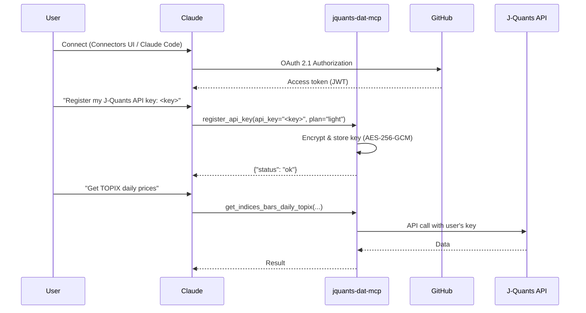

# jquants-dat-mcp

An [MCP (Model Context Protocol)](https://modelcontextprotocol.io/) server that retrieves Japanese stock market data via [J-Quants API v2](https://jpx-jquants.com/).

This is a companion to [j-quants-doc-mcp](https://github.com/knishioka/j-quants-doc-mcp) (documentation MCP) — while that server explains the API, this one actually **calls** it.

## Features

- **25 MCP tools** covering all J-Quants API v2 endpoints
- **Two-tier SQLite cache** — row-level cache for time-series data, response-level cache with TTL for others
- **Stock split detection** — automatic cache invalidation when AdjFactor changes
- **Rate limiting** — plan-aware sliding window (Free: 5/min, Light: 60, Standard: 120, Premium: 500)
- **Retry with backoff** — automatic retry for 429/5xx errors
- **Pagination** — transparent multi-page fetching
- **Plan-aware** — all tools registered regardless of plan; graceful error messages on restriction

## Requirements

- Python 3.10+
- [J-Quants API key](https://jpx-jquants.com/) (Free plan or above)

## Installation

```bash
# Using uv (recommended)
uv pip install jquants-dat-mcp

# Using pip
pip install jquants-dat-mcp
```

### From source

```bash
git clone https://github.com/shigechika/jquants-dat-mcp.git
cd jquants-dat-mcp
uv sync --dev
```

## Configuration

Settings are loaded with the following priority (later wins):

1. `~/.jquants-api/jquants-api.toml` — API key only (J-Quants official config)
2. `~/.config/jquants-dat-mcp/config.ini` (user global)
3. `./config.ini` (current directory)
4. Environment variables (from MCP client or shell)

### API Key (zero-config)

If you already use [jquants-api-client](https://github.com/J-Quants/jquants-api-client-python), your API key is automatically read from `~/.jquants-api/jquants-api.toml`. No extra configuration needed.

### config.ini

MCP-specific settings (plan, cache, client behavior):

```ini
[jquants]
plan = premium
# cache_dir = ~/.cache/jquants-dat-mcp
# base_url = https://api.jquants.com/v2

[client]
# max_retries = 5
# retry_base_delay = 1.0
# max_pages = 10

[server]
# ssl_certfile = /path/to/fullchain.pem
# ssl_keyfile = /path/to/privkey.pem
# bearer_token = <secret>
# encryption_key = <random-secret>   # enables per-user API key storage (multi-user mode)

[oauth]
# github_client_id = <your-github-client-id>
# github_client_secret = <your-github-client-secret>
# base_url = https://mcp.example.com
# jwt_signing_key = <random-secret>  # optional: auto-generated if blank
# require_consent = true
```

### Environment Variables

| Variable | Required | Default | Description |
|---|---|---|---|
| `JQUANTS_API_KEY` | No* | — | J-Quants API key |
| `JQUANTS_PLAN` | No | `free` | Plan: `free` / `light` / `standard` / `premium` |
| `JQUANTS_CACHE_DIR` | No | `~/.cache/jquants-dat-mcp` | Cache directory path |
| `JQUANTS_BASE_URL` | No | `https://api.jquants.com/v2` | API base URL |
| `MAX_RETRIES` | No | `5` | Max retry attempts for failed requests |
| `RETRY_BASE_DELAY` | No | `1.0` | Base delay (seconds) for exponential backoff |
| `MAX_PAGES` | No | `10` | Max pages to fetch per paginated request |
| `SSL_CERTFILE` | No | — | Path to SSL certificate file (HTTP transport) |
| `SSL_KEYFILE` | No | — | Path to SSL private key file (HTTP transport) |
| `MCP_BEARER_TOKEN` | No | — | Bearer token for HTTP authentication |
| `GITHUB_CLIENT_ID` | No | — | GitHub OAuth App client ID (enables OAuth 2.1) |
| `GITHUB_CLIENT_SECRET` | No | — | GitHub OAuth App client secret |
| `OAUTH_BASE_URL` | No | — | Public base URL of the server (e.g. `https://mcp.example.com`) |
| `OAUTH_JWT_SIGNING_KEY` | No | auto | Secret for JWT signing; auto-generated if blank |
| `OAUTH_REQUIRE_CONSENT` | No | `true` | Show GitHub OAuth consent screen (`true`/`false`) |
| `MCP_ENCRYPTION_KEY` | No | — | Passphrase for AES-256-GCM encryption of per-user API keys |

\* API key is auto-detected from `~/.jquants-api/jquants-api.toml`. Set `JQUANTS_API_KEY` only to override.

Environment variables override both `config.ini` and `jquants-api.toml`. This allows MCP clients (Claude Desktop, Claude Code) to pass settings via their `env` block while keeping defaults elsewhere.

## Authentication

jquants-dat-mcp supports three authentication modes:

| Mode | When to use |
|---|---|
| None | Local stdio or trusted LAN (single user) |
| Bearer Token | Single-user remote access over HTTPS |
| GitHub OAuth 2.1 | Multi-user access / Claude Desktop Connectors |
| Google OAuth 2.1 | Multi-user access via Google account |

The mode is selected automatically at startup:

1. **Google OAuth 2.1** — when `GOOGLE_CLIENT_ID`, `GOOGLE_CLIENT_SECRET`, and `OAUTH_BASE_URL` are all set, and `OAUTH_PROVIDER=google`
2. **GitHub OAuth 2.1** — when `GITHUB_CLIENT_ID`, `GITHUB_CLIENT_SECRET`, and `OAUTH_BASE_URL` are all set
3. **Bearer Token** — when `MCP_BEARER_TOKEN` (or `bearer_token` in `config.ini`) is set
4. **None** — no authentication (stdio transport or trusted environment)

### GitHub OAuth 2.1

The server acts as an OAuth 2.1 authorization server using GitHub as the upstream identity provider (IdP). Clients are redirected to GitHub's login page; the server exchanges the authorization code for a signed JWT that identifies the user across requests.

#### 1. Create a GitHub OAuth App

1. Go to **GitHub → Settings → Developer settings → OAuth Apps → New OAuth App**
2. Fill in:
   - **Application name**: `jquants-dat-mcp` (or any name)
   - **Homepage URL**: your server's public base URL (e.g. `https://mcp.example.com`)
   - **Authorization callback URL**: `https://mcp.example.com/oauth/callback/github`
3. Click **Register application**, then click **Generate a new client secret**
4. Copy the **Client ID** and the generated **Client secret**

#### 2. Configure the server

**Via environment variables:**

```bash
export GITHUB_CLIENT_ID=Ov23liXXXXXXXXXXXXXX
export GITHUB_CLIENT_SECRET=<your-client-secret>
export OAUTH_BASE_URL=https://mcp.example.com      # must be publicly reachable
export OAUTH_JWT_SIGNING_KEY=<random-secret>       # optional: auto-generated if blank
export MCP_ENCRYPTION_KEY=<random-secret>          # required for per-user API key storage
```

**Via `config.ini`:**

```ini
[oauth]
github_client_id = Ov23liXXXXXXXXXXXXXX
github_client_secret = <your-client-secret>
base_url = https://mcp.example.com
# jwt_signing_key = <random-secret>   # optional: auto-generated if blank
# require_consent = true              # default: true

[server]
encryption_key = <random-secret>      # required for per-user API key storage
```

#### 3. Start the server with OAuth

```bash
jquants-dat-mcp -t streamable-http --port 8080 \
  --ssl-certfile /path/to/fullchain.pem \
  --ssl-keyfile /path/to/privkey.pem \
  --github-client-id <ID> \
  --github-client-secret <SECRET> \
  --oauth-base-url https://mcp.example.com
```

When all OAuth settings are configured via environment variables or `config.ini`, CLI flags are optional — OAuth is activated automatically on startup.

| CLI Option | Description |
|---|---|
| `--github-client-id` | GitHub OAuth App client ID |
| `--github-client-secret` | GitHub OAuth App client secret |
| `--oauth-base-url` | Public base URL of the server (used to build redirect URIs) |

### Google OAuth 2.1

The server supports Google as an alternative OAuth 2.1 identity provider. Users are redirected to Google's Sign-In page; the server exchanges the authorization code for a signed JWT.

#### 1. Create a Google OAuth 2.0 Client

1. Go to [Google Cloud Console](https://console.cloud.google.com/) → **APIs & Services → Credentials → Create Credentials → OAuth 2.0 Client ID**
2. Select **Web application** and fill in:
   - **Authorized JavaScript origins**: `https://mcp.example.com`
   - **Authorized redirect URIs**: `https://mcp.example.com/oauth/callback/google`
3. Click **Create**, then copy the **Client ID** and **Client secret**

#### 2. Configure the server

**Via environment variables:**

```bash
export GOOGLE_CLIENT_ID=<your-client-id>
export GOOGLE_CLIENT_SECRET=<your-client-secret>
export OAUTH_PROVIDER=google
export OAUTH_BASE_URL=https://mcp.example.com
export MCP_ENCRYPTION_KEY=<random-secret>          # required for per-user API key storage
```

**Via `config.ini`:**

```ini
[oauth]
google_client_id = <your-client-id>
google_client_secret = <your-client-secret>
oauth_provider = google
base_url = https://mcp.example.com

[server]
encryption_key = <random-secret>
```

### /settings Web UI

When OAuth is enabled, the server provides a browser-based settings page at `https://mcp.example.com/settings`.

1. Open `https://mcp.example.com/settings` in a browser
2. Click **Sign in with GitHub** (or **Sign in with Google** when `oauth_provider = google`)
3. After authentication, enter your J-Quants API key and plan, then click **Save**

This is equivalent to calling `register_api_key` via Claude, but accessible directly from any browser without an MCP client.

## Multi-user Mode

When GitHub OAuth 2.1 and `MCP_ENCRYPTION_KEY` are both configured, the server operates in **multi-user mode**: each authenticated user stores their own J-Quants API key on the server, and all data tools use that key automatically. All users share the read cache; each user gets an independent J-Quants client with isolated rate limiting.

### User flow



### Tools for multi-user mode

| Tool | Required | Description |
|---|---|---|
| `register_api_key` | OAuth 2.1 + `MCP_ENCRYPTION_KEY` | Encrypt and store your J-Quants API key |
| `delete_api_key` | OAuth 2.1 + `MCP_ENCRYPTION_KEY` | Remove your stored key |

**Registering a key** (tell Claude):

> "Register my J-Quants API key: `<your-refresh-token>`, plan: light"

Claude calls `register_api_key(api_key="...", plan="light")`. Valid plans: `free`, `light`, `standard`, `premium`. The plan controls per-user rate limiting.

### Security

- API keys are encrypted with **AES-256-GCM** (authenticated encryption — integrity-protected)
- The encryption key is derived via **PBKDF2-HMAC-SHA256** (600,000 iterations) from `MCP_ENCRYPTION_KEY`
- Each ciphertext uses a unique random 12-byte nonce — encrypting the same key twice produces different ciphertext
- Tampered or truncated ciphertexts are rejected before decryption

### Backward compatibility

| Configuration | Behavior |
|---|---|
| No auth, no `MCP_ENCRYPTION_KEY` | Single-user: global `JQUANTS_API_KEY` for all connections |
| Bearer token | Single-user: same as above, with HTTP authentication |
| OAuth + no `MCP_ENCRYPTION_KEY` | OAuth authentication, but all users share the global `JQUANTS_API_KEY` |
| OAuth + `MCP_ENCRYPTION_KEY` | Full multi-user: each user has an independent encrypted API key |

## Usage

### Claude Code

Register the MCP server with `claude mcp add`:

```bash
claude mcp add jquants-dat-mcp \
  -e JQUANTS_PLAN=premium \
  -- jquants-dat-mcp
```

Or if installed from source:

```bash
claude mcp add jquants-dat-mcp \
  -e JQUANTS_PLAN=premium \
  -- /path/to/jquants-dat-mcp/.venv/bin/jquants-dat-mcp
```

The `--scope` (`-s`) option controls where the configuration is stored:

| Scope | Description | Config location |
|---|---|---|
| `local` (default) | Current project, current user only | `.claude.json` |
| `project` | Current project, shared with team | `.mcp.json` in project root |
| `user` | All projects, current user only | `~/.claude.json` |

API key is auto-detected from `~/.jquants-api/jquants-api.toml`. Set `-e JQUANTS_API_KEY=...` only to override.

### Claude Desktop

Add to Claude Desktop config file:

| OS | Config file |
|---|---|
| macOS | `~/Library/Application Support/Claude/claude_desktop_config.json` |
| Windows | `%APPDATA%\Claude\claude_desktop_config.json` |
| Linux | `~/.config/Claude/claude_desktop_config.json` |

```json
{
  "mcpServers": {
    "jquants-dat-mcp": {
      "command": "/path/to/jquants-dat-mcp/.venv/bin/jquants-dat-mcp",
      "env": {
        "JQUANTS_PLAN": "premium"
      }
    }
  }
}
```

> **Note:** Claude Desktop has a limited `PATH` (`/usr/local/bin`, `/usr/bin`, etc.), so you must specify the full path to the executable.

Restart Claude Desktop after editing.

### Standalone (stdio)

```bash
jquants-dat-mcp
```

### Streamable HTTP (remote access)

Run the server over HTTP so that MCP clients on other machines can connect:

```bash
jquants-dat-mcp --transport streamable-http --port 8080
```

This exposes the MCP endpoint at `http://<host>:8080/mcp`. Clients on the same LAN (or via SSH tunnel) can connect to the server.

**Claude Code (remote):**

```bash
claude mcp add jquants-dat-mcp \
  -e JQUANTS_PLAN=premium \
  --transport http http://192.0.2.1:8080/mcp
```

| Option | Default | Description |
|---|---|---|
| `--transport`, `-t` | `stdio` | Transport type: `stdio` or `streamable-http` |
| `--host` | `0.0.0.0` | Bind address |
| `--port`, `-p` | `8080` | Port number |
| `--ssl-certfile` | — | Path to SSL certificate file |
| `--ssl-keyfile` | — | Path to SSL private key file |
| `--bearer-token` | — | Bearer token for authentication |

### TLS + Bearer Token Authentication

For secure remote access over the internet (e.g., IPv6), enable TLS encryption and Bearer token authentication:

```bash
# Generate a bearer token
python3 -c "import secrets; print(secrets.token_hex(32))"

# Start with TLS and authentication
jquants-dat-mcp -t streamable-http --port 8080 \
  --ssl-certfile /path/to/fullchain.pem \
  --ssl-keyfile /path/to/privkey.pem \
  --bearer-token <TOKEN>
```

Or configure via `config.ini` (no CLI flags needed):

```ini
[server]
ssl_certfile = /path/to/fullchain.pem
ssl_keyfile = /path/to/privkey.pem
bearer_token = <TOKEN>
```

**Claude Code (remote with TLS):**

> **Note:** `claude mcp add --transport http --header "Authorization: Bearer ..."` does not send the header during health checks ([claude-code#29562](https://github.com/anthropics/claude-code/issues/29562)). Use the stdio proxy as a workaround:

```bash
claude mcp add jquants-dat-mcp -- \
  /path/to/jquants-dat-mcp/.venv/bin/python \
  /path/to/jquants-dat-mcp/scripts/mcp-stdio-proxy.py \
  https://[2001:db8::1]:8080/mcp \
  --bearer-token <TOKEN>
```

### Claude Desktop (remote via stdio proxy)

Claude Desktop does not support Streamable HTTP transport directly. Use `scripts/mcp-stdio-proxy.py` to bridge stdio to a remote MCP server:

```json
{
  "mcpServers": {
    "jquants-dat-mcp": {
      "command": "/path/to/jquants-dat-mcp/.venv/bin/python",
      "args": [
        "/path/to/jquants-dat-mcp/scripts/mcp-stdio-proxy.py",
        "http://192.0.2.1:8080/mcp"
      ]
    }
  }
}
```

To connect to a TLS-enabled server with Bearer token authentication:

```json
{
  "mcpServers": {
    "jquants-dat-mcp": {
      "command": "/path/to/jquants-dat-mcp/.venv/bin/python",
      "args": [
        "/path/to/jquants-dat-mcp/scripts/mcp-stdio-proxy.py",
        "https://[2001:db8::1]:8080/mcp",
        "--bearer-token", "<TOKEN>"
      ]
    }
  }
}
```

Restart Claude Desktop after editing.

### Claude Desktop Connectors (OAuth 2.1)

Claude Desktop's **Connectors** feature provides a native OAuth 2.1 authentication flow. Users click **Connect** in the Connectors panel and are redirected to GitHub's login page automatically — no manual token management required.

> **Requirements:**
> - Server accessible over **HTTPS** (TLS certificate required)
> - GitHub OAuth 2.1 configured (see [GitHub OAuth 2.1](#github-oauth-21))
> - `MCP_ENCRYPTION_KEY` set on the server (for per-user API key storage)

**Server-side startup:**

```bash
jquants-dat-mcp -t streamable-http --port 8080 \
  --ssl-certfile /path/to/fullchain.pem \
  --ssl-keyfile /path/to/privkey.pem \
  --github-client-id <ID> \
  --github-client-secret <SECRET> \
  --oauth-base-url https://mcp.example.com
```

**`claude_desktop_config.json` (Connectors UI):**

```json
{
  "mcpServers": {
    "jquants-dat-mcp": {
      "type": "http",
      "url": "https://mcp.example.com/mcp"
    }
  }
}
```

On first use, Claude Desktop opens a browser window for GitHub OAuth. After authentication, the token is stored automatically and subsequent connections use it silently.

> **Note:** Claude Desktop Connectors support (`"type": "http"` with OAuth) is rolling out gradually. If it is not yet available in your version, use the [stdio proxy method](#claude-desktop-remote-via-stdio-proxy) as a fallback.

## Available Tools

### Equities (6 tools)

| Tool | Endpoint | Plan | Description |
|---|---|---|---|
| `get_equities_master` | `/equities/master` | Free+ | Listed issue information |
| `get_equities_bars_daily` | `/equities/bars/daily` | Free+ | Daily stock prices (OHLC) |
| `get_equities_bars_minute` | `/equities/bars/minute` | Light+ | Minute-level stock prices |
| `get_equities_bars_daily_am` | `/equities/bars/daily/am` | Premium | Morning session prices |
| `get_equities_investor_types` | `/equities/investor-types` | Light+ | Trading by investor type |
| `get_equities_earnings_calendar` | `/equities/earnings-calendar` | Free+ | Earnings schedule |

### Financials (3 tools)

| Tool | Endpoint | Plan | Description |
|---|---|---|---|
| `get_fins_summary` | `/fins/summary` | Free+ | Financial summary (quarterly) |
| `get_fins_details` | `/fins/details` | Premium | Detailed statements (BS/PL/CF) |
| `get_fins_dividend` | `/fins/dividend` | Premium | Cash dividend data |

### Indices (2 tools)

| Tool | Endpoint | Plan | Description |
|---|---|---|---|
| `get_indices_bars_daily` | `/indices/bars/daily` | Free+ | Index daily prices |
| `get_indices_bars_daily_topix` | `/indices/bars/daily/topix` | Free+ | TOPIX daily prices |

### Derivatives (3 tools)

| Tool | Endpoint | Plan | Description |
|---|---|---|---|
| `get_derivatives_bars_daily_futures` | `/derivatives/bars/daily/futures` | Light+ | Futures daily prices |
| `get_derivatives_bars_daily_options` | `/derivatives/bars/daily/options` | Light+ | Options daily prices |
| `get_derivatives_bars_daily_options_225` | `/derivatives/bars/daily/options/225` | Light+ | Nikkei 225 options prices |

### Markets (6 tools)

| Tool | Endpoint | Plan | Description |
|---|---|---|---|
| `get_markets_margin_interest` | `/markets/margin-interest` | Standard+ | Margin trading data |
| `get_markets_margin_alert` | `/markets/margin-alert` | Standard+ | Margin trading alerts |
| `get_markets_short_ratio` | `/markets/short-ratio` | Standard+ | Short selling ratio |
| `get_markets_short_sale_report` | `/markets/short-sale-report` | Standard+ | Short sale position report |
| `get_markets_breakdown` | `/markets/breakdown` | Premium | Market breakdown by investor |
| `get_markets_calendar` | `/markets/calendar` | Free+ | Trading calendar |

### Bulk Download (2 tools)

| Tool | Endpoint | Plan | Description |
|---|---|---|---|
| `get_bulk_list` | `/bulk/list` | Light+ | List downloadable CSV files |
| `get_bulk_download_url` | `/bulk/get` | Light+ | Get signed download URL |

### Utility (5 tools)

| Tool | Auth required | Description |
|---|---|---|
| `health_check` | — | Server health and API key status |
| `cache_status` | — | Cache statistics |
| `cache_clear` | — | Clear cached data |
| `register_api_key` | OAuth 2.1 | Store your J-Quants API key (multi-user mode) |
| `delete_api_key` | OAuth 2.1 | Remove your stored J-Quants API key |

## Caching

The server uses a two-tier SQLite cache:

- **Tier 1 (Row-level)**: Time-series data cached by date and code. Supports incremental fetching and stock split detection via AdjFactor comparison.
  - `equities_bars_daily`, `equities_master`, `fins_summary`, `indices_bars_daily_topix`, `investor_types`, `markets_margin_interest`, `markets_margin_alert`, `markets_short_ratio`, `markets_breakdown`, `markets_calendar`
- **Tier 2 (Response-level)**: Full API responses cached with configurable TTL (6h / 24h / 7d).

Cache is stored at `~/.cache/jquants-dat-mcp/cache.db` by default.

### Bulk Data Import

The `scripts/bulk_fetch_all.py` script downloads all available bulk CSV data from the J-Quants Bulk API and imports it into the SQLite cache. This is the fastest way to populate the local cache with historical data.

```bash
# Fetch all available data for your plan
uv run python scripts/bulk_fetch_all.py

# Fetch specific endpoints only
uv run python scripts/bulk_fetch_all.py --endpoints fins_summary topix margin_interest

# Dry run — show file list and sizes without downloading
uv run python scripts/bulk_fetch_all.py --dry-run
```

The script respects the plan-based rate limit (e.g. 60 req/min for Light) and retries on 429 errors.

### CSV Import

`scripts/import_csv_to_cache.py` imports local CSV files into the cache. Useful for sideloading data from other pipelines without calling the API.

```bash
# Full import (initial setup)
uv run python scripts/import_csv_to_cache.py \
    --market-history /path/to/jpx-market-history.csv \
    --tickers /path/to/jpx-tickers.csv

# Incremental import (daily operation)
uv run python scripts/import_csv_to_cache.py \
    --market-history /path/to/jpx-market-history.csv \
    --tickers /path/to/jpx-tickers.csv \
    --incremental
```

With `--incremental`, only rows newer than the latest cached date are imported (~4,000 rows/day instead of 5M+). Stock splits and reverse splits are automatically detected via `AdjFactor != 1.0` — affected stocks are fully re-imported to update adjusted prices across all dates.

### Daily Fetch

`scripts/daily_fetch.py` fetches additional J-Quants data via `jquantsapi.ClientV2` and inserts it directly into the SQLite cache. Designed to be called from an external daily pipeline (e.g. a cron job or shell script).

The script reads the plan from `~/.config/jquants-dat-mcp/config.ini` (or `JQUANTS_PLAN` env var) and automatically determines which endpoints to fetch:

| Plan | Endpoints |
|---|---|
| Free | `fins_summary`, `earnings_cal` |
| Light | + `topix`, `investor_types` |
| Standard | + `short_ratio`, `margin_interest`, `margin_alert`, `short_sale_report` |
| Premium | + `breakdown` |

```bash
# Fetch all endpoints available for your plan
python3 scripts/daily_fetch.py

# Fetch specific endpoints only
python3 scripts/daily_fetch.py --topix --investor-types

# Fetch trading calendar
python3 scripts/daily_fetch.py --calendar

# Backfill historical Markets data (past N days)
python3 scripts/daily_fetch.py --backfill 90

# Use a custom cache DB path
python3 scripts/daily_fetch.py --db /path/to/cache.db
```

Permission errors (403) are handled gracefully — the script logs the error and continues to the next endpoint without crashing.

## Cloud Run Deployment

This server can be deployed to [Google Cloud Run](https://cloud.google.com/run) using the "in-memory + GCS write-back" pattern:

- On startup, `cache.db` is downloaded from GCS to `/tmp`
- SQLite runs entirely in `/tmp` (Cloud Run ephemeral filesystem)
- Every 5 minutes (configurable) and on SIGTERM, the DB is uploaded back to GCS

> **Note:** `maxScale: 1` is required to avoid concurrent SQLite writes from multiple instances.

### Prerequisites

- [Docker](https://docs.docker.com/get-docker/) and [Google Cloud SDK](https://cloud.google.com/sdk/docs/install)
- A GCS bucket for cache persistence
- A service account with `roles/storage.objectAdmin` on that bucket

### Build and push

```bash
PROJECT_ID=your-project-id
REGION=asia-northeast1
REPO=your-artifact-registry-repo
IMAGE="${REGION}-docker.pkg.dev/${PROJECT_ID}/${REPO}/jquants-dat-mcp:latest"

# Build (includes google-cloud-storage via [cloud-run] extra)
docker build -t "${IMAGE}" .

# Push
docker push "${IMAGE}"
```

### Deploy

```bash
# Edit cloud-run-service.yaml: replace PROJECT_ID, REGION, REPO, GCS_BUCKET,
# and uncomment secret references for JQUANTS_API_KEY and MCP_BEARER_TOKEN.

gcloud run services replace cloud-run-service.yaml \
  --region "${REGION}"
```

### Environment variables

| Variable | Required | Default | Description |
|---|---|---|---|
| `GCS_BUCKET` | Yes | — | GCS bucket name for cache persistence |
| `GCS_PREFIX` | No | `jquants-dat-mcp/` | Object key prefix in the bucket |
| `GCS_SYNC_INTERVAL` | No | `300` | Upload interval in seconds |
| `PORT` | No | `8000` | HTTP port (set by Cloud Run) |
| `JQUANTS_API_KEY` | Yes | — | J-Quants API key (use Secret Manager) |
| `JQUANTS_PLAN` | No | `free` | Plan: `free` / `light` / `standard` / `premium` |
| `MCP_BEARER_TOKEN` | No | — | Bearer token for HTTP authentication |

### IAM setup

```bash
# Create service account
gcloud iam service-accounts create jquants-dat-mcp \
  --display-name "jquants-dat-mcp Cloud Run SA"

# Grant GCS access
gcloud storage buckets add-iam-policy-binding gs://YOUR_BUCKET \
  --member "serviceAccount:jquants-dat-mcp@${PROJECT_ID}.iam.gserviceaccount.com" \
  --role "roles/storage.objectAdmin"

# Grant Secret Manager access (if using Secret Manager)
gcloud projects add-iam-policy-binding "${PROJECT_ID}" \
  --member "serviceAccount:jquants-dat-mcp@${PROJECT_ID}.iam.gserviceaccount.com" \
  --role "roles/secretmanager.secretAccessor"
```

### Initial cache upload

Before the first deployment, upload an existing `cache.db` to GCS:

```bash
gcloud storage cp ~/.cache/jquants-dat-mcp/cache.db \
  gs://YOUR_BUCKET/jquants-dat-mcp/cache.db
```

### Memory requirements

`cache.db` can grow to 4 GB or more depending on the plan and date range. The service yaml sets `memory: 8Gi` to provide sufficient headroom. Cloud Run gen2 is required for memory allocations above 4 Gi.

## Development

```bash
# Install dev dependencies
uv sync --dev

# Run tests
uv run pytest -v

# Lint
uv run ruff check src/ tests/

# Format
uv run ruff format src/ tests/
```

## License

[MIT](LICENSE)
