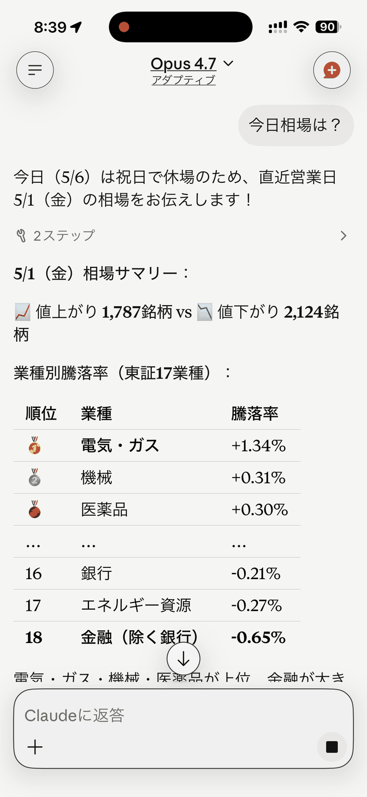
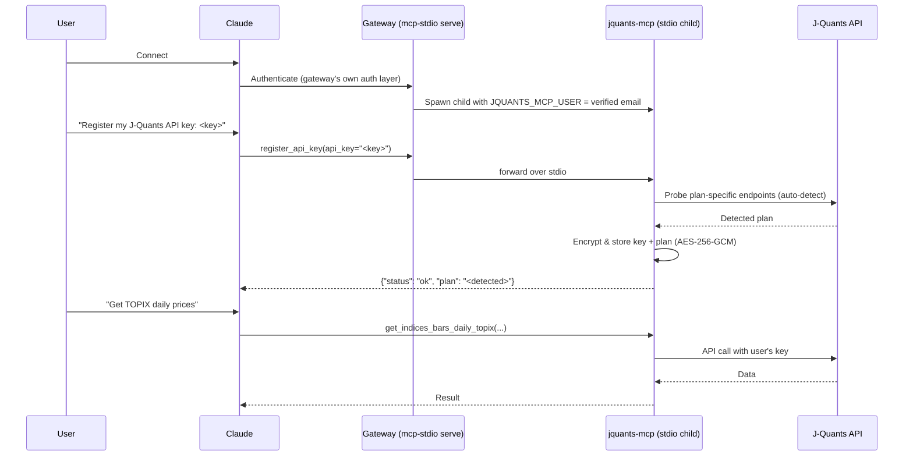

<!-- mcp-name: io.github.shigechika/jquants-mcp -->

# jquants-mcp

English | [日本語](README.ja.md)

An [MCP (Model Context Protocol)](https://modelcontextprotocol.io/) server that retrieves Japanese stock market data via [J-Quants API v2](https://jpx-jquants.com/).

User-facing documentation site: <https://shigechika.github.io/jquants-mcp/> (also available in [日本語](https://shigechika.github.io/jquants-mcp/ja/)) — start there if you want a gentler 5-minute introduction. This README is the technical reference (config schema, all 55 tools with parameter tables, deployment).

Release history and changelog: [GitHub Releases](https://github.com/shigechika/jquants-mcp/releases).

Deployment shapes and how to pick between them: see [docs/deploy/](docs/deploy/).

## Demo

<p align="center">
  
</p>

24-second loop showing real output from the Claude iPhone app calling jquants-mcp tools:

- Sector performance ranking (業種別騰落率) — `get_sector_performance`
- Top turnover by trading value (売買代金ランキング) — `get_top_turnover_value`
- Candlestick chart with SMA — `get_candlestick_data`
- Quarterly financial summary (決算ダイジェスト) — `get_fins_summary`
- 5-stock return comparison — `get_comparison_chart_data`

Individual frames are in [docs/screenshots/](docs/screenshots/).

## Features

- **55 MCP tools** — 22 J-Quants API v2 endpoints, 11 market overview + valuation, 10 offline screener, 1 technical indicators, 1 single-stock summary, 3 cache-only equity search + earnings (schedule + results), 2 chart tools (JSON, no optional dependencies), and 5 server utilities
- **Two-tier SQLite cache** — row-level cache for time-series data, response-level cache with TTL for others
- **Stock split detection** — automatic cache invalidation when AdjFactor changes
- **Rate limiting** — plan-aware sliding window (Free: 5/min, Light: 60, Standard: 120, Premium: 500)
- **Retry with backoff** — automatic retry for 429/5xx errors
- **Pagination** — transparent multi-page fetching
- **Plan-aware** — all tools registered regardless of plan; graceful error messages on restriction

## Requirements

- Python 3.10+
- [J-Quants API key](https://jpx-jquants.com/) (Free plan or above)

## Installation

```bash
# Using uv (recommended)
uv pip install jquants-mcp

# Using pip
pip install jquants-mcp
```

### From source

```bash
git clone https://github.com/shigechika/jquants-mcp.git
cd jquants-mcp
uv sync --dev
```

## Configuration

Settings are loaded with the following priority (later wins):

1. `~/.jquants-api/jquants-api.toml` — API key only (J-Quants official config)
2. `~/.config/jquants-mcp/config.ini` (user global)
3. `./config.ini` (current directory)
4. Environment variables (from MCP client or shell)

### API Key (zero-config)

If you already use [jquants-api-client](https://github.com/J-Quants/jquants-api-client-python), your API key is automatically read from `~/.jquants-api/jquants-api.toml`. No extra configuration needed.

### API Key via browser login

```sh
jquants-mcp login
```

Opens a browser to J-Quants (AWS Cognito, PKCE flow), and on success writes the API key to `~/.config/jquants-mcp/config.ini` (mode 0600). Same auth backend as the [official jquants-cli](https://github.com/J-Quants/jquants-cli). Use `jquants-mcp logout` to clear the saved key.

### config.ini

MCP-specific settings (cache, client behavior):

```ini
[jquants]
# cache_dir = ~/.cache/jquants-mcp
# base_url = https://api.jquants.com/v2

[client]
# max_retries = 5
# retry_base_delay = 1.0
# max_pages = 10

[server]
# encryption_key = <random-secret>   # enables per-user API key storage (multi-user mode)
# allowed_emails = alice@example.com,bob@example.com
```

### Environment Variables

| Variable | Required | Default | Description |
|---|---|---|---|
| `JQUANTS_API_KEY` | No* | — | J-Quants API key |
| `JQUANTS_API_TOML_PATH` | No | `~/.jquants-api/jquants-api.toml` | Path to the J-Quants official config file. Override to avoid macOS 26+ launchd sandbox restrictions (see [macOS launchd note](#macos-launchd-note) below) |
| `JQUANTS_PLAN` | No | auto-detect | Plan: `free` / `light` / `standard` / `premium` (auto-detected from the API key at server startup; set this variable only to override) |
| `JQUANTS_CACHE_DIR` | No | `~/.cache/jquants-mcp` | Cache directory path |
| `JQUANTS_BASE_URL` | No | `https://api.jquants.com/v2` | API base URL |
| `MAX_RETRIES` | No | `5` | Max retry attempts for failed requests |
| `RETRY_BASE_DELAY` | No | `1.0` | Base delay (seconds) for exponential backoff |
| `MAX_PAGES` | No | `10` | Max pages to fetch per paginated request |
| `JQUANTS_MCP_USER` | No | — | Identity of the authenticated user, injected by the gateway (see [Authentication](#authentication)). Never set this by hand |
| `MCP_ENCRYPTION_KEY` | No | — | Passphrase for AES-256-GCM encryption of per-user API keys |
| `MCP_ENCRYPTION_KEY_PREVIOUS` | No | — | Previous encryption passphrase — enables dual-key decrypt during a rotation window. See [secrets rotation runbook](docs/runbooks/secrets-rotation.md) |
| `RATE_LIMIT_PER_MINUTE` | No | `60` | Per-user request ceiling (multi-user mode). Applies per `JQUANTS_MCP_USER` identity |
| `RATE_LIMIT_BURST` | No | `20` | Per-user burst allowance (token-bucket capacity) |
| `JQUANTS_ALLOWED_EMAILS` | No | — | Comma-separated allowlist of emails. Empty = allow any user the gateway authenticated (self-host default). Set this on public Cloud Run instances to restrict access; unauthorized users get a 403-style message pointing them to self-host |

\* API key is auto-detected from `~/.jquants-api/jquants-api.toml`. Set `JQUANTS_API_KEY` only to override.

Environment variables override both `config.ini` and `jquants-api.toml`. This allows MCP clients (Claude Desktop, Claude Code) to pass settings via their `env` block while keeping defaults elsewhere.

### macOS launchd note

If you run `jquants-mcp` as a **macOS LaunchAgent** and the API key lives in `~/.jquants-api/jquants-api.toml`, the server may silently hang during startup on macOS 26 or later. The TCC sandbox applied to launchd-spawned processes blocks `open()` on some dotfiles under `$HOME` (mode `600`), and the process never finishes starting.

Workaround: copy the toml outside the sandboxed home hierarchy and point the server at it via `JQUANTS_API_TOML_PATH`:

```sh
sudo mkdir -p /usr/local/etc/jquants-mcp
sudo cp ~/.jquants-api/jquants-api.toml /usr/local/etc/jquants-mcp/jquants-api.toml
sudo chown "$USER":staff /usr/local/etc/jquants-mcp/jquants-api.toml
sudo chmod 600 /usr/local/etc/jquants-mcp/jquants-api.toml
```

Then add the following to your LaunchAgent plist's `EnvironmentVariables` dict:

```xml
<key>JQUANTS_API_TOML_PATH</key>
<string>/usr/local/etc/jquants-mcp/jquants-api.toml</string>
```

Alternatives: set `JQUANTS_API_KEY` directly in the plist (simpler but puts the key in a plist file that Time Machine / iCloud may back up), or put `api_key =` directly in `~/.config/jquants-mcp/config.ini` (if that path is not sandbox-blocked on your macOS version).

Linux/systemd and other init systems are not affected.

## Authentication

The server speaks **stdio only** and binds no network socket, so it performs no authentication of its own — there is no listener to authenticate against. Access control is a property of whoever starts the process:

| Deployment | Who controls access |
|---|---|
| Local (Claude Code, Claude Desktop) | The OS. The MCP client spawns the server as a subprocess; the API key comes from `config.ini` / `jquants-api.toml` / `JQUANTS_API_KEY` |
| Remote | A gateway in front of the server. The gateway terminates authentication and spawns the stdio server per session |

### Gateway identity

For remote or multi-user deployments, put a gateway in front of the stdio server. [`mcp-stdio serve`](https://github.com/shigechika/mcp-stdio) is the gateway both production deployments use: it accepts MCP over HTTP, authenticates the caller, and spawns one `jquants-mcp` child process per session.

The gateway passes the authenticated identity down to that child as the `JQUANTS_MCP_USER` environment variable (`mcp-stdio serve --trusted-user-header X-Forwarded-Email --user-env JQUANTS_MCP_USER`). One child process serves exactly one principal for its whole lifetime, and the server reads `JQUANTS_MCP_USER` as that principal's verified email — it applies the `JQUANTS_ALLOWED_EMAILS` allowlist and per-user rate limits to it, and looks up that user's stored API key.

> **Trust model:** `JQUANTS_MCP_USER` is trusted as-is; the server does no verification of its own. Whoever can set the child process's environment *is* that user, so the variable must be injected by the gateway and never by a user-supplied value.

When `JQUANTS_MCP_USER` is absent — the normal local case — the server runs single-user against the globally configured API key.

A worked example of the whole shape (auth proxy in front, gateway, stdio child, cache download) is [`scripts/entrypoint-stdio.sh`](scripts/entrypoint-stdio.sh), the entrypoint of the Cloud Run deployment described below. There is no other documented remote-access story: the server itself has no transport, TLS, or token options.

## Multi-user Mode

When the server receives a gateway identity (`JQUANTS_MCP_USER`, see [Authentication](#authentication)) and `MCP_ENCRYPTION_KEY` is configured, it operates in **multi-user mode**: each user stores their own J-Quants API key on the server, and all data tools use that key automatically. All users share the read cache; each user gets an independent J-Quants client with isolated rate limiting and their own plan's date-range window.

### User flow


```mermaid
sequenceDiagram
    participant U as User
    participant C as Claude
    participant G as Gateway (mcp-stdio serve)
    participant S as jquants-mcp (stdio child)
    participant J as J-Quants API
    U->>C: Connect
    C->>G: Authenticate (gateway's own auth layer)
    G->>S: Spawn child with JQUANTS_MCP_USER = verified email
    U->>C: "Register my J-Quants API key: <key>"
    C->>G: register_api_key(api_key="<key>")
    G->>S: forward over stdio
    S->>J: Probe plan-specific endpoints (auto-detect)
    J-->>S: Detected plan
    S->>S: Encrypt & store key + plan (AES-256-GCM)
    S-->>C: {"status": "ok", "plan": "<detected>"}
    U->>C: "Get TOPIX daily prices"
    C->>S: get_indices_bars_daily_topix(...)
    S->>J: API call with user's key
    J-->>S: Data
    S-->>C: Result
```

### Tools for multi-user mode

| Tool | Required | Description |
|---|---|---|
| `register_api_key` | `JQUANTS_MCP_USER` + `MCP_ENCRYPTION_KEY` | Encrypt and store your J-Quants API key |
| `delete_api_key` | `JQUANTS_MCP_USER` + `MCP_ENCRYPTION_KEY` | Remove your stored key |

Both tools return an explanatory error instead of failing silently when either requirement is missing.

**Registering a key** (tell Claude):

> "Register my J-Quants API key: `<your-api-key>`"

Claude calls `register_api_key(api_key="...")`. The server probes plan-specific endpoints with the key to auto-detect the plan (`free` / `light` / `standard` / `premium`) and stores it alongside the encrypted key — no manual selection needed. Subsequent tool calls use the detected plan for rate limiting and date-range restrictions.

This is the only way to register a key on a multi-user deployment; the server exposes no web form and no HTTP endpoint of any kind.

### Security

- API keys are encrypted with **AES-256-GCM** (authenticated encryption — integrity-protected)
- The encryption key is derived via **PBKDF2-HMAC-SHA256** (200,000 iterations) from `MCP_ENCRYPTION_KEY`, with a random 16-byte salt per encryption
- Each ciphertext uses a unique random 12-byte nonce — encrypting the same key twice produces different ciphertext
- Tampered or truncated ciphertexts are rejected before decryption

### Single-user fallback

| Configuration | Behavior |
|---|---|
| No `JQUANTS_MCP_USER` (local stdio) | Single-user: global `JQUANTS_API_KEY` for all calls |
| `JQUANTS_MCP_USER`, no `MCP_ENCRYPTION_KEY` | Gateway-authenticated, but all users share the global `JQUANTS_API_KEY` |
| `JQUANTS_MCP_USER` + `MCP_ENCRYPTION_KEY` | Full multi-user: each user has an independent encrypted API key |

## Usage

### Claude Code (plugin)

This repository doubles as a single-plugin marketplace, so Claude Code can install
the server for you:

```
/plugin marketplace add shigechika/jquants-mcp
/plugin install jquants-mcp@jquants-mcp
```

The plugin launches `uvx`, so it must be on the `PATH` of the process that
runs Claude Code — a login shell usually has it, but a GUI-launched app may
not; install [uv](https://docs.astral.sh/uv/) system-wide if the plugin
fails to start.

The plugin launches `uvx jquants-mcp` and reads the same environment variables
described in [Configuration](#configuration). `JQUANTS_API_KEY` is deliberately
left out of the plugin's own `.mcp.json` so the key you already have — from
`jquants-mcp login` (`~/.config/jquants-mcp/config.ini`) or the J-Quants
official `~/.jquants-api/jquants-api.toml` — is still found; export it
yourself before starting Claude Code only if you want to override both of
those.

### Claude Code (manual)

Register the MCP server with `claude mcp add`:

```bash
claude mcp add jquants-mcp -- jquants-mcp
```

Or if installed from source:

```bash
claude mcp add jquants-mcp \
  -- /path/to/jquants-mcp/.venv/bin/jquants-mcp
```

The `--scope` (`-s`) option controls where the configuration is stored:

| Scope | Description | Config location |
|---|---|---|
| `local` (default) | Current project, current user only | `.claude.json` |
| `project` | Current project, shared with team | `.mcp.json` in project root |
| `user` | All projects, current user only | `~/.claude.json` |

API key is auto-detected from `~/.jquants-api/jquants-api.toml`. Set `--env JQUANTS_API_KEY=...` only to override.

### AI Agent Skills

Install the operational guidance Skill into your Claude Code project:

```bash
npx skills add shigechika/jquants-mcp
```

This adds `skills/jquants-mcp-usage/SKILL.md` to your project, giving Claude Code the daily workflows (one-call briefings, value screening, single-stock deep dives) plus practical tips on cache tiers, plan-based date limits, screener patterns, and safe cache management — without touching the tool definitions.

### Claude Desktop

Add to Claude Desktop config file:

| OS | Config file |
|---|---|
| macOS | `~/Library/Application Support/Claude/claude_desktop_config.json` |
| Windows | `%APPDATA%\Claude\claude_desktop_config.json` |
| Linux | `~/.config/Claude/claude_desktop_config.json` |

```json
{
  "mcpServers": {
    "jquants-mcp": {
      "command": "/path/to/jquants-mcp/.venv/bin/jquants-mcp"
    }
  }
}
```

The server auto-detects the plan from your API key on startup — no need to set it manually. Add an `env` block only if you want to override the detection or point to a different API key.

> **Note:** Claude Desktop has a limited `PATH` (`/usr/local/bin`, `/usr/bin`, etc.), so you must specify the full path to the executable.

Restart Claude Desktop after editing.

### Standalone (stdio)

```bash
jquants-mcp
```

### Remote access

The server has no network transport of its own — no `--transport`, no `--host`/`--port`, no TLS options. To reach it from another machine, front the stdio server with a gateway that terminates authentication and spawns `jquants-mcp` per session. With [`mcp-stdio serve`](https://github.com/shigechika/mcp-stdio) that looks like:

```bash
mcp-stdio serve --host 127.0.0.1 --port 8081 --path /mcp \
  --enable-oauth --public-url https://mcp.example.com \
  --trusted-user-header X-Forwarded-Email --user-env JQUANTS_MCP_USER \
  -- jquants-mcp
```

> **`--trusted-user-header` requires an authenticating proxy in front — not merely a TLS-terminating one.**
> The gateway trusts that header without verifying it. A plain TLS proxy passes client headers through, so anyone could send `X-Forwarded-Email: victim@example.com` and be served as that user, reaching their stored API key. The proxy must **authenticate the caller and overwrite the header with the verified identity**, discarding whatever the client sent. `oauth2-proxy` does this (its `skip_auth_strip_headers` default strips client-supplied headers on pass-through routes). Bind the gateway to loopback, as above, so it is reachable only via that proxy.
>
> Omit `--trusted-user-header` and `--user-env` if you have no such proxy: the server then runs single-user against the configured API key, which is safe.

[`scripts/entrypoint-stdio.sh`](scripts/entrypoint-stdio.sh) is the worked example. It is the entrypoint of the Cloud Run deployment described below, and shows the gateway running behind an `oauth2-proxy` sidecar together with the startup cache download.

That is the whole remote-access story. How clients connect depends only on the gateway you chose; the sections below cover the two shapes used with `mcp-stdio serve`.

#### Claude Code / Claude Desktop (remote via mcp-stdio)

Claude Desktop does not speak Streamable HTTP directly, and `claude mcp add --transport http --header "Authorization: Bearer ..."` drops the header during health checks ([claude-code#28293](https://github.com/anthropics/claude-code/issues/28293)). The [mcp-stdio](https://pypi.org/project/mcp-stdio/) client bridges stdio to the remote endpoint in both cases:

```bash
pip install mcp-stdio  # or: uvx mcp-stdio

# Claude Code — --oauth drives the gateway's OAuth flow in your browser
claude mcp add jquants-mcp -- mcp-stdio --oauth https://mcp.example.com/mcp
```

```json
{
  "mcpServers": {
    "jquants-mcp": {
      "command": "mcp-stdio",
      "args": ["--oauth", "https://mcp.example.com/mcp"]
    }
  }
}
```

Restart Claude Desktop after editing. Use `--bearer-token <TOKEN>` instead of `--oauth` if your gateway authenticates with a static token.

#### Claude Desktop Connectors

When the gateway speaks OAuth 2.1 over HTTPS (`mcp-stdio serve --enable-oauth`), Claude Desktop's **Connectors** panel can connect natively — click **Connect** and complete the login in the browser; the token is stored and reused silently.

```json
{
  "mcpServers": {
    "jquants-mcp": {
      "type": "http",
      "url": "https://mcp.example.com/mcp"
    }
  }
}
```

Per-user API keys additionally require `MCP_ENCRYPTION_KEY` on the server — see [Multi-user Mode](#multi-user-mode). If `"type": "http"` is not yet available in your Claude Desktop version, use the mcp-stdio bridge above instead.

## Available Tools

### Equities (8 tools)

| Tool | Endpoint | Plan | Description |
|---|---|---|---|
| `get_equities_master` | `/equities/master` | Free+ | Listed issue information |
| `get_equities_bars_daily` | `/equities/bars/daily` | Free+ | Daily stock prices (OHLC) |
| `get_equities_bars_minute` | `/equities/bars/minute` | Light+ | Minute-level stock prices |
| `get_equities_bars_daily_am` | `/equities/bars/daily/am` | Premium | Morning session prices |
| `get_equities_investor_types` | `/equities/investor-types` | Light+ | Trading by investor type |
| `get_equities_earnings_calendar` | `/equities/earnings-calendar` | Free+ | Earnings schedule (single date or by code) |
| `get_earnings_this_week` | (cache only) | Free+ | Companies reporting earnings in a date window, grouped by day (default today..+7d) |
| `search_equities` | (cache only) | Free+ | Reverse lookup by company name (e.g. `"住友商事"` → `8053`) |

### Financials (4 tools)

| Tool | Endpoint | Plan | Description |
|---|---|---|---|
| `get_fins_summary` | `/fins/summary` | Free+ | Financial summary (quarterly) |
| `get_fins_details` | `/fins/details` | Premium | Detailed statements (BS/PL/CF) |
| `get_fins_dividend` | `/fins/dividend` | Premium | Cash dividend data |
| `get_earnings_results_this_week` | (cache only) | Free+ | Earnings results disclosed in a date window (default last 7d), grouped by day with headline P&L + forecast progress |

### Indices (2 tools)

| Tool | Endpoint | Plan | Description |
|---|---|---|---|
| `get_indices_bars_daily` | `/indices/bars/daily` | Standard+ | Index daily prices |
| `get_indices_bars_daily_topix` | `/indices/bars/daily/topix` | Light+ | TOPIX daily prices |

### Derivatives (3 tools)

| Tool | Endpoint | Plan | Description |
|---|---|---|---|
| `get_derivatives_bars_daily_futures` | `/derivatives/bars/daily/futures` | Premium | Futures daily prices |
| `get_derivatives_bars_daily_options` | `/derivatives/bars/daily/options` | Premium | Options daily prices |
| `get_derivatives_bars_daily_options_225` | `/derivatives/bars/daily/options/225` | Standard+ | Nikkei 225 options prices |

### Markets (6 tools)

| Tool | Endpoint | Plan | Description |
|---|---|---|---|
| `get_markets_margin_interest` | `/markets/margin-interest` | Standard+ | Margin trading data |
| `get_markets_margin_alert` | `/markets/margin-alert` | Standard+ | Margin trading alerts |
| `get_markets_short_ratio` | `/markets/short-ratio` | Standard+ | Short selling ratio |
| `get_markets_short_sale_report` | `/markets/short-sale-report` | Standard+ | Short sale position report |
| `get_markets_breakdown` | `/markets/breakdown` | Premium | Market breakdown by investor |
| `get_markets_calendar` | `/markets/calendar` | Free+ | Trading calendar |

### Bulk Download (2 tools)

| Tool | Endpoint | Plan | Description |
|---|---|---|---|
| `get_bulk_list` | `/bulk/list` | Light+ | List downloadable CSV files |
| `get_bulk_download_url` | `/bulk/get` | Light+ | Get signed download URL |

### Market Overview & Valuation (11 tools)

Cross-sectional cache-only tools that scan all listed equities. No extra API calls, useful for "what's the overall market doing today?" and sector valuation queries.

| Tool | Description |
|---|---|
| `detect_price_change` | Daily advance/decline summary (値上がり/値下がり銘柄数) and advance-decline ratio. |
| `get_advance_decline_ratio` | Cumulative advance/decline ratio (騰落レシオ) over the last *period* trading days. Default 25 (overbought >120, oversold <70). |
| `get_top_movers` | Top gainers/losers ranked by percentage price change. Returns code + name + change_pct. |
| `get_top_volume` | Top stocks by trading volume (出来高ランキング, share count). Returns code + name + volume + turnover_value. |
| `get_top_turnover_value` | Top stocks by turnover value (売買代金ランキング, yen). Surfaces high-priced large-caps that dominate institutional flow, distinct from `get_top_volume`. |
| `get_sector_performance` | Sector-level average daily change (業種別騰落率) grouped by TSE 33 sectors (default) or 17 sectors (`sector_type="s17"`). |
| `get_sector_briefing` | Sector-level median PER, PBR, and ROE (業種別ブリーフィング) aggregated from the most recent FY financials. Split-adjusted. Sorted by PER ascending (cheapest first). |
| `get_dividend_yield_ranking` | High dividend yield stock ranking (高配当利回りランキング). Joins `DivAnn` from `fins_summary` with `AdjC` to compute yield_pct = DivAnn / AdjC × 100. Skips interim reports with empty DivAnn. |
| `get_valuation_ranking` | PER/PBR valuation ranking (バリュエーションランキング). Joins latest-FY `EPS`/`BPS` with `AdjC` (split-adjusted) across all stocks; default 20 cheapest by PER. Excludes net-loss (EPS≤0, PER) / negative-book (BPS≤0, PBR). `metric`, `min_value`/`max_value`, `market`, `sector`, `disc_months` filters. |
| `get_value_stock_screen` | Combined value screen (年安・割安・高配当・好決算スクリーニング) — ALL criteria must hold: close within `near_low_pct` % of the 52-week low (or fresh 52w low), PER < `max_per` AND PBR < `max_pbr`, forward dividend yield ≥ `min_yield` %, and a profit-increase forecast (`NxFNp`/`FNP` > `NP`). Split-adjusted, REITs excluded, all-cache. Items carry `margin_ratio` (信用倍率 = LongVol/ShrtVol) + `margin_date` (Standard+; null otherwise). |
| `get_market_briefing` | Composite daily briefing (相場ブリーフィング) — advance/decline + 25-day ADR + sector top/bottom + top movers + top turnover + screener highlights + value screen + TOPIX change in one call. |

### Screener (10 tools)

Offline tools that compute signals directly from the SQLite cache. No extra API calls, pure Python, no numpy/pandas. Intended for Claude-assisted stock screening without hitting rate limits.

| Tool | Description |
|---|---|
| `detect_price_limit` | Find stocks that touched the daily upper/lower price limit (ストップ高/安) using the `UL`/`LL` flags. Optional close-at-limit refinement via `C == H` / `C == L`. |
| `compare_close_vs_vwap` | Compute the daily VWAP (`Va / Vo`) and compare to the close for a given code + date or date range. |
| `detect_52w_high_low` | New 52-week rolling high/low (Yahoo / Bloomberg / TradingView convention). Returns `new_high` / `new_high_close` / `new_low` / `new_low_close` plus conviction context: `AdjO`, `close_vs_vwap` (`"above"`/`"below"`), `volume_ratio`, `volume_ratio_sessions`. |
| `detect_52w_high_low_range` | Same as above but across a date range (`date_from`–`date_to`). Use this instead of repeated single-date calls. |
| `detect_ytd_high_low` | New year-to-date (年初来) high/low (Kabutan / JPX / Yahoo!ファイナンス convention). Same four signals against the YTD prior window plus `AdjO`, `close_vs_vwap`, `volume_ratio`, `volume_ratio_sessions`. |
| `detect_ytd_high_low_range` | Same as above but across a date range (`date_from`–`date_to`). Use this instead of repeated single-date calls. |
| `detect_volume_surge` | List stocks whose volume on `date` exceeds the trailing 20-day average by a configurable `multiplier` (default 2.0). |
| `detect_distribution_days` | Identify distribution days (機関投資家の売り圧力) using TOPIX as the market proxy and total market turnover (`SUM(Va)`) as the volume signal. A distribution day fires when TOPIX falls ≥ `sigma_multiplier` σ (default 2.0) below the 20-session rolling mean. Four or more within `window_sessions` (default 25) sessions is a warning that the uptrend may be failing (IBD — Investor's Business Daily — method adapted for TOPIX). Each entry includes `volume_confirmed` (whether total market Va exceeded the prior session). |
| `detect_follow_through_day` | Confirm a new uptrend (フォロースルーデイ). TOPIX must rise ≥ `sigma_multiplier` σ (default 2.0) above the 20-session rolling mean on session 4 or later from `rally_start` (the low/reversal day), with higher total market Va than the prior session. Provide the first day of the rally attempt as `rally_start`; check each subsequent date until the signal fires or distribution resumes. |
| `detect_consecutive_dividend_increase` | Screen for stocks with at least `min_years` (default 10) consecutive years of annual dividend increase (連続増配). Split-adjusted. Supports `as_of_date` for lookahead-free back-testing. Results sorted by consecutive years descending; each entry includes `code`, `name`, `consecutive_years`, `latest_div_ann`, `latest_fy_end`, and a `history` list of recent fiscal years. All plans (cache-only). |

### Single Stock Briefing (1 tool)

Cache-only tool that assembles a one-page snapshot for a single stock from cached data. No extra API calls.

| Tool | Description |
|---|---|
| `get_stock_briefing` | One-page briefing for a single stock (株式ブリーフィング): latest price (close, change_pct, volume, OHLC), most recent FY financials (revenue, operating profit, net income), and valuation ratios (PER, PBR, ROE, EPS, BPS, dividend yield). All figures are split-adjusted. PER is null when EPS ≤ 0 (net-loss period); ROE is null when EPS ≤ 0 and no native ROE value is cached (a native ROE, when present, is returned regardless of EPS sign). Dividend yield uses the most recent DivAnn disclosed within the past 18 months. |

### Technical Indicators (1 tool)

Pure-Python SMA / Bollinger Bands / RSI computation over the cached daily bars. No extra API call for codes already in cache; falls back to the J-Quants API on a cache miss and stores the result.

| Tool | Description |
|---|---|
| `get_technical_indicators` | Compute SMA (5/25/75), Bollinger Bands (bb20, ±2σ sample std), and RSI (rsi14, Wilder smoothing) for a single code over a date or date range. Returns numeric values — useful for "is close above SMA25?" or "is RSI overbought?" without rendering a chart. All values use split-adjusted close (AdjC). Indicators not yet warmed up are returned as `null`. |

> **RSI in charts**: RSI sub-panel is not yet available. Use `get_technical_indicators` for numeric RSI values.

### Charts (2 tools)

Both tools return JSON for React artifact / Plotly rendering (no optional dependencies).

| Tool | Description |
|---|---|
| `get_candlestick_data` | OHLCV + indicator data as JSON parallel arrays for a single code. Returns `dates`, `ohlcv`, `indicators` (SMA / Bollinger), `lock_days`, `earnings_dates`. Default: 91-day range, `sma5` + `sma25` overlays. |
| `get_comparison_chart_data` | Multi-stock time-series data as JSON wide-format records (up to 10 codes). Default `mode="return_pct"` normalises each series to 0% at its first bar; `mode="price"` plots adjusted close. |

Indicator options for `get_candlestick_data`:

- **Indicators**: `volume`, `sma5`, `sma20`, `sma25`, `sma60`, `sma75`, `sma200`, `bb20` (20-day Bollinger band; expands to `bb20_upper` / `bb20_mid` / `bb20_lower`)
- **Adjusted prices**: split-adjusted by default (`adjusted=True`); set `False` for raw OHLC

### Utility (5 tools)

| Tool | Auth required | Description |
|---|---|---|
| `health_check` | — | Server health and API key status |
| `cache_status` | — | Cache statistics |
| `cache_clear` | — | Clear cached data |
| `register_api_key` | Gateway identity | Store your J-Quants API key (multi-user mode) |
| `delete_api_key` | Gateway identity | Remove your stored J-Quants API key |

## Caching

The server uses a two-tier SQLite cache:

- **Tier 1 (Row-level)**: Time-series data cached by date and code. Supports incremental fetching and stock split detection via AdjFactor comparison.
  - `equities_bars_daily`, `equities_master`, `fins_summary`, `indices_bars_daily_topix`, `investor_types`, `markets_margin_interest`, `markets_margin_alert`, `markets_short_ratio`, `markets_breakdown`, `markets_calendar`
- **Tier 2 (Response-level)**: Full API responses cached with configurable TTL (6h / 24h / 7d).

Cache is stored at `~/.cache/jquants-mcp/cache.db` by default.

**Expected disk usage after a full historical fetch** (approximate; varies by market data availability):

| Plan | Retention | Approx. size |
|---|---|---|
| Free | 2 years | ~500 MB |
| Light | 5 years | ~2.9 GB |
| Standard | 10 years | ~3.5 GB |
| Premium | All available | ~4 GB+ |

### Bulk Data Import

The `scripts/bulk_fetch_all.py` script downloads all available bulk CSV data from the J-Quants Bulk API and imports it into the SQLite cache. This is the fastest way to populate the local cache with historical data.

```bash
# Fetch all available data for your plan
uv run python scripts/bulk_fetch_all.py

# Fetch specific endpoints only
uv run python scripts/bulk_fetch_all.py --endpoints fins_summary topix margin_interest

# Dry run — show file list and sizes without downloading
uv run python scripts/bulk_fetch_all.py --dry-run
```

The script respects the plan-based rate limit (e.g. 60 req/min for Light) and retries on 429 errors. A full historical fetch takes roughly **1 hour**; use `health_check` to monitor progress.

### CSV Import

The CSV sideload script (`import_csv_to_cache.py`) is maintained by the publisher pipeline that feeds this cache. If you are building your own pipeline, implement sideloading by inserting directly into the `equities_bars_daily` / `equities_master` tables following the schema defined in `src/jquants_mcp/cache/schema.py`.

### Daily Fetch

`scripts/daily_fetch.py` fetches additional J-Quants data via `jquantsapi.ClientV2` and inserts it directly into the SQLite cache. Designed to be called from an external daily pipeline (e.g. a cron job or shell script).

The script reads the plan from `~/.config/jquants-mcp/config.ini` (or `JQUANTS_PLAN` env var) and automatically determines which endpoints to fetch:

| Plan | Endpoints |
|---|---|
| Free | `fins_summary`, `earnings_cal` |
| Light | + `topix`, `investor_types` |
| Standard | + `short_ratio`, `margin_interest`, `margin_alert`, `short_sale_report` |
| Premium | + `breakdown` |

```bash
# Fetch all endpoints available for your plan
python3 scripts/daily_fetch.py

# Fetch specific endpoints only
python3 scripts/daily_fetch.py --topix --investor-types

# Fetch trading calendar
python3 scripts/daily_fetch.py --calendar

# Backfill historical Markets data (past N days)
python3 scripts/daily_fetch.py --backfill 90

# Use a custom cache DB path
python3 scripts/daily_fetch.py --db /path/to/cache.db
```

Permission errors (403) are handled gracefully — the script logs the error and continues to the next endpoint without crashing.

### Cache Health Check

`scripts/verify_cache_completeness.py` audits the local cache and reports which tables are up-to-date, stale, or missing for the current plan.

```bash
# Quick freshness check (text output)
uv run python scripts/verify_cache_completeness.py

# Machine-readable JSON (for CI / monitoring)
uv run python scripts/verify_cache_completeness.py --output json

# Detect date-level gaps (days where only a fraction of stocks were fetched)
uv run python scripts/verify_cache_completeness.py --check-gaps

# Show what --auto-fix would repair, without making API calls
uv run python scripts/verify_cache_completeness.py --check-gaps --auto-fix --dry-run

# Re-fetch gap days automatically
uv run python scripts/verify_cache_completeness.py --check-gaps --auto-fix
```

Exit codes: `0` = all tables healthy, `1` = stale or missing tables, `2` = fatal (DB unreadable).

The plan is auto-detected from your API key (same probe as `daily_fetch.py`); pass `--plan <plan>` or set `JQUANTS_PLAN` to override (skips the probe).

Useful before a plan downgrade to confirm all currently-covered data has been fetched, and as a periodic check to catch silent fetch failures early.

## Cloud Run Deployment

This server can be deployed to [Google Cloud Run](https://cloud.google.com/run). Because the server is stdio-only, the service is two containers: an `oauth2-proxy` sidecar handles Google login, and the app container runs [`scripts/entrypoint-stdio.sh`](scripts/entrypoint-stdio.sh) — `mcp-stdio serve` fronting a per-session `jquants-mcp` child process (see [Authentication](#authentication)).

State is split across two managed stores:

- **`cache.db`** — published to a GCS bucket by the self-hosted server and downloaded to `/tmp` (tmpfs) on every cold start. Cloud Run reads it but never writes back.
- **`users`** — per-user encrypted J-Quants API keys, stored in Firestore (Native mode). Strongly consistent and multi-writer safe, so no SQLite write conflicts. The gateway keeps its own OAuth token state in a separate Firestore collection.

Details: see [GCS and Firestore integration](#gcs-and-firestore-integration) below.

> For a fork-and-deploy walkthrough (WIF, OAuth client, custom domain, Claude mobile setup, allowlist), see [docs/deploy/gcp.md](docs/deploy/gcp.md). The sections below summarise the moving parts; the deploy guide is the canonical step-by-step.

### Prerequisites

- [Google Cloud SDK](https://cloud.google.com/sdk/docs/install)
- A GCS bucket holding a read-only snapshot of `cache.db` (updated out-of-band by the self-hosted server)
- Firestore in Native mode enabled on the project (stores per-user API keys, and the gateway's OAuth token state)
- A service account with:
  - `roles/storage.objectViewer` on the GCS bucket (read-only access to `cache.db`)
  - `roles/datastore.user` on the project (Firestore read/write)
  - `roles/secretmanager.secretAccessor` if using Secret Manager for API keys

### Create a GCS bucket

```bash
gcloud storage buckets create gs://YOUR_BUCKET \
  --location asia-northeast1
```

### Enable Firestore

```bash
gcloud firestore databases create \
  --location=us-west1 \
  --type=firestore-native
```

### Deploy

The recommended path is to fork the repository and rely on the GitHub Actions CD workflow at [.github/workflows/cd.yml](.github/workflows/cd.yml). It builds the image with Cloud Build and then updates **only the app container's image** (`gcloud run services update --container app --image …`); the sidecar, scaling, CPU, env vars and secrets are set once by hand and deliberately never touched by CD.

The two-container service itself is created once, out of band, with the app container started as `--command /app/scripts/entrypoint-stdio.sh`. [docs/deploy/gcp.md](docs/deploy/gcp.md) is the canonical step-by-step for that initial setup.

Memory and scaling sizing notes are in [Memory requirements](#memory-requirements) below.

### Environment variables

| Variable | Required | Default | Description |
|---|---|---|---|
| `GCS_BUCKET` | Yes | — | GCS bucket holding the `cache.db` snapshot |
| `GCS_PREFIX` | No | `jquants-mcp/` | Object key prefix in the bucket |
| `JQUANTS_CACHE_DIR` | No | `/tmp` | Local directory where `cache.db` is materialized (tmpfs on Cloud Run) |
| `PUBLIC_URL` | Yes | — | Public base URL of the service (e.g. `https://mcp.example.com`); passed to `mcp-stdio serve --public-url` |
| `PORT` | No | `8081` | Port the gateway listens on (the `oauth2-proxy` sidecar is the ingress container) |
| `FIRESTORE_TOKEN_STORE` | No | `mcp_stdio_oauth/state` | Firestore path for the gateway's OAuth token store |
| `JQUANTS_API_KEY` | Yes | — | J-Quants API key (use Secret Manager) |
| `JQUANTS_PLAN` | No | auto-detect | Plan: `free` / `light` / `standard` / `premium` (auto-detected from the API key unless overridden) |
| `MCP_ENCRYPTION_KEY` | No | — | Enables per-user API key storage (multi-user mode); use Secret Manager |
| `JQUANTS_ALLOWED_EMAILS` | No | — | Restrict which authenticated users may use the service |
| `GOOGLE_CLOUD_PROJECT` | Yes | — | GCP project ID. Required for Firestore (user DB) and Secret Manager access. Set via `vars.GCP_PROJECT` in the CD workflow |

Firestore uses Application Default Credentials from the Cloud Run service account. The `oauth2-proxy` sidecar carries its own configuration (Google OAuth client, cookie secret) — see [docs/deploy/gcp.md](docs/deploy/gcp.md).

### GCS and Firestore integration

Cloud Run deployments depend on two managed stores, not an in-container SQLite set:

| Data | Where it lives | Access mode |
|---|---|---|
| `cache.db` (market data) | GCS object, materialized to `/tmp/cache.db` on startup | Read-only from Cloud Run |
| `users` (per-user encrypted J-Quants API keys) | Firestore `users` collection | Read/write |
| OAuth tokens and client registrations | Firestore, `FIRESTORE_TOKEN_STORE` path — owned by the gateway, not by this server | Read/write |

`cache.db` is owned by a self-hosted publisher (a cron / scheduled task running `scripts/daily_fetch.py` or `scripts/bulk_fetch_all.py` + `scripts/gcs_export_cache.py`) that pushes a fresh snapshot to GCS on each run. Cloud Run never writes back to GCS.

#### Startup flow

```mermaid
sequenceDiagram
    participant E as entrypoint-stdio.sh
    participant G as GCS
    participant M as mcp-stdio serve

    E->>G: download cache.db.zst to /tmp (synchronous)
    Note right of E: runs in the startup window,<br/>where CPU is fully allocated
    G-->>E: ~1.2 GiB compressed
    Note right of E: stream-decompressed to ~3 GiB;<br/>falls back to uncompressed cache.db
    E->>M: start gateway (cache.db already present)
    activate M
    Note right of M: each session spawns a stdio child<br/>serving from the Tier 1 cache<br/>(live J-Quants API only if the<br/>download was skipped/failed)
    deactivate M
```

Notes:
- `cache.db` is downloaded **synchronously during container startup**, before the gateway starts accepting sessions. It is published zstd-compressed as `cache.db.zst` (~1.2 GiB on the wire, stream-decompressed to ~3 GiB) because the Cloud Run instance's GCS read bandwidth (~60 MB/s) is the bottleneck; the downloader falls back to the uncompressed `cache.db` when `.zst` is absent. It runs in the container-startup window, where CPU is fully allocated (plus `--cpu-boost`): under Cloud Run's request-based CPU allocation a download started *after* the server is ready can be throttled to ~0 between requests and never finish. The trade-off is a longer cold start — the first request after a scale-to-zero waits for the download.
- If the download fails, startup continues and the server serves via the live J-Quants API (slower, counts against rate limits). `cache_status` then returns a minimal payload (`db_path` + `plan` only) until a cache is loaded.
- Firestore is strongly consistent, so per-user data survives instance recycling and is safe against concurrent writers. Sessions, however, are held in-instance by the gateway (one child process per session), so the production service runs with `max-instances=1`; scaling out is a gateway-level concern, not a storage one.

#### Daily cache refresh

After startup, `cache.db` is refreshed daily by the publisher. How that update reaches a
running server depends on the deployment.

**Cloud Run — instance recycling**

There is no in-container refresh mechanism. With `min-instances=0` every cold start
downloads a current `cache.db`, so the only window in which a running instance can hold a
stale copy is one that stays warm across the publisher's export. In that window, days not
yet cached fall through to the live J-Quants API (correct, just slower), while corrections
to already-cached rows do stay stale — the cache-vs-API decision is presence-based and the
row-level tier applies no TTL. Measured instance lifetimes under `min-instances=0` are
15–26 minutes, so the exposure is bounded by recycling. A push-based reload endpoint
existed until v1.0.0; it was removed after the design was evaluated and rejected as not
worth the moving parts (#584).

**Local process**

The publisher and the server share a filesystem, so an updated `cache.db` is visible to
the next query with no signal required. Behind a gateway such as `mcp-stdio serve`, each
session spawns a fresh child process that opens the file as it stands at that moment.

#### Troubleshooting

**Permission error on startup (`403 Forbidden` or `storage.objects.get denied`):**

```bash
gcloud storage buckets get-iam-policy gs://YOUR_BUCKET \
  --format="table(bindings.role, bindings.members)"
```

The service account needs `roles/storage.objectViewer` on the bucket — see [IAM setup](#iam-setup).

**Firestore permission errors:**

```bash
gcloud projects get-iam-policy "${PROJECT_ID}" \
  --flatten="bindings[].members" \
  --filter="bindings.members:serviceAccount:jquants-mcp@*"
```

The service account needs `roles/datastore.user` on the project.

**`cache_status` returns only `db_path` and `plan` (no row counts):**

The startup download did not complete, or the integrity prewarm is still running. Check the container log for `cache.db download complete` (emitted by `entrypoint-stdio.sh` after the synchronous download); its absence means the download was skipped or failed and the server is on the live-API fallback.

**`cache.db` not found in GCS on first deploy:**

There is no "empty cache" fallback mode beyond API fallback — the server will keep serving requests directly from the J-Quants API. Upload a `cache.db` snapshot from your self-hosted server to GCS to enable Tier 1 caching (see [Initial cache.db upload](#initial-cachedb-upload)).

### IAM setup

```bash
SA="jquants-mcp@${PROJECT_ID}.iam.gserviceaccount.com"

# Create service account
gcloud iam service-accounts create jquants-mcp \
  --display-name "jquants-mcp Cloud Run SA"

# Read-only access to the cache.db snapshot in GCS
gcloud storage buckets add-iam-policy-binding gs://YOUR_BUCKET \
  --member "serviceAccount:${SA}" \
  --role "roles/storage.objectViewer"

# Firestore access for the users collection and the gateway's token store
gcloud projects add-iam-policy-binding "${PROJECT_ID}" \
  --member "serviceAccount:${SA}" \
  --role "roles/datastore.user"

# Secret Manager access (if using Secret Manager for JQUANTS_API_KEY etc.)
gcloud projects add-iam-policy-binding "${PROJECT_ID}" \
  --member "serviceAccount:${SA}" \
  --role "roles/secretmanager.secretAccessor"
```

Note: if the self-hosted server that publishes `cache.db` uses a different service account, only *that* account needs write access to the bucket. The Cloud Run service account remains viewer-only.

### Initial cache.db upload

Cloud Run reads `cache.db` as a read-only snapshot. Publish a snapshot from your self-hosted server (which has been warming the cache) before the first deploy:

```bash
gcloud storage cp ~/.cache/jquants-mcp/cache.db \
  gs://YOUR_BUCKET/jquants-mcp/cache.db \
  --no-gzip-in-flight
```

> **Important:** disable parallel composite uploads (the default for large files). They corrupt SQLite files because the reassembled object contains byte ranges that do not form a valid database page layout. On the publishing host, set:
>
> ```bash
> gcloud config set storage/parallel_composite_upload_enabled False
> ```

No manual Firestore setup is required — collections are created on first write.

### Memory requirements

Cloud Run materializes `cache.db` into `/tmp` (a tmpfs, i.e. RAM). The memory limit therefore must cover:

- `cache.db` size (currently ~3 GiB)
- Python runtime + mcp SDK + sqlite + httpx overhead (~300 MiB)
- Request-time JSON serialization headroom

Current production sizing is `--memory 8Gi --cpu 2`, with `min-instances=0` (scale to zero), `max-instances=1`, and CPU always allocated. Those three billing-relevant settings are never passed by the CD workflow; they are set once by hand and asserted before and after every deploy by [.github/workflows/scripts/assert-jquants-billing-settings.sh](.github/workflows/scripts/assert-jquants-billing-settings.sh), so an out-of-band change fails the next deploy instead of persisting silently. Scale-to-zero is load-bearing for correctness as well as cost — every cold start re-downloads a current `cache.db` (see [Daily cache refresh](#daily-cache-refresh)). Cloud Run gen2 is required for memory allocations above 4 Gi, and >4 GiB also forces ≥2 vCPU (8 GiB is the ceiling for 2 vCPU).

Memory is 8 GiB because a cache reload briefly holds **~2× `cache.db`** in `/tmp` (which is tmpfs, i.e. RAM): the new snapshot downloads to a temp file while the current `cache.db` is still mapped, then atomically replaces it. At ~3 GiB per snapshot that peak (~6 GiB) plus the Python/SQLite RSS exceeds a 6 GiB limit and tmpfs writes fail with **SIGBUS** (observed as `Container terminated on signal 7`), so the limit is 8 GiB. If `cache.db` grows materially, raise the limit further (and keep ≥2 vCPU; >8 GiB needs ≥4 vCPU).

## Operations

For production incidents on the Cloud Run deployment, see the runbooks:

- [OOM / memory pressure](docs/runbooks/oom.md)
- [5xx spike](docs/runbooks/5xx-spike.md)
- [Firestore outage / quota](docs/runbooks/firestore-outage.md)
- [cache.db missing / download failed](docs/runbooks/cache-db-missing.md)
- [OAuth loop / persistent 401](docs/runbooks/oauth-loop.md)
- [Firestore restore](docs/runbooks/firestore-restore.md)
- [Secrets rotation](docs/runbooks/secrets-rotation.md)

Alert policies that trigger these are in [`ops/alerts/`](ops/alerts/); each policy's documentation links back to the matching runbook.

The [disaster recovery posture](docs/dr.md) documents the current single-region deployment, RTO/RPO expectations, and the (undrilled) standby-region procedure.

Service-level objectives — availability and latency targets with an error-budget policy — are in [docs/slo.md](docs/slo.md).

## Development

```bash
# Install dev dependencies
uv sync --dev

# Run tests
uv run pytest -v

# Lint
uv run ruff check src/ tests/

# Format
uv run ruff format src/ tests/
```

## Disclaimer

This software (jquants-mcp) is a technical tool for retrieving Japanese stock data from the [J-Quants API v2](https://jpx-jquants.com/) for use with Claude and other MCP clients. It is intended to provide reference information for your own investment research, and:

- This software and its output **do not constitute investment advice or recommendations**.
- We make no warranty regarding the accuracy, completeness, or timeliness of the information provided.
- **Investment decisions are made at your own risk and responsibility.**
- Past performance does not guarantee future results.
- The author is not registered as a financial instruments business operator under Japanese law.
- Use is subject to the [terms and conditions](https://jpx-jquants.com/) of J-Quants, the underlying data provider.
- The author disclaims all liability for any damages arising from the use of this software.

## License

[MIT](LICENSE)
