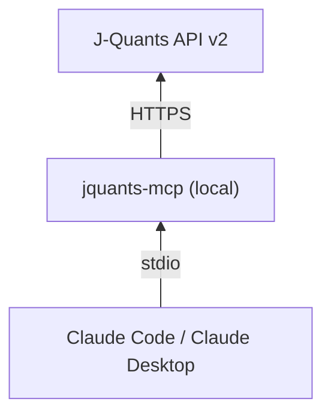
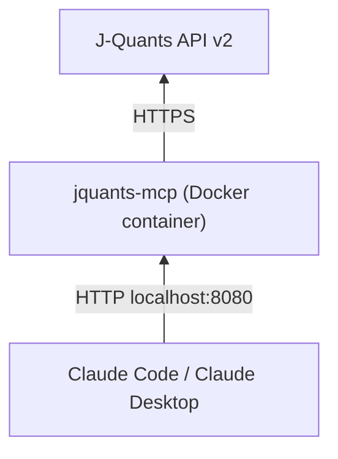
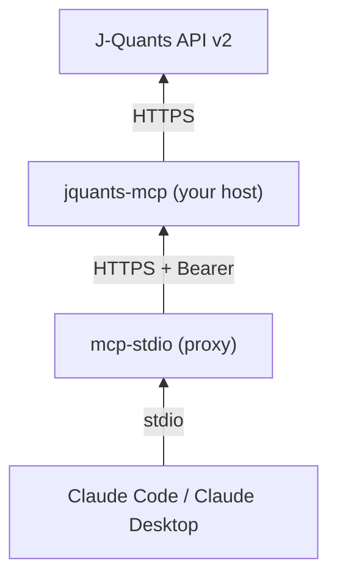
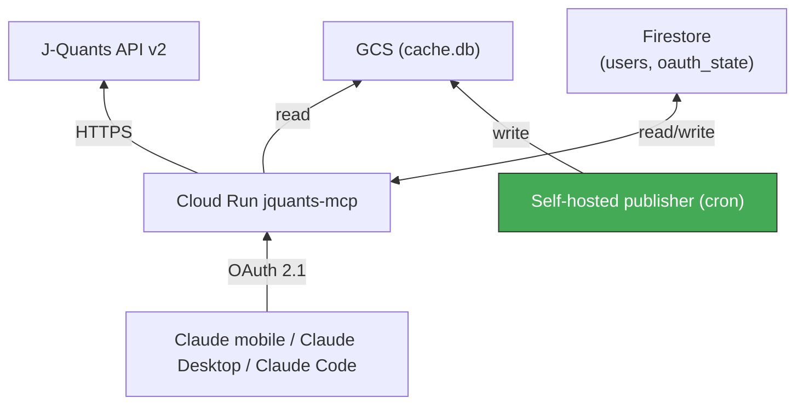
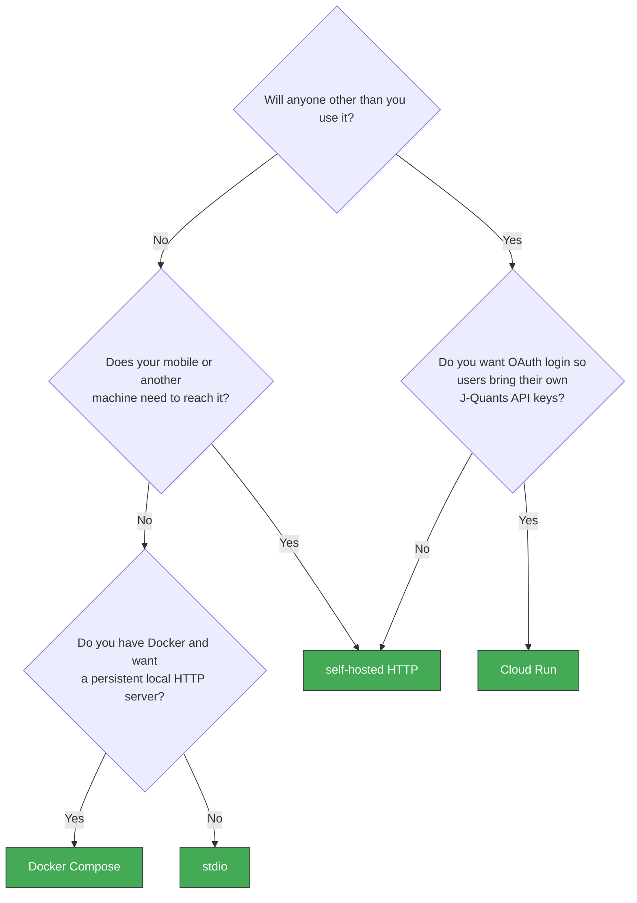

# Deployment Overview

jquants-mcp can be deployed in four shapes. Pick the one that matches your usage pattern.

| Shape | Who runs it | Cost | Setup effort | Best for |
|---|---|---|---|---|
| **stdio** (local) | One user, one machine | Free | < 5 min | Single-user desktop via Claude Code / Claude Desktop; no persistent cache needed |
| **Docker Compose** (local) | One user, one machine | Free | < 10 min | Local HTTP server without installing Python; cache persists across restarts |
| **Self-hosted HTTP** | One or a few trusted users, one host | Host + J-Quants plan | ~1 hour | Homelab / always-on server reachable from mobile or other machines |
| **Cloud Run** (GCP) | Multiple users, OAuth auth | GCP (~\$0–\$10/mo for low traffic) + J-Quants plan | 2–4 hours first time | Family / team, mobile clients, OAuth login per user |

## stdio

- Launched by the MCP client as a subprocess (`uvx jquants-mcp` or `claude mcp add`)
- Single API key via env var, config file, or `jquants-mcp login` (PKCE)
- Local SQLite cache at `~/.cache/jquants-mcp/cache.db`
- Cannot be reached from mobile or a different machine

Set up: see the main [README](../../README.md#installation).

## Docker Compose

- No Python installation required — just Docker
- Runs as a persistent local HTTP server on `http://localhost:8080/mcp`
- Cache stored in a named Docker volume; survives container restarts
- Optional: set `ENABLE_DAILY_FETCH=true` for automatic weekday cache updates

Set up: see [local.md](local.md) (Option A).

## Self-hosted HTTP

- Runs on any host that can hold a TLS cert (laptop at home, NUC, VPS)
- Streamable HTTP transport, Bearer token authentication
- One SQLite cache on the host, shared between invocations
- Mobile clients work via `mcp-stdio` proxy (Claude Code header bug workaround)

Set up: see [local.md](local.md) (Option B).

## Cloud Run (GCP)

- Managed by Google Cloud Run, autoscaling, HTTPS out-of-the-box
- Multi-user: per-user encrypted J-Quants API keys in Firestore, OAuth 2.1 login
- Allowlist (`JQUANTS_ALLOWED_EMAILS`) controls who can sign in
- Requires a self-hosted publisher to populate `cache.db` in GCS
- Compatible with Claude Desktop Connectors, Claude mobile, Claude Code

Set up: see [gcp.md](gcp.md).

## Decision flowchart

