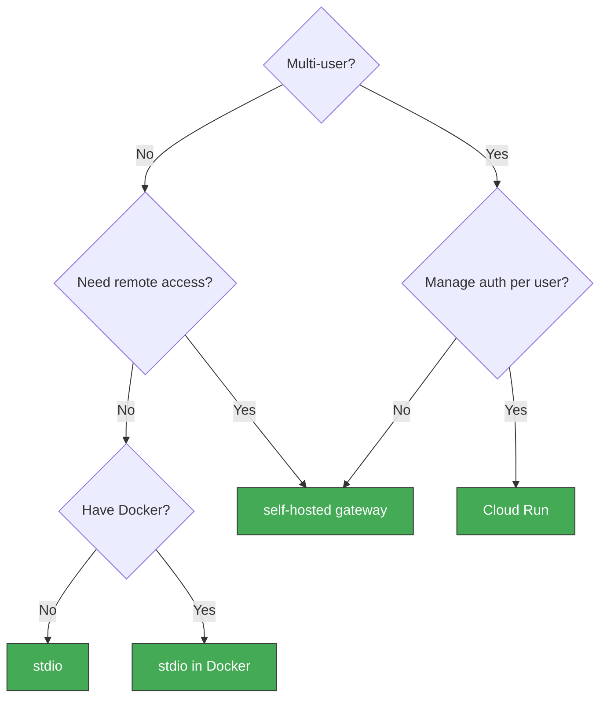
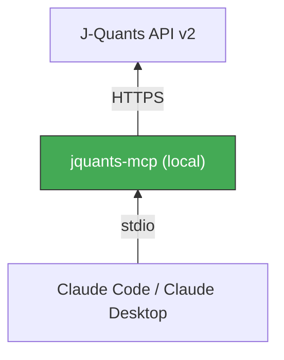
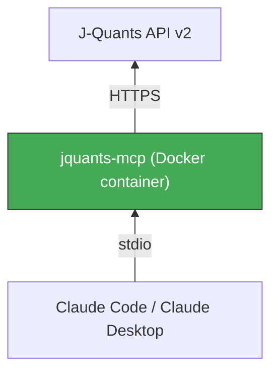
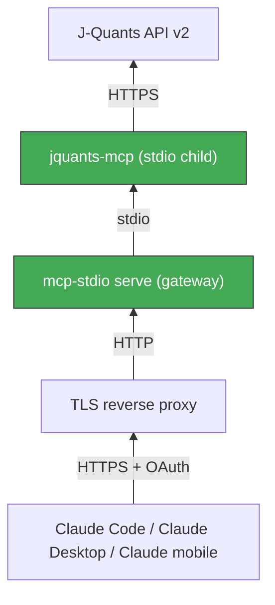
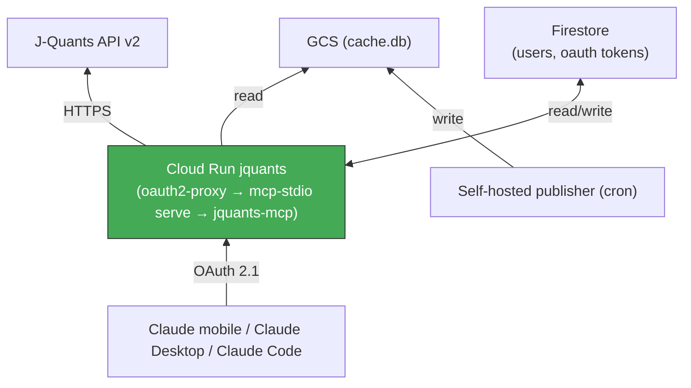

# Deployment Overview

jquants-mcp can be deployed in four shapes. Pick the one that matches your usage pattern.

The server itself always speaks **stdio only**. Every remote shape below works
the same way: a gateway ([mcp-stdio](https://pypi.org/project/mcp-stdio/)) sits
in front, terminates HTTP and authentication, and spawns one `jquants-mcp`
child process per authenticated user.

| Shape | Who runs it | Cost | Setup effort | Best for |
|---|---|---|---|---|
| **stdio** (local) | One user, one machine | Free | < 5 min | Single-user desktop via Claude Code / Claude Desktop |
| **stdio in Docker** (local) | One user, one machine | Free | < 10 min | Same, without installing Python; cache persists in a named volume |
| **Self-hosted gateway** | One or a few trusted users, one host | Host + J-Quants plan | ~1 hour | Homelab / always-on server reachable from mobile or other machines |
| **Cloud Run** (GCP) | Multiple users, OAuth auth | GCP (~\$0–\$10/mo for low traffic) + J-Quants plan | 2–4 hours first time | Family / team, mobile clients, OAuth login per user |

## Decision flowchart

```mermaid
flowchart TD
    Q1{"Multi-user?"}
    Q1 -->|No| Q2{"Need remote access?"}
    Q1 -->|Yes| Q3{"Manage auth per user?"}

    Q2 -->|No| Q4{"Have Docker?"}
    Q2 -->|Yes| R3["self-hosted gateway"]

    Q4 -->|No| R2["stdio"]
    Q4 -->|Yes| R1["stdio in Docker"]

    Q3 -->|No| R3
    Q3 -->|Yes| R4["Cloud Run"]

    style R1 fill:#4a5,stroke:#333,color:#fff
    style R2 fill:#4a5,stroke:#333,color:#fff
    style R3 fill:#4a5,stroke:#333,color:#fff
    style R4 fill:#4a5,stroke:#333,color:#fff
```

## stdio

```mermaid
graph BT
    C["J-Quants API v2"]
    B["jquants-mcp (local)"]
    A["Claude Code / Claude Desktop"]

    A -->|stdio| B
    B -->|HTTPS| C

    style B fill:#4a5,stroke:#333,color:#fff
```

- Launched by the MCP client as a subprocess (`uvx jquants-mcp` or `claude mcp add`)
- Single API key via env var, config file, or `jquants-mcp login` (PKCE)
- Local SQLite cache at `~/.cache/jquants-mcp/cache.db`
- Cannot be reached from mobile or a different machine

Set up: see the main [README](../../README.md#installation).

## stdio in Docker

```mermaid
graph BT
    C["J-Quants API v2"]
    B["jquants-mcp (Docker container)"]
    A["Claude Code / Claude Desktop"]

    A -->|stdio| B
    B -->|HTTPS| C

    style B fill:#4a5,stroke:#333,color:#fff
```

- No Python installation required — just Docker
- The MCP client launches a container per session; no port to bind, no token to manage
- Cache stored in a named Docker volume; survives container restarts
- Refresh the cache with a one-off `daily_fetch.py` container against the same volume

Set up: see [local.md](local.md) (Option A).

## Self-hosted gateway

```mermaid
graph BT
    E["J-Quants API v2"]
    D["jquants-mcp (stdio child)"]
    C["mcp-stdio serve (gateway)"]
    B["TLS reverse proxy"]
    A["Claude Code / Claude Desktop / Claude mobile"]

    A -->|"HTTPS + OAuth"| B
    B -->|HTTP| C
    C -->|stdio| D
    D -->|HTTPS| E

    style C fill:#4a5,stroke:#333,color:#fff
    style D fill:#4a5,stroke:#333,color:#fff
```

- Runs on any host that can hold a TLS cert (laptop at home, NUC, VPS)
- `mcp-stdio serve` terminates MCP OAuth; TLS is terminated by a reverse proxy in front of it
- One `jquants-mcp` child process per authenticated user, identity injected as `JQUANTS_MCP_USER`
- One SQLite cache on the host, shared between invocations

Set up: see [local.md](local.md) (Option B).

## Cloud Run (GCP)

```mermaid
graph BT
    C["J-Quants API v2"]
    D["GCS (cache.db)"]
    E["Firestore\n(users, oauth tokens)"]
    B["Cloud Run jquants\n(oauth2-proxy → mcp-stdio serve → jquants-mcp)"]
    A["Claude mobile / Claude Desktop / Claude Code"]
    F["Self-hosted publisher (cron)"]

    A -->|"OAuth 2.1"| B
    B -->|HTTPS| C
    B -->|read| D
    B <-->|read/write| E
    F -->|write| D

    style B fill:#4a5,stroke:#333,color:#fff
```

- Managed by Google Cloud Run, autoscaling, HTTPS out-of-the-box
- Two containers: an `oauth2-proxy` sidecar for user sign-in, and the app container running `mcp-stdio serve` in front of `jquants-mcp`
- Multi-user: per-user encrypted J-Quants API keys in Firestore, registered with the `register_api_key` MCP tool
- Allowlist (`JQUANTS_ALLOWED_EMAILS`) controls who can sign in
- Requires a self-hosted publisher to populate `cache.db` in GCS
- Compatible with Claude Desktop Connectors, Claude mobile, Claude Code

Set up: see [gcp.md](gcp.md).
