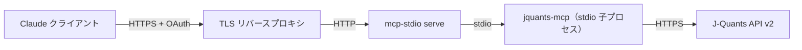

# セルフホストデプロイ

jquants-mcp を自分で管理するホストで動かし、Claude Desktop / Claude Code から接続します。

マルチユーザーの Cloud Run デプロイは代わりに [gcp.ja.md](gcp.ja.md) を参照。

> **サーバーは stdio のみを話します。** 1.0.0 以降、`jquants-mcp` 内部には HTTP
> トランスポートも TLS 終端も Bearer トークンモードもありません。`--transport`・
> `--host`・`--port`・`--ssl-certfile`・`--ssl-keyfile`・`--bearer-token` の各
> フラグは `[oauth]` 設定セクションとともに削除されました。リモートアクセスは
> **サーバーの前段に置くゲートウェイ**（[mcp-stdio](https://pypi.org/project/mcp-stdio/)）
> が提供します。ゲートウェイが HTTP と認証を終端し、認証済みユーザーごとに
> `jquants-mcp` の子プロセスを起動します。この形態は後述の Option B です。

---

## Option A: Docker（Python 不要）

Docker がインストール済みなら、これがローカル MCP サーバーを最速で立ち上げる方法です。
Python も TLS 証明書も GCS アカウントも不要です。

MCP クライアントがセッションごとにコンテナを起動し、stdio で通信します。
バインドするポートも管理するトークンもありません。

### 前提条件

- Docker Desktop（macOS / Windows）または Docker Engine（Linux）
- J-Quants アカウントと API キー

### 1. キャッシュ volume を作成

キャッシュは Docker named volume に置き、セッションをまたいで維持します:

```bash
docker volume create jquants-mcp-cache
```

### 2. Claude Desktop から接続

Claude Desktop の MCP 設定（macOS では `~/Library/Application Support/Claude/claude_desktop_config.json`）を編集:

```json
{
  "mcpServers": {
    "jquants": {
      "command": "docker",
      "args": [
        "run", "--rm", "-i",
        "--entrypoint", "jquants-mcp",
        "-e", "JQUANTS_API_KEY=xxx",
        "-e", "JQUANTS_CACHE_DIR=/home/appuser/.cache/jquants-mcp",
        "-v", "jquants-mcp-cache:/home/appuser/.cache/jquants-mcp",
        "ghcr.io/shigechika/jquants-mcp:latest"
      ]
    }
  }
}
```

`--entrypoint jquants-mcp` は必須です。イメージ既定のエントリポイントスクリプトを
バイパスして stdio サーバーを直接起動します。セッション終了時にコンテナは終了します。

### 3. Claude Code から接続

```bash
claude mcp add jquants -- docker run --rm -i \
  --entrypoint jquants-mcp \
  -e JQUANTS_API_KEY=xxx \
  -e JQUANTS_CACHE_DIR=/home/appuser/.cache/jquants-mcp \
  -v jquants-mcp-cache:/home/appuser/.cache/jquants-mcp \
  ghcr.io/shigechika/jquants-mcp:latest
```

### 4. キャッシュを投入（初回のみ）

volume は空の状態で始まります。同じ volume に対して単発コンテナでフル履歴取得を
実行してください（J-Quants プランによって 1〜3 時間程度）:

```bash
docker run --rm \
  --entrypoint python \
  -e JQUANTS_API_KEY=xxx \
  -e JQUANTS_CACHE_DIR=/home/appuser/.cache/jquants-mcp \
  -v jquants-mcp-cache:/home/appuser/.cache/jquants-mcp \
  ghcr.io/shigechika/jquants-mcp:latest \
  /app/scripts/daily_fetch.py --all
```

**日次更新:** `--all` を外した同じコマンドが差分更新です。ホスト側の cron /
launchd / systemd タイマーからスケジュールしてください:

```bash
docker run --rm \
  --entrypoint python \
  -e JQUANTS_API_KEY=xxx \
  -e JQUANTS_CACHE_DIR=/home/appuser/.cache/jquants-mcp \
  -v jquants-mcp-cache:/home/appuser/.cache/jquants-mcp \
  ghcr.io/shigechika/jquants-mcp:latest \
  /app/scripts/daily_fetch.py
```

### 5. よく使うコマンド

```bash
docker pull ghcr.io/shigechika/jquants-mcp:latest   # イメージを更新
docker volume inspect jquants-mcp-cache             # キャッシュの実体を確認
docker volume rm jquants-mcp-cache                  # キャッシュを削除（データ消失注意！）
```

### 6. 常時起動のローカルエンドポイント（Docker Compose）

上の構成はセッションごとにコンテナを起動します。固定 URL で常駐させたい場合
（Claude Code から使う、同じマシンの複数クライアントから使う、など）は、
リポジトリ直下の `compose.yml` がその形をまとめています。

```bash
git clone https://github.com/shigechika/jquants-mcp.git
cd jquants-mcp
echo 'JQUANTS_API_KEY=xxx' > .env
docker compose up -d --build
```

エンドポイントは `http://localhost:8080/mcp` です。

```bash
claude mcp add --transport http jquants http://localhost:8080/mcp
```

コンテナ内部では stdio サーバーの前段に `mcp-stdio serve` が立ちます。Option B と
同じゲートウェイ構成から、ホスト外に出ないぶん TLS と OAuth を省いた形です。
ポートは `127.0.0.1` にのみ公開されます。

キャッシュ用ボリュームは空の状態から始まり、ツールを呼ぶたびに埋まっていきます。
キャッシュに無いデータは J-Quants API から直接取得するため、最初のリクエストから
そのまま使えます。定期的に温めておきたい場合は `ENABLE_DAILY_FETCH=true`
（平日 17:30 JST）を設定するか、手順 4 の全期間取得を compose のボリュームに対して
実行してください。

**localhost の外に公開する前に**（`compose.yml` のポート公開範囲を広げる前に）、
必ずベアラートークンを設定してください。既定ではサーバー自身は認証を要求しません。

```bash
MCP_STDIO_SERVE_TOKEN=$(openssl rand -hex 32) docker compose up -d --build
```

他マシンからのアクセスには Option B を推奨します。共有トークン1本ではなく、
TLS とユーザーごとの OAuth が付きます。

---

## Option B: セルフホストゲートウェイ（リモートアクセス）

この方法ではサーバーをネットワークに公開できるため、ラップトップ・モバイルなど
ホスト外の端末からも接続できます。

`jquants-mcp` 自体はネットワークから到達できません。前段に
[mcp-stdio](https://pypi.org/project/mcp-stdio/) の `serve` コマンドを
ゲートウェイとして立てます。ゲートウェイが MCP over HTTP を待ち受け、OAuth を
終端し、認証済みユーザーごとに `jquants-mcp` の子プロセスを起動して、そのユーザーの
identity を環境変数 `JQUANTS_MCP_USER` として子プロセスに注入します。



このガイドは以下を前提とします:
- ホストに向けた TLS 証明書を取得できること
- ホストが常時稼働していること（launchd / systemd でゲートウェイを常駐）

### 前提条件

- Python 3.10+ が使える Linux または macOS ホスト
- ホストに向いているドメイン名（IPv4 または IPv6）。IPv6 DDNS の例は [shigechika/macos-ddns6](https://github.com/shigechika/macos-ddns6) を参照
- TLS 証明書。[acme.sh](https://github.com/acmesh-official/acme.sh) の DNS-01 チャレンジが IPv6 専用ホストやワイルドカード証明書に対応しておりおすすめ
- J-Quants アカウントと API キー

### 1. jquants-mcp とゲートウェイをインストール

```bash
uv tool install jquants-mcp      # または: pipx install jquants-mcp
uv tool install mcp-stdio        # または: pipx install mcp-stdio
```

### 2. jquants-mcp を設定

ゲートウェイは自身の環境を各子プロセスに引き渡すため、ローカル stdio 利用時と
まったく同じ設定で構いません。`~/.config/jquants-mcp/config.ini` に記載する方法:

```ini
[jquants]
api_key = <J-Quants API キー>
```

または環境変数 `JQUANTS_API_KEY` でも設定可能。

マルチユーザーで運用する場合は代わりに `MCP_ENCRYPTION_KEY` を設定し、各ユーザーが
`register_api_key` MCP ツールで自分の J-Quants キーを登録します。キーはユーザーごとに
暗号化して保存されます。サインイン可能なユーザーは `JQUANTS_ALLOWED_EMAILS`
（カンマ区切り。空なら認証済みユーザー全員を許可）で制限します。

### 3. ゲートウェイを起動

```bash
mcp-stdio serve \
  --enable-oauth \
  --public-url https://mcp.example.com \
  --path /mcp \
  --user-env JQUANTS_MCP_USER \
  --allow-redirect-uri https://claude.ai/api/mcp/auth_callback \
  --host 127.0.0.1 \
  --port 8080 \
  -- jquants-mcp
```

`--` 以降がゲートウェイがユーザーごとに起動するコマンドです。

`mcp-stdio serve` は平文 HTTP でバインドします。TLS は前段のリバースプロキシ
（nginx・Caddy・Cloudflare Tunnel など）で終端し、`127.0.0.1:8080` に転送して
ください。セッション上限・トークン TTL・トークンストアの永続化などは jquants-mcp
ではなく mcp-stdio 側の設定です。フラグの全容は mcp-stdio のドキュメントを参照。

### バックグラウンドサービスとして起動

**macOS（launchd）:** `~/Library/LaunchAgents/com.example.jquants-mcp.plist` を
KeepAlive + RunAtLoad で作成し、同じ `mcp-stdio serve` コマンドを起動します。
macOS 26+ の TCC サンドボックス問題が発生する場合は、`JQUANTS_API_TOML_PATH` で
設定ファイルパスを明示してください（詳細: [README の macOS launchd note](../../README.md#macos-launchd-note)）。

**Linux（systemd）:** `/etc/systemd/system/jquants-mcp.service` を作成:

```ini
[Unit]
Description=jquants-mcp gateway
After=network-online.target

[Service]
Type=simple
User=mcp
Environment=JQUANTS_API_KEY=<J-Quants API キー>
ExecStart=/home/mcp/.local/bin/mcp-stdio serve \
  --enable-oauth \
  --public-url https://mcp.example.com \
  --path /mcp \
  --user-env JQUANTS_MCP_USER \
  --allow-redirect-uri https://claude.ai/api/mcp/auth_callback \
  --host 127.0.0.1 --port 8080 \
  -- /home/mcp/.local/bin/jquants-mcp
Restart=on-failure
RestartSec=5s

[Install]
WantedBy=multi-user.target
```

```bash
sudo systemctl enable --now jquants-mcp
```

### 4. Claude クライアントから接続

**Claude Desktop（Connectors UI）/ Claude モバイル:** カスタムコネクタとして
`https://mcp.example.com/mcp` を追加し、プロンプトに従ってサインインします。

**Claude Code:** クライアント側でも `mcp-stdio` を使うと、OAuth フローがローカルで
実行されトークンがキャッシュされます:

```bash
claude mcp add jquants -- uvx mcp-stdio --oauth https://mcp.example.com/mcp
```

Claude Code には一部の HTTP トランスポートで `Authorization` ヘッダーが落ちるバグが
あります（[claude-code#28293](https://github.com/anthropics/claude-code/issues/28293)）。
`mcp-stdio` 経由にすればこれを回避できます。

### 5. 運用

- ログ: `journalctl -u jquants-mcp -f`（systemd）または `/tmp/jquants-mcp.err.log`（launchd デフォルト）
- キャッシュ DB: `~/.cache/jquants-mcp/cache.db` — 取得データが増えると数 GB になります（[Caching](../../README.md#caching) 参照）
- キャッシュ投入: `uv run scripts/daily_fetch.py` を cron / launchd タイマーで毎日実行

---

## Cloud Run への移行タイミング

以下の場合は [gcp.ja.md](gcp.ja.md) への移行を検討:

- 自分以外のユーザーに各自の J-Quants アカウントで使わせたい
- 自前のリバースプロキシを運用せず、マネージドな HTTPS とサインイン層を使いたい
- ホストが不安定でオートスケーリング / ゼロオペレーションが必要

それ以外は J-Quants API・キャッシュスキーマ・ツール群はすべて同じです。
