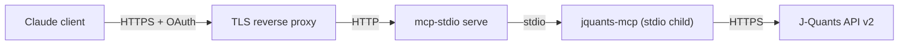

# Local Deployment

Run jquants-mcp on a host you control and connect from Claude Desktop or Claude Code.

For the multi-user Cloud Run deployment, see [gcp.md](gcp.md) instead.

> **The server speaks stdio only.** Since 1.0.0 there is no HTTP transport, no
> TLS termination, and no Bearer-token mode inside `jquants-mcp` — the
> `--transport`, `--host`, `--port`, `--ssl-certfile`, `--ssl-keyfile` and
> `--bearer-token` flags were removed along with the `[oauth]` config section.
> Remote access is provided by a **gateway in front of the server**
> ([mcp-stdio](https://pypi.org/project/mcp-stdio/)), which terminates HTTP and
> authentication and spawns one `jquants-mcp` child process per authenticated
> user. Option B below covers that shape.

---

## Option A: Docker (no Python required)

If you have Docker installed, this is the fastest path to a running local MCP
server. No Python, no TLS certificate, and no GCS account needed.

The MCP client launches a container per session and talks to it over stdio, so
there is no port to bind and no token to manage.

### Prerequisites

- Docker Desktop (macOS / Windows) or Docker Engine (Linux)
- A J-Quants account + API key

### 1. Create a cache volume

The cache lives in a Docker named volume so it survives across sessions:

```bash
docker volume create jquants-mcp-cache
```

### 2. Connect from Claude Desktop

Edit your Claude Desktop MCP config
(`~/Library/Application Support/Claude/claude_desktop_config.json` on macOS):

```json
{
  "mcpServers": {
    "jquants": {
      "command": "docker",
      "args": [
        "run", "--rm", "-i",
        "--entrypoint", "jquants-mcp",
        "-e", "JQUANTS_API_KEY=xxx",
        "-e", "JQUANTS_CACHE_DIR=/home/appuser/.cache/jquants-mcp",
        "-v", "jquants-mcp-cache:/home/appuser/.cache/jquants-mcp",
        "ghcr.io/shigechika/jquants-mcp:latest"
      ]
    }
  }
}
```

`--entrypoint jquants-mcp` is required: it bypasses the image's default
entrypoint script and runs the stdio server directly. The container exits when
the session ends.

### 3. Connect from Claude Code

```bash
claude mcp add jquants -- docker run --rm -i \
  --entrypoint jquants-mcp \
  -e JQUANTS_API_KEY=xxx \
  -e JQUANTS_CACHE_DIR=/home/appuser/.cache/jquants-mcp \
  -v jquants-mcp-cache:/home/appuser/.cache/jquants-mcp \
  ghcr.io/shigechika/jquants-mcp:latest
```

### 4. Populate the cache (first run)

The volume starts empty. Run a full historical fetch (takes 1–3 hours depending
on your J-Quants plan) as a one-off container against the same volume:

```bash
docker run --rm \
  --entrypoint python \
  -e JQUANTS_API_KEY=xxx \
  -e JQUANTS_CACHE_DIR=/home/appuser/.cache/jquants-mcp \
  -v jquants-mcp-cache:/home/appuser/.cache/jquants-mcp \
  ghcr.io/shigechika/jquants-mcp:latest \
  /app/scripts/daily_fetch.py --all
```

**Daily updates:** run the same command without `--all` for an incremental
update, and schedule it from the host (cron / launchd / systemd timer):

```bash
docker run --rm \
  --entrypoint python \
  -e JQUANTS_API_KEY=xxx \
  -e JQUANTS_CACHE_DIR=/home/appuser/.cache/jquants-mcp \
  -v jquants-mcp-cache:/home/appuser/.cache/jquants-mcp \
  ghcr.io/shigechika/jquants-mcp:latest \
  /app/scripts/daily_fetch.py
```

### 5. Useful commands

```bash
docker pull ghcr.io/shigechika/jquants-mcp:latest   # upgrade the image
docker volume inspect jquants-mcp-cache             # where the cache lives
docker volume rm jquants-mcp-cache                  # delete the cache (data loss!)
```

### 6. Always-on local endpoint (Docker Compose)

The setup above launches a container per session. If you would rather have one
long-running server on a fixed URL — useful for Claude Code, or for several
clients on the same machine — `compose.yml` in the repository root packages
that shape:

```bash
git clone https://github.com/shigechika/jquants-mcp.git
cd jquants-mcp
echo 'JQUANTS_API_KEY=xxx' > .env
docker compose up -d --build
```

The endpoint is `http://localhost:8080/mcp`:

```bash
claude mcp add --transport http jquants http://localhost:8080/mcp
```

Internally the container runs `mcp-stdio serve` in front of the stdio server —
the same gateway shape as Option B, minus TLS and OAuth, since nothing leaves
the host. The port is published on `127.0.0.1` only.

The cache volume starts empty and fills as tools are called; anything not
cached is fetched from the live J-Quants API, so it works from the first
request. Set `ENABLE_DAILY_FETCH=true` to keep it warm on a schedule
(weekdays 17:30 JST), or run the one-off historical fetch from step 4 against
the compose volume.

**Before exposing it beyond localhost** — that is, before widening the port
mapping in `compose.yml` — set a bearer token, because the server itself
requires no authentication by default:

```bash
MCP_STDIO_SERVE_TOKEN=$(openssl rand -hex 32) docker compose up -d --build
```

For access from other machines, prefer Option B: it adds TLS and per-user
OAuth rather than a single shared token.

---

## Option B: Self-hosted gateway (remote access)

This option exposes the server over the network so you can connect from
laptops, mobile, and other machines outside the host.

`jquants-mcp` itself is not reachable over the network. You run
[mcp-stdio](https://pypi.org/project/mcp-stdio/)'s `serve` command as a
gateway: it listens for MCP over HTTP, terminates OAuth, and spawns a
`jquants-mcp` child process per authenticated user, injecting that user's
identity into the child as the `JQUANTS_MCP_USER` environment variable.



This guide assumes:
- You can get a TLS certificate for a domain that points to the host
- The host is always on (launchd / systemd keeps the gateway alive)

### Prerequisites

- Linux or macOS host with Python 3.10+
- A domain name pointing at the host (IPv4 or IPv6). For IPv6 see [shigechika/macos-ddns6](https://github.com/shigechika/macos-ddns6) for an example DDNS setup
- A TLS certificate. [acme.sh](https://github.com/acmesh-official/acme.sh) with DNS-01 challenge works well (supports IPv6-only hosts and wildcard certs)
- A J-Quants account + API key

### 1. Install jquants-mcp and the gateway

```bash
uv tool install jquants-mcp      # or: pipx install jquants-mcp
uv tool install mcp-stdio        # or: pipx install mcp-stdio
```

### 2. Configure jquants-mcp

The gateway passes its own environment to each child process, so configure the
server exactly as you would for local stdio use — either
`~/.config/jquants-mcp/config.ini`:

```ini
[jquants]
api_key = <your J-Quants API key>
```

or the `JQUANTS_API_KEY` environment variable.

For a multi-user gateway, set `MCP_ENCRYPTION_KEY` instead and let each user
register their own J-Quants key with the `register_api_key` MCP tool; keys are
stored encrypted per user. Restrict who may sign in with
`JQUANTS_ALLOWED_EMAILS` (comma-separated; empty means any authenticated user).

### 3. Run the gateway

```bash
mcp-stdio serve \
  --enable-oauth \
  --public-url https://mcp.example.com \
  --path /mcp \
  --user-env JQUANTS_MCP_USER \
  --allow-redirect-uri https://claude.ai/api/mcp/auth_callback \
  --host 127.0.0.1 \
  --port 8080 \
  -- jquants-mcp
```

Everything after `--` is the command the gateway spawns per user.

`mcp-stdio serve` binds plain HTTP; terminate TLS in front of it with a reverse
proxy (nginx, Caddy, Cloudflare Tunnel, …) that forwards to
`127.0.0.1:8080`. See mcp-stdio's own documentation for the full flag set —
session limits, token TTLs, and persistent token stores are configured there,
not in jquants-mcp.

### Run as a background service

**macOS (launchd):** Create `~/Library/LaunchAgents/com.example.jquants-mcp.plist`
with KeepAlive + RunAtLoad, invoking the same `mcp-stdio serve` command. Point
`JQUANTS_API_TOML_PATH` at a non-sandboxed path if you hit the macOS 26+ TCC
issue — see the [macOS launchd note](../../README.md#macos-launchd-note) in README.

**Linux (systemd):** Create `/etc/systemd/system/jquants-mcp.service`:

```ini
[Unit]
Description=jquants-mcp gateway
After=network-online.target

[Service]
Type=simple
User=mcp
Environment=JQUANTS_API_KEY=<your J-Quants API key>
ExecStart=/home/mcp/.local/bin/mcp-stdio serve \
  --enable-oauth \
  --public-url https://mcp.example.com \
  --path /mcp \
  --user-env JQUANTS_MCP_USER \
  --allow-redirect-uri https://claude.ai/api/mcp/auth_callback \
  --host 127.0.0.1 --port 8080 \
  -- /home/mcp/.local/bin/jquants-mcp
Restart=on-failure
RestartSec=5s

[Install]
WantedBy=multi-user.target
```

```bash
sudo systemctl enable --now jquants-mcp
```

### 4. Connect from Claude clients

**Claude Desktop (Connectors UI) / Claude mobile:** add a custom connector
pointing at `https://mcp.example.com/mcp` and sign in when prompted.

**Claude Code:** use `mcp-stdio` on the client side as well, so the OAuth flow
runs locally and the token is cached:

```bash
claude mcp add jquants -- uvx mcp-stdio --oauth https://mcp.example.com/mcp
```

Claude Code has a known bug that drops the `Authorization` header on some HTTP
transports ([claude-code#28293](https://github.com/anthropics/claude-code/issues/28293));
routing through `mcp-stdio` avoids it.

### 5. Operate

- Logs: `journalctl -u jquants-mcp -f` (systemd) or `/tmp/jquants-mcp.err.log` (launchd default)
- Cache DB: `~/.cache/jquants-mcp/cache.db` grows as you fetch data — see [Caching](../../README.md#caching) in README
- Populate cache: `uv run scripts/daily_fetch.py` (schedule daily via cron / launchd timer)

---

## When to graduate to Cloud Run

Move to [gcp.md](gcp.md) when:
- You want to share the server with people who have their own J-Quants accounts
- You want managed HTTPS and a hosted sign-in layer instead of running your own reverse proxy
- The host is unreliable and you need autoscaling / zero-ops

Everything else stays the same — the same J-Quants API, the same cache schema, the same tools.
