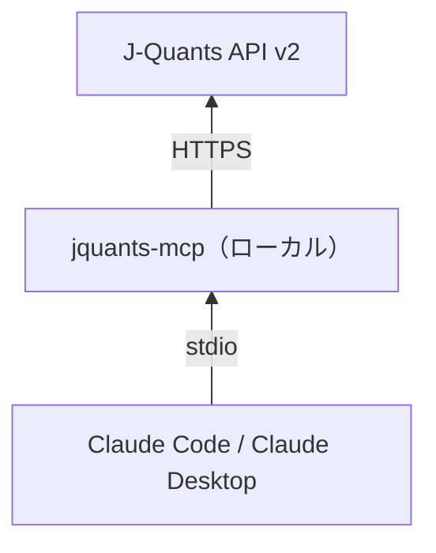
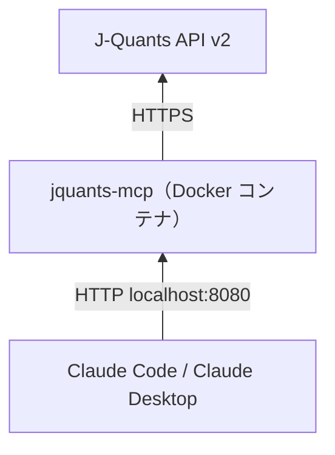
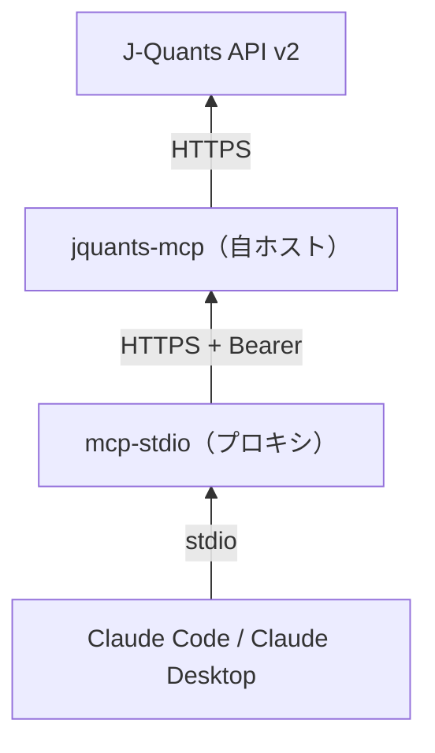
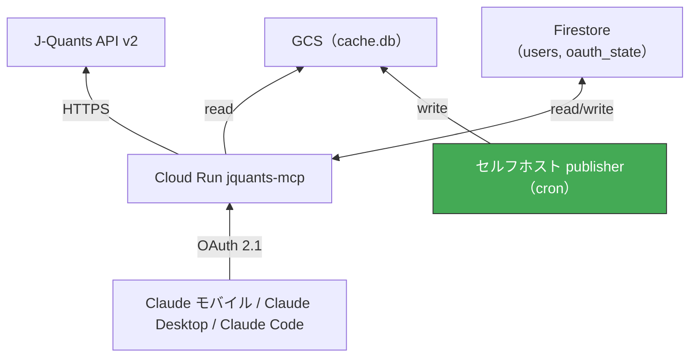
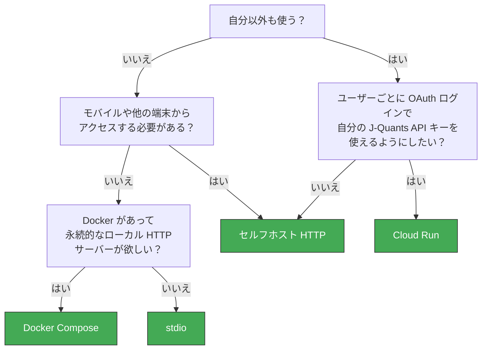

# デプロイ概要

jquants-mcp は 4 つの形態でデプロイできます。用途に合ったものを選んでください。

| 形態 | 運用者 | コスト | セットアップ | 適した用途 |
|---|---|---|---|---|
| **stdio**（ローカル） | 1 人・1 台 | 無料 | < 5 分 | Claude Code / Claude Desktop での単一ユーザー利用 |
| **Docker Compose**（ローカル） | 1 人・1 台 | 無料 | < 10 分 | Python 不要でローカル HTTP サーバーを立てたい、キャッシュを永続化したい |
| **セルフホスト HTTP** | 少数の信頼ユーザー | ホスト代 + J-Quants | ~1 時間 | 常時稼働サーバーからモバイルや他端末に接続したい |
| **Cloud Run**（GCP） | 複数ユーザー、OAuth 認証 | GCP 代（低トラフィックで ~$0–$10/月）+ J-Quants | 初回 2〜4 時間 | 家族・チーム利用、モバイル対応、ユーザーごとの OAuth ログイン |

## stdio

- MCP クライアントがサブプロセスとして起動（`uvx jquants-mcp` または `claude mcp add`）
- API キーは環境変数・設定ファイル・`jquants-mcp login`（PKCE）で設定
- ローカル SQLite キャッシュ: `~/.cache/jquants-mcp/cache.db`
- モバイルや別端末からはアクセス不可

セットアップ: [README](../../README.md#installation) を参照。

## Docker Compose

- Python インストール不要 — Docker だけで動く
- `http://localhost:8080/mcp` でローカル HTTP サーバーとして常駐
- キャッシュは Docker named volume に保存 → コンテナ再起動後も維持
- `ENABLE_DAILY_FETCH=true` で平日の自動キャッシュ更新が有効になる

セットアップ: [local.md](local.md)（Option A）を参照。

## セルフホスト HTTP

- TLS 証明書を取得できるホスト（自宅ラップトップ・NUC・VPS）で動作
- Streamable HTTP トランスポート、Bearer トークン認証
- ホスト上の SQLite キャッシュを複数セッションで共有
- Claude Code のヘッダーバグ回避のため `mcp-stdio` プロキシ経由でモバイルからも接続可能

セットアップ: [local.md](local.md)（Option B）を参照。

## Cloud Run（GCP）

- Google Cloud Run によるマネージド運用、オートスケーリング、HTTPS 標準対応
- マルチユーザー: ユーザーごとの J-Quants API キーを Firestore に暗号化保存、OAuth 2.1 ログイン
- `JQUANTS_ALLOWED_EMAILS` でサインイン可能なユーザーを制限
- GCS に `cache.db` を定期アップロードするセルフホスト publisher が必要
- Claude Desktop Connectors UI・Claude モバイル・Claude Code に対応

セットアップ: [gcp.ja.md](gcp.ja.md) を参照。

## 選択フローチャート

