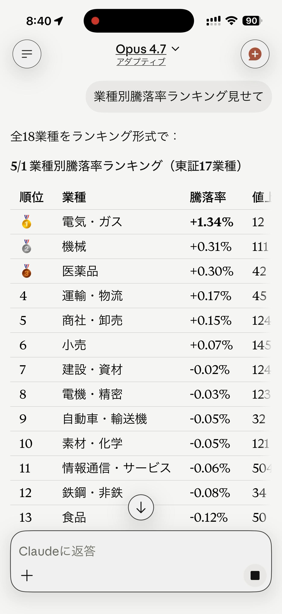
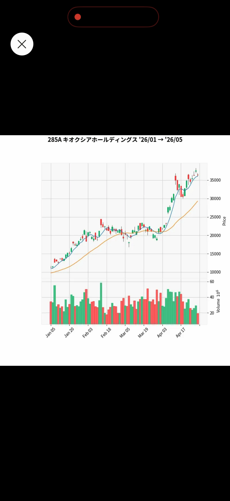

# Quickstart

Get jquants-mcp answering Japanese stock questions in Claude in about 5 minutes.

## Prerequisites

- Python 3.10 or newer (`python3 --version`)
- A [J-Quants account](https://jpx-jquants.com/) with at least the Free plan
  (Light or above unlocks daily bars beyond the 12-week delay)
- One of: Claude Code (CLI), Claude Desktop, or any MCP-aware client

## 1. Install jquants-mcp

=== "uv (recommended)"

    ```bash
    uv tool install jquants-mcp
    ```

=== "pipx"

    ```bash
    pipx install jquants-mcp
    ```

=== "pip"

    ```bash
    pip install --user jquants-mcp
    ```

For inline candlestick / comparison charts, install with the `[charts]` extra:

```bash
uv tool install "jquants-mcp[charts]"
```

This pulls `mplfinance` and `matplotlib` (~60 MB). If you skip the extra, the
chart tools are silently unregistered and the rest still works.

## 2. Get your J-Quants API key

The easiest way is the built-in browser login (PKCE flow):

```bash
jquants-mcp login
```

This opens the J-Quants OAuth page; after approving, the API key is saved
to `~/.config/jquants-mcp/config.ini` (mode 0600). Run `jquants-mcp logout`
to clear it.

If you prefer to manage the key yourself, copy it from the
[J-Quants dashboard](https://jpx-jquants.com/) and put it in the same file:

```ini
# ~/.config/jquants-mcp/config.ini
[jquants]
api_key = YOUR_API_KEY_HERE
```

`JQUANTS_API_KEY` env var also works if you would rather not write a config file.

## 3. Connect to Claude

=== "claude.ai (browser / mobile)"

    1. Open [claude.ai](https://claude.ai) and create a **Project**
       (left sidebar → **Projects** → **+ New project**).
    2. Open the project → gear icon → **Integrations** → **Add integration** →
       **Custom** → enter the URL of your jquants-mcp server (e.g. a
       Cloud Run deployment). Authenticate with Google OAuth.
    3. _(Optional but recommended)_ Click **Project instructions** and paste
       the contents of
       [`docs/claude-project-instructions.md`](claude-project-instructions.md).
       This teaches Claude how to render React artifact charts from the tool
       output without extra prompting.

=== "Claude Code (CLI)"

    ```bash
    claude mcp add jquants -- jquants-mcp
    ```

    Verify with `claude mcp list`. The next time you launch `claude`, the
    server is available.

=== "Claude Desktop"

    Edit `~/Library/Application Support/Claude/claude_desktop_config.json`
    (macOS) or the equivalent on Windows / Linux:

    ```json
    {
      "mcpServers": {
        "jquants": {
          "command": "jquants-mcp"
        }
      }
    }
    ```

    Restart Claude Desktop to pick up the change.

## 4. Try it out

Open Claude and ask:

> 今日の業種別騰落率を教えて

Claude calls `get_sector_performance` and returns a ranked sector table. The
first call seeds the local cache; subsequent queries are instant.

<p align="center" markdown>
{ width="280" }
</p>

Try a chart:

> キオクシア（285A）のチャートを 3 か月分

If you installed the `[charts]` extra, Claude renders a candlestick PNG inline.

<p align="center" markdown>
{ width="280" }
</p>

## Next steps

- **[Tools →](tools.md)** — what else you can ask Claude to do.
- **[FAQ →](faq.md)** — common errors, plan recommendations, multi-user mode.
- **Full reference**:
  [GitHub README](https://github.com/shigechika/jquants-mcp) covers
  config schema, deployment shapes (Docker / Cloud Run / self-hosted HTTP),
  per-tool parameter tables, and OAuth.
