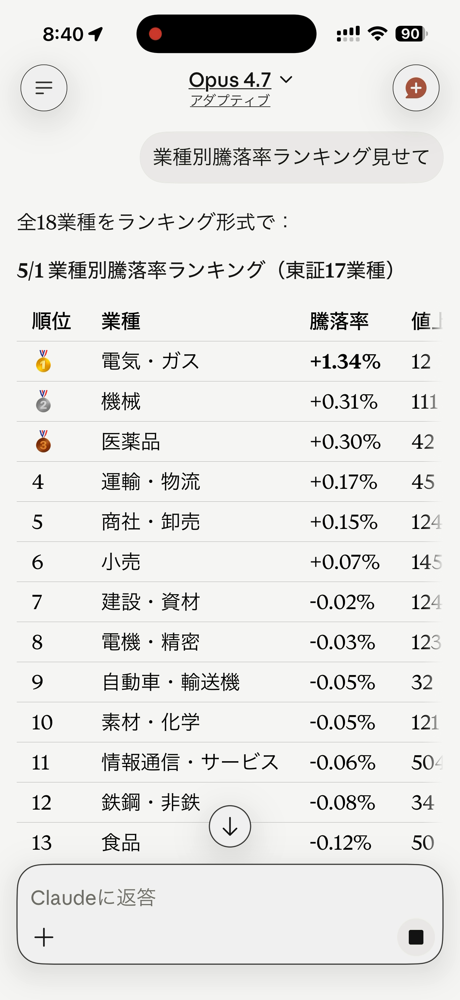
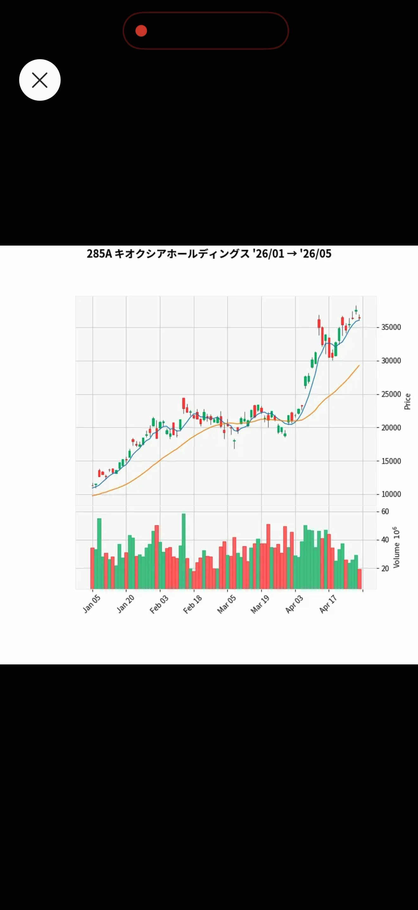

# Quickstart

Get jquants-mcp answering Japanese stock questions in Claude in about 5 minutes.

## Prerequisites

- Python 3.10 or newer (`python3 --version`)
- A [J-Quants account](https://jpx-jquants.com/) with at least the Free plan
  (Light or above unlocks daily bars beyond the 12-week delay)
- One of: Claude Code (CLI), Claude Desktop, or any MCP-aware client

## 1. Install jquants-mcp

=== "uv (recommended)"

    ```bash
    uv tool install jquants-mcp
    ```

=== "pipx"

    ```bash
    pipx install jquants-mcp
    ```

=== "pip"

    ```bash
    pip install --user jquants-mcp
    ```

## 2. Get your J-Quants API key

The easiest way is the built-in browser login (PKCE flow):

```bash
jquants-mcp login
```

This opens the J-Quants OAuth page; after approving, the API key is saved
to `~/.config/jquants-mcp/config.ini` (mode 0600). Run `jquants-mcp logout`
to clear it.

If you prefer to manage the key yourself, copy it from the
[J-Quants dashboard](https://jpx-jquants.com/) and put it in the same file:

```ini
# ~/.config/jquants-mcp/config.ini
[jquants]
api_key = YOUR_API_KEY_HERE
```

`JQUANTS_API_KEY` env var also works if you would rather not write a config file.

## 3. Connect to Claude

=== "claude.ai (browser / desktop / mobile)"

    1. Open [claude.ai](https://claude.ai) and create a **Project**
       (left sidebar → **Projects** → **New project**).
    2. Open the project → gear icon → **Integrations** → **Add integration** →
       **Custom** → enter the URL of the gateway fronting your jquants-mcp
       server (e.g. a Cloud Run deployment). jquants-mcp itself speaks only
       stdio, so remote clients always connect through a gateway — the
       reference Cloud Run setup signs you in with your Google account.
    3. _(Optional but recommended)_ Click **Add instructions** and paste
       the contents of
       [`docs/claude-project-instructions.md`](claude-project-instructions.md).
       This teaches Claude how to render React artifact charts from the tool
       output without extra prompting.
    4. The project settings (including the MCP connection) sync automatically
       to the Claude mobile app within a few minutes.

=== "Claude Code (plugin)"

    This repository doubles as a single-plugin marketplace, so Claude Code
    can install the server for you:

    ```
    /plugin marketplace add shigechika/jquants-mcp
    /plugin install jquants-mcp@jquants-mcp
    ```

    The plugin launches `uvx`, so it must be on the `PATH` of the process
    that runs Claude Code — a login shell usually has it, but a
    GUI-launched app may not; install [uv](https://docs.astral.sh/uv/)
    system-wide if the plugin fails to start.

    Reads the same environment variables as
    [step 2](#2-get-your-j-quants-api-key) above. The plugin's own
    `.mcp.json` intentionally leaves out `JQUANTS_API_KEY` so the key you
    just set up — `~/.config/jquants-mcp/config.ini` from `jquants-mcp
    login`, or a pre-existing `~/.jquants-api/jquants-api.toml` — is still
    found; export `JQUANTS_API_KEY` yourself before starting Claude Code
    only if you'd rather override both of those.

=== "Claude Code (CLI)"

    ```bash
    claude mcp add jquants -- jquants-mcp
    ```

    Verify with `claude mcp list`. The next time you launch `claude`, the
    server is available.

=== "Claude Desktop"

    Edit `~/Library/Application Support/Claude/claude_desktop_config.json`
    (macOS) or the equivalent on Windows / Linux:

    ```json
    {
      "mcpServers": {
        "jquants": {
          "command": "jquants-mcp"
        }
      }
    }
    ```

    Restart Claude Desktop to pick up the change.

## 4. Try it out

Open Claude and ask:

> 今日の業種別騰落率を教えて

Claude calls `get_sector_performance` and returns a ranked sector table. The
first call seeds the local cache; subsequent queries are instant.

<p align="center" markdown>
{ width="280" }
</p>

Try a chart:

> キオクシア（285A）のチャートを 3 か月分

Claude calls `get_candlestick_data` and renders a candlestick React artifact inline.

<p align="center" markdown>
{ width="280" }
</p>

## Next steps

- **[Tools →](tools.md)** — what else you can ask Claude to do.
- **[FAQ →](faq.md)** — common errors, plan recommendations, multi-user mode.
- **Full reference**:
  [GitHub README](https://github.com/shigechika/jquants-mcp) covers
  config schema, deployment shapes (Docker / Cloud Run / gateway-fronted
  self-hosting), per-tool parameter tables, and the gateway-side
  authentication setup.
