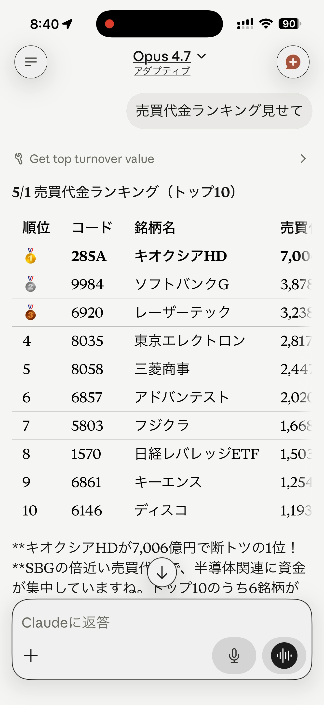
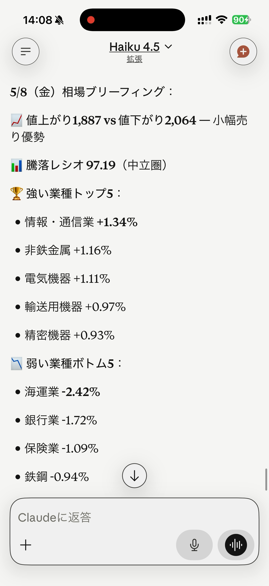
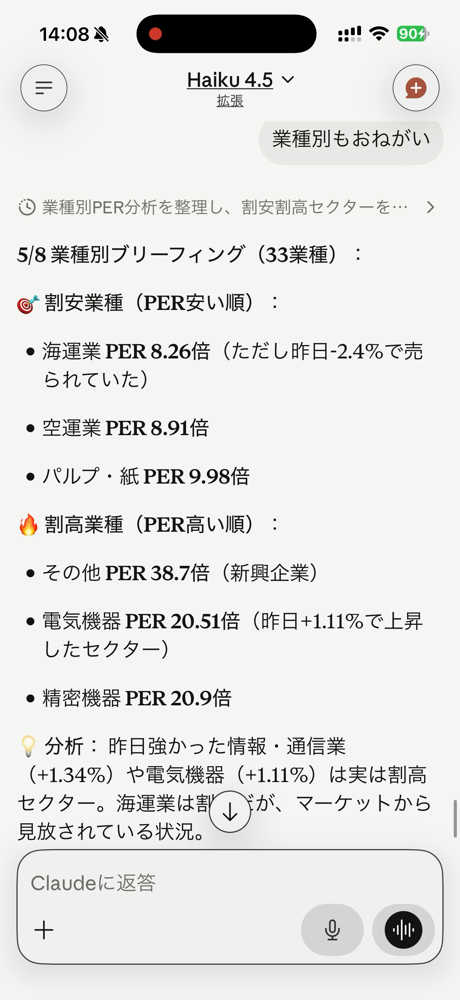
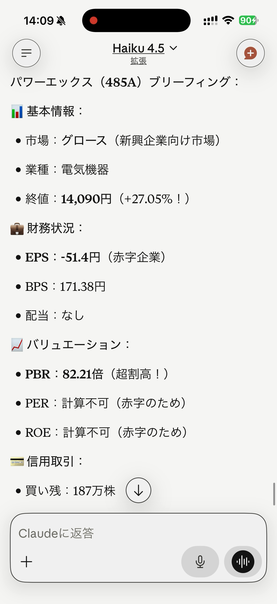
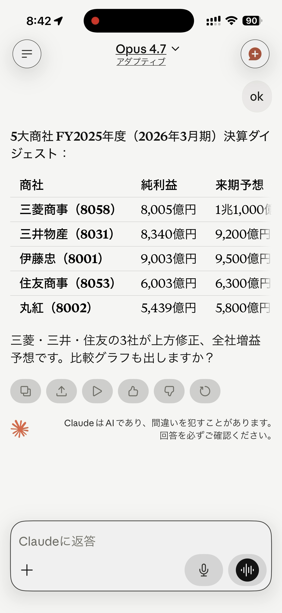
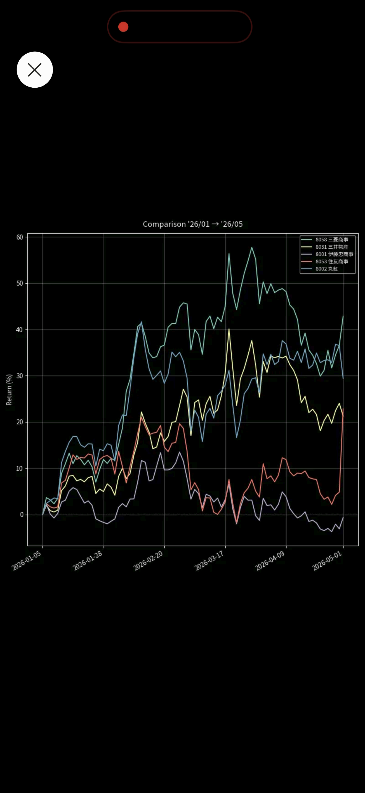

# Tools

A user-facing tour of what jquants-mcp lets Claude do. For exact parameter
tables and endpoint mappings, see the
[GitHub README](https://github.com/shigechika/jquants-mcp#available-tools).

## Asking the right way

You don't have to memorise tool names — Claude picks the right one from your
question. The examples below show queries that map cleanly to a single tool;
Claude can also chain several tools (e.g. screen for top movers, then chart
the leader) without you having to ask.

## Daily market overview & valuation

What's the market doing today, and which sectors look cheap?

| Question | Tool |
|---|---|
| "How many stocks advanced vs declined today?" | `detect_price_change` |
| "25-day advance/decline ratio" | `get_advance_decline_ratio` |
| "Top 10 gainers today" | `get_top_movers` |
| "Volume ranking" | `get_top_volume` |
| "Turnover value ranking" (yen-based, institutional flow) | `get_top_turnover_value` |
| "Sector performance today" (TSE 33 sectors or 17 sectors) | `get_sector_performance` |
| "Sector PER/PBR/ROE — which sectors look cheap?" | `get_sector_briefing` |
| "High dividend yield ranking" | `get_dividend_yield_ranking` |
| "Today's market briefing" (one-call composite summary) | `get_market_briefing` |

These all run against the local cache — no API call, no rate limit.

{ width="280" }

## One-call briefings

Ask for a morning brief and Claude returns a composite narrative — market overview,
sector valuation, or single-stock detail — without you having to chain multiple tools:

| Question | Tool |
|---|---|
| "今日の相場ブリーフィング" / "Today's market briefing" | `get_market_briefing` |
| "業種別バリュエーション、割安順で" / "Sector PER/PBR/ROE cheapest first" | `get_sector_briefing` |
| "485A のブリーフィング" / "485A stock briefing" | `get_stock_briefing` |

{ width="280" }

{ width="280" }

{ width="280" }

## Per-stock data

Drill into a specific code:

| Question | Tool |
|---|---|
| "8053 (Sumitomo Corp) — price, financials, and PER at a glance" | `get_stock_briefing` |
| "7203 (Toyota) — past month daily prices" | `get_equities_bars_daily` |
| "8053 Sumitomo Corp earnings summary" | `get_fins_summary` |
| "9984 SoftBank dividend history" | `get_fins_dividend` |
| "285A (Kioxia) — 3-month candlestick chart" | `render_candlestick` |
| "What's the code for Sumitomo Corp?" | `search_equities` |

`render_candlestick` defaults to a 91-day window with `volume + sma5 + sma25`
overlays. SMAs are warmed up from earlier bars so the moving averages are
fully populated from the first displayed candle.

{ width="280" }

## Screening

Find stocks matching a signal:

| Question | Tool |
|---|---|
| "Stocks hitting new year-to-date highs" | `detect_ytd_high_low` |
| "Stocks hitting new 52-week highs" | `detect_52w_high_low` |
| "Stocks at daily price limit (ストップ高/安)" (close vs. locked-limit breakdown) | `detect_price_limit` |
| "Stocks with volume 2× the 20-day average" | `detect_volume_surge` |
| "Stocks that closed above VWAP" | `compare_close_vs_vwap` |

All screeners are pure-Python over the cached daily bars — no extra API calls
even for full-universe scans.

## Comparison charts

Side-by-side return comparison for up to 10 codes:

> Compare year-to-date returns for the five major trading houses (8001 8002 8031 8053 8058)

Claude calls `render_comparison_chart` with `mode="return_pct"` (the default),
producing a return chart with each series normalised to 0% at the first bar.
Add `mode="price"` if you want the raw split-adjusted close instead.

{ width="280" }

## Investor positioning (Standard plan and above)

| Question | Tool |
|---|---|
| "Investor-type turnover breakdown" | `get_equities_investor_types` |
| "Short-sale ratio by sector" | `get_markets_short_ratio` |
| "Margin trading balance" | `get_markets_margin_interest` |
| "Stocks under additional margin requirement" | `get_markets_margin_alert` |

## Calendar and reference

| Question | Tool |
|---|---|
| "Earnings announcements this week" | `get_equities_earnings_calendar` |
| "Public holidays next week" | `get_markets_calendar` |
| "Listed equities master list" | `get_equities_master` |

## Utility / admin

| Question | Tool |
|---|---|
| "Server health status" | `health_check` |
| "Cache statistics" | `cache_status` |
| "Clear the cache" | `cache_clear` |

The full list of 47 tools (with endpoints, plan requirements, and parameter
tables) is on the
[Available Tools section of the GitHub README](https://github.com/shigechika/jquants-mcp#available-tools).
